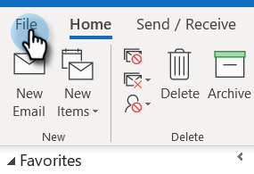

# 자체 보기 방지 {#preventing-self-views}

## 개요 {#overview}

보기 추적에 잘못된 긍지를 가져오면 보고가 일치하지 않을 수 있습니다. MSC 사용자가 이메일 클라이언트에서 추적 픽셀을 실수로 호출할 때(이것을 자체 보기라고 함) 이러한 문제가 발생하는 경우가 많습니다. 다음은 이러한 경험을 대폭 줄이고 자체 보기를 제거하는 데 도움이 되는 몇 가지 팁입니다.

## 웹(Outlook 웹 앱 및 Gmail) {#web-outlook-web-app-and-gmail}

Outlook Web App 및 Gmail에서 이메일을 열 때 보기가 추적되지 않도록 Sales Connect가 브라우저에 쿠키를 저장합니다. 여전히 자가 보기를 수신하고 있는 경우 다음을 수행하는 것이 좋습니다.

* 컴퓨터에 쿠키가 활성화되어 있는지 확인합니다.

* 새 컴퓨터 또는 모바일 장치를 사용하는 경우 웹 응용 프로그램에 로그인되어 있는지 확인하십시오. 그러면 귀사의 컴퓨터/장치가 앞으로 나아간다고 인식할 수 있습니다.

## 데스크톱(Windows) {#desktop-windows}

이메일 클라이언트에서 보이지 않는 작은 이미지 픽셀을 다운로드하여 보기를 추적합니다. 이미지를 자동으로 다운로드할 수 없도록 설정하여 Outlook에서 자체 보기의 양을 크게 줄일 수 있습니다. 이 방법은 아래에 나와 있습니다.

1. Outlook의 메뉴 모음에서 **파일**&#x200B;을 클릭합니다.

   

1. **옵션**&#x200B;을 클릭합니다.

   

1. [Outlook 옵션] 대화 상자에서 **신뢰 센터**&#x200B;를 클릭합니다.

   

1. Microsoft Outlook Trust Center에서 **Trust Center 설정**&#x200B;을 클릭합니다.

   

1. 왼쪽의 메뉴에서 [자동 다운로드]를 클릭하고 **HTML 이메일 또는 RSS 항목**&#x200B;에 그림을 자동으로 다운로드하지 않음 확인란을 선택합니다.

   

1. [신뢰 센터] 대화 상자에서 **확인**&#x200B;을 클릭합니다.

   

1. Outlook 옵션 대화 상자에서 **확인**&#x200B;을 클릭합니다.

   

## 데스크톱(Mac) {#desktop-mac}

이메일 클라이언트에서 보이지 않는 작은 이미지 픽셀을 다운로드하여 보기를 추적합니다. 이미지를 자동으로 다운로드할 수 없도록 설정하여 Outlook에서 자체 보기의 양을 크게 줄일 수 있습니다. 이 방법은 아래에 나와 있습니다.

1. Outlook의 메뉴 모음에서 **Outlook**&#x200B;을 클릭하고 **기본 설정**&#x200B;을 선택합니다.

   

1. [이메일]에서 **읽기**&#x200B;를 선택합니다.

   

1. 보안 아래에서 **안 함** 라디오 단추를 클릭합니다.

   

