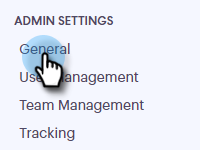
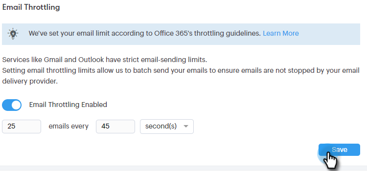

# 이메일 연결 제한 {#email-connection-throttling}

Exchange 또는 Gmail 이메일 제공업체를 통해 전송할 Sales Connect 계정을 통합하면 설정이 간소화되고 1:1 영업 커뮤니케이션을 위한 이메일 전달 기능이 최적화됩니다. 그러나 시스템을 건전하게 유지하고 계정을 안전하게 유지하기 위해 Gmail 및 Exchange는 이메일 전송 제한을 적용합니다. 이러한 제한 사항은 제공자의 재량에 따라 증가 또는 감소될 수 있습니다.

## 이메일 연결 제한(베타) {#email-connection-throttling-beta}

>[!AVAILABILITY]
>
>이 기능은 현재 베타 릴리스에 있습니다. 이 베타에 참여하려면 고객 성공 관리자에게 문의하십시오.

이메일 연결 조절을 사용하면 Sales Connect 관리자는 Gmail 또는 Exchange를 배달 채널로 사용할 때 이메일의 전송률을 구성하여 이메일 전달 채널 공급자에게 전송되는 속도가 강제된 제한을 초과하지 않도록 할 수 있습니다.

제한이 일관되게 초과되는 경우 배달 채널 공급자에서 의심스러운 행동을 하여 이메일이 실패하거나 계정이 비활성화되는 경우가 있습니다.

**메모/밝은 영역**

* 사용자가 Gmail 또는 Exchange에 연결하면 자동으로 활성화됩니다.
* 필요에 맞게 권장 사항에서 설정을 늘리거나 줄이려는 경우 사용자 정의할 수 있습니다.
* Gmail 또는 Exchange를 통해 보낸 이메일을 제한하며 사용자 지정 배달 채널에 대해 제한 없이
* 이메일 연결 제한은 각 사용자가 이메일 공급자와의 고유한 연결을 가지고 있으므로 각 개별 사용자의 이메일을 별도로 대기열에 넣습니다.

**이메일 연결 조정 설정 구성**

1. 톱니바퀴 아이콘을 클릭하고 **설정**&#x200B;을 선택합니다.

   

1. **일반**&#x200B;을 클릭합니다.

   

1. 이메일 연결 조정 카드에 이메일 채널 공급자에게 보낼 이메일의 원하는 일괄 처리 크기를 입력합니다.

   

1. 각 배치를 보내기 전에 대기할 시간을 설정합니다. 이 예에서는 45초마다 25개의 이메일을 선택합니다.

   

1. **저장**&#x200B;을 클릭합니다.

   

변경 사항이 저장되면 모든 사용자는 이메일을 보내기 위해 연결된 Gmail 또는 Exchange 계정에 일괄적으로 보내집니다.

## 이메일 공급자 제한: {#email-provider-limits}

**Outlook 365**

기업/기업

* 하루에 10,000개
* 분당 30회
* 이메일당 500명의 수신자

[자세한 내용은 ](https://docs.microsoft.com/en-us/office365/servicedescriptions/exchange-online-service-description/exchange-online-limits?redirectedfrom=MSDN#RecipientLimits)에서 확인할 수 있습니다.

**Gmail**

* 하루 2000명(시험버전 및 플래그 지정된 계정의 경우 500명)
* 초당 2개의 이메일(API 제한)
* 메시지당 2,000명(외부 수신자의 경우 최대 500명)

[자세한 내용은 ](https://support.google.com/a/answer/166852?hl=en)에서 확인할 수 있습니다.

**Microsoft Exchange Server(2010, 2013)**

한도는 조직이 서버를 호스팅할 때 조직의 IT 부서에 의해 설정됩니다. 자세한 내용은 해당하는 경우 네트워크 또는 시스템 관리자에게 문의하십시오.

>[!MORELIKETHIS]
>
>* [전달 채널 개요](/help/marketo/product-docs/marketo-sales-connect/email/email-delivery/delivery-channel-overview.md)
>* [Gmail 사용자를 위한 이메일 연결](/help/marketo/product-docs/marketo-sales-connect/email-plugins/gmail/email-connection-for-gmail-users.md)
>* [Outlook 사용자를 위한 전자 메일 연결](/help/marketo/product-docs/marketo-sales-connect/email-plugins/msc-for-outlook/email-connection-for-outlook-users.md)

