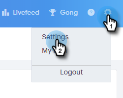
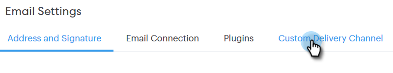

# 사용자 정의 게재 채널 설정 {#setting-up-a-custom-delivery-channel}

[!DNL Marketo Sales Connect]을(를) 사용하면 전자 메일 배달을 위해 사용자 지정 SMTP 서버와 통합할 수 있습니다. Gmail 또는 [!DNL Exchange] 배달 채널에서 대량 전자 메일을 보내지 않으려는 사용자에게 적합한 옵션입니다.

사용자는 자신의 개별 사용을 위해 사용자 지정 SMTP 서버를 설정할 수 있습니다. 또는 관리자는 인스턴스의 모든 [!DNL Sales Connect] 사용자 간에 공유되도록 팀 SMTP를 설정할 수 있습니다.

>[!NOTE]
>
>* SMTP 서버 설정 외에 전자 메일을 보내려면 먼저 [전자 메일 ID를 확인](/help/marketo/product-docs/marketo-sales-connect/getting-started/email-settings/verify-your-email.md)해야 합니다.
>* SMTP 서버에 대한 올바른 서버 자격 증명을 얻기 위해 IT 팀 또는 SMTP 서버 공급업체와 협력하는 것이 좋습니다.
>* SMTP 서버 자격 증명을 사용하여 Gmail 및 [!DNL Exchange] 서버에 연결할 수 없습니다. 이러한 공급자와 통합하려면 이메일 연결 서비스를 사용하십시오.

## 사용자 정의 SMTP {#custom-smtp}

1. [웹 응용 프로그램](https://toutapp.com/login)에 로그인하고 오른쪽 상단의 톱니바퀴 아이콘을 클릭한 다음 **[!UICONTROL Settings]**&#x200B;을(를) 선택합니다.

   

1. [!UICONTROL My Account]에서 **[!UICONTROL Email Settings]**&#x200B;을(를) 클릭합니다.

   

1. **[!UICONTROL Custom Delivery Channel]**&#x200B;를 클릭합니다.

   

1. [!UICONTROL SMTP Server] 자격 증명을 입력하고 **[!UICONTROL Connect]**&#x200B;을(를) 클릭합니다.

   

   >[!NOTE]
   >
   >이 채널이 유일한 게재 채널인 경우 모든 이메일 ID에 자동으로 할당되고 여기에서 완료됩니다. 유일한 게재 채널이 아닌 경우 5단계로 진행하십시오.

1. [!UICONTROL Email Settings]에 있는 동안 **[!UICONTROL Address and Signature]**&#x200B;을(를) 클릭합니다.

   

1. 게재 채널을 선택할 전자 메일 ID를 찾아 **[!UICONTROL Choose Delivery Channel]**&#x200B;을(를) 클릭합니다.

   

1. [!UICONTROL Deliverability] 카드에서 **[!UICONTROL Edit]**&#x200B;을(를) 클릭합니다.

   

1. [!UICONTROL Channel] 드롭다운을 클릭하고 방금 추가한 사용자 지정 게재 채널을 선택합니다. **[!UICONTROL Save]**&#x200B;를 클릭합니다.

   

   >[!NOTE]
   >
   >팀 관리자가 팀 SMTP 서버를 설정하면 기본 전자 메일 ID에만 자동으로 적용되고 다른 전자 메일 ID에 대한 옵션으로 사용할 수 있습니다.

## 팀 SMTP 서버 {#team-smtp-server}

>[!NOTE]
>
>**관리자 권한 필요**

1. [웹 응용 프로그램](https://toutapp.com/login)에 로그인하고 오른쪽 상단의 톱니바퀴 아이콘을 클릭한 다음 **[!UICONTROL Settings]**&#x200B;을(를) 선택합니다.

   

1. [!UICONTROL Admin Settings]에서 **[!UICONTROL General]**&#x200B;을(를) 클릭합니다.

   

1. **[!UICONTROL Team Delivery Channel]**&#x200B;를 클릭합니다.

   

1. [!UICONTROL SMTP Server] 자격 증명을 입력하고 **[!UICONTROL Connect]**&#x200B;을(를) 클릭합니다.

   

   >[!NOTE]
   >
   >팀 SMTP 서버는 모든 팀 구성원에 대한 기본 전자 메일 ID의 기본 배달 채널이 됩니다. 또한 다른 모든 이메일 ID에 대한 게재 채널 옵션으로 사용할 수 있습니다.

   >[!MORELIKETHIS]
   >
   >* [Gmail 사용자를 위한 전자 메일 연결](/help/marketo/product-docs/marketo-sales-connect/email-plugins/gmail/email-connection-for-gmail-users.md)
   >
   >* [사용자 [!DNL Outlook] 의 전자 메일 연결](/help/marketo/product-docs/marketo-sales-connect/email-plugins/msc-for-outlook/email-connection-for-outlook-users.md)
