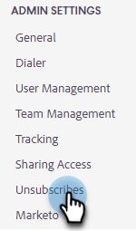

# 자동 추가 구독 취소 메시지 설정 {#auto-append-unsubscribe-message-setting}

보낸 모든 이메일에 구독 취소 메시지가 포함되어 있으므로 수신자는 커뮤니케이션을 거부할 수 있습니다. 구독 취소 메시지 추가가 활성화되면 팀이 Marketo Sales에서 보내는 모든 커뮤니케이션에 웹 애플리케이션에서 보낸 이메일, Salesforce, Gmail 플러그인 및 Outlook 플러그인을 포함한 구독 취소 메시지가 포함됩니다.

## 참고할 사항 {#things-to-note}

* 플러그인에서 보낸 이메일의 경우, 구독 취소는 템플릿을 사용할 때만 추가됩니다.

* 이메일 템플릿에 `{{team_unsubscribe}}` 동적 필드를 사용하고 구독 취소 메시지 추가 설정이 활성화된 경우 팀 구독 취소 동적 필드가 구독 취소 메시지를 _대신_&#x200B;에 추가합니다.

## 구독 취소 추가 활성화/비활성화 {#enable-disable-unsubscribe-append}

1. 톱니바퀴 아이콘을 클릭하고 **설정**&#x200B;을 선택합니다.

   

1. 관리자 설정에서 **구독 취소**&#x200B;를 클릭합니다.

   

1. 메시징 탭의 구독 취소 메시지 추가에서 슬라이더를 원하는 상태로 이동합니다.

   

>[!TIP]
>
>구독 취소 메시지 추가 설정을 비활성화하는 경우 템플릿에 구독 취소 바닥글을 추가하여 통신에 옵트아웃 옵션이 있는지 확인하는 것이 좋습니다. 이렇게 하려면 각 템플릿에 사용자 지정 메시지를 추가하거나 `{{team_unsubscribe}}` [동적 필드](/help/marketo/product-docs/marketo-sales-connect/templates/dynamic-fields/dynamic-fields-glossary.md){target="_blank"}를 사용할 수 있습니다.
