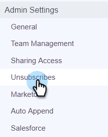

# Marketing to 가입 해지 확인 {#marketo-unsubscribe-check}

Marketing to Unsubscribe Check는 Marketing에 대한 팀의 연결을 사용하여 Marketing의 리드 관리 시스템에서 구독을 취소하는 사람에게 이메일이 전송되지 않도록 합니다. 판매 사용자가 Sales Connect로 이메일을 보내면 이메일 ID가 구독되지 않았는지 확인하기 위해 Marketing에 API 호출이 이루어집니다. 이 경우 이메일 전송을 차단합니다.

>[!NOTE]
>
>**관리자 권한 필요**

## {#turning-it-on}에서 켜기

1. 웹 응용 프로그램에서 톱니바퀴 아이콘을 클릭하고 **설정**&#x200B;을 선택합니다.

   

1. 관리 설정에서 **가입 취소**&#x200B;를 클릭합니다.

   

1. **통합**&#x200B;을 클릭합니다.

   

1. Marketing to Unsubscribe Check 섹션에서 슬라이더를 클릭하여 검사를 활성화합니다.

   

## {#things-to-know}을(를) 알아야 하는 사항

Marketing To 가입 해지 확인...

* API 제한에 위반하지 않음
* 마케팅 연결을 설정해야 합니다.
* 전역 설정임
* 웹 애플리케이션, 이메일 클라이언트 및 Salesforce에서 보낸 이메일 차단

