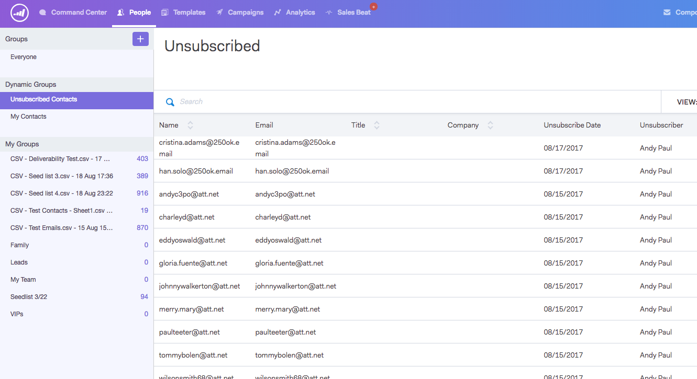

# 그룹 구독 취소 {#unsubscribe-group}

한 곳에서 구독 취소한 모든 사람을 보고 관리합니다.

검색 창을 사용하여 구독 취소한 사람을 조회합니다.

관리자의 경우 구독 취소 그룹으로 이동하여 [!UICONTROL Account Unsubscribes]을(를) 기준으로 필터링하고 사용자 데이터베이스에 수집된 모든 구독 취소를 볼 수 있습니다.

