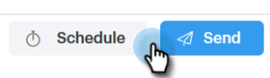

# 선택 및 보내기 {#composing-bulk-emails-with-select-and-send}를 사용하여 벌크 이메일 구성

선택 및 보내기 옵션을 사용하여 이메일을 전송/편집하는 방법은 다음과 같습니다.

## 이메일 보내기 {#sending-emails}

1. 사람 페이지로 이동합니다.

   

1. 이메일로 보낼 사람을 선택합니다.

   

   >[!NOTE]
   >
   >선택 및 전송을 사용할 때는 최대 200명을 선택할 수 있습니다.

1. **선택한 전자 메일** 단추를 클릭합니다.

   

1. 제목 줄을 입력하고 템플릿을 선택(또는 처음부터 이메일 작성)한 다음 [예약](http://docs.marketo.com/x/GAQ6Ag)이메일을 보냅니다.

   

   >[!NOTE]
   >
   >템플릿을 선택하고 보내기 전에 모든 동적 필드가 올바르게 채워지는지 확인하려면 **동적 필드 미리 보기**&#x200B;를 클릭합니다. 모든 이메일을 미리 보기 위해 벌크 사이드바의 모든 받는 사람을 선택해야 합니다. 이메일 하나를 선택하고 **동적 필드 미리 보기**&#x200B;를 클릭하면 해당 이메일만 미리 볼 수 있습니다.

## 이메일 편집 {#editing-emails}

**벌크 편집**

1. [이메일 전송 섹션](http://docs.marketo.com/display/DOCS/Composing+Bulk+Emails+with+Select+and+Send#ComposingBulkEmailswithSelectandSend-SendingEmails)에서 1-3단계를 수행합니다.

   >[!NOTE]
   >
   >모든 수신자는 기본적으로 선택됩니다. 개인을 클릭하고 모든 사람을 다시 선택하려면 **모든 받는 사람**&#x200B;을 클릭합니다. 일괄적으로 편집하려면 모든 수신자를 선택해야 합니다.

1. 편집기에서 변경합니다. 새 이메일을 만들거나 템플릿을 편집할 수 있습니다(이 예에서는 새 이메일을 만듭니다.).

   

   >[!NOTE]
   >
   >특정 전자 메일 수신자를 클릭하여 해당 전자 메일에 전파된 변경 내용을 볼 수 있습니다.

1. **보내기**(또는 [예약](http://docs.marketo.com/x/GAQ6Ag))을 클릭하여 대량 전자 메일 업데이트로 모든 받는 사람에게 보냅니다.

   

**각 이메일 편집**

일괄 업데이트를 완료하면 일괄 작성 사이드바의 모든 이메일에 대한 변경 사항을 덮어쓸 수 있으므로 각 이메일을 사용자 정의하기 전에 일괄 업데이트를 완료합니다.

1. [이메일 전송 섹션에서 1-4단계를 수행합니다.](http://docs.marketo.com/display/DOCS/Composing+Bulk+Emails+with+Select+and+Send#ComposingBulkEmailswithSelectandSend-SendingEmails)

   >[!NOTE]
   >
   >모든 수신자는 기본적으로 선택됩니다. 개인을 클릭하고 모든 사람을 다시 선택하려면 **모든 받는 사람**&#x200B;을 클릭합니다. 일괄적으로 편집하려면 모든 수신자를 선택해야 합니다.

1. 개별 수신자를 선택합니다.

   

1. 편집기에서 변경합니다.

   

   >[!NOTE]
   >
   >이 위치에서 나머지 이메일을 업데이트하지 않고 벌크 사이드바의 한 이메일을 편집할 수 있습니다.

   >[!TIP]
   >
   >다른 수신자를 클릭하여 이전에 선택한 수신자에 대한 변경 내용이 표시되지 않음을 확인할 수 있습니다.

1. **보내기**(또는 [예약](http://docs.marketo.com/x/GAQ6Ag))을 클릭하여 대량 전자 메일 업데이트로 모든 받는 사람에게 보냅니다.

   

   >[!MORELIKETHIS]
   >
   >
   >    
   >    
   >    * [일괄 전송 옵션](http://docs.marketo.com/x/HwQ6Ag)
   >    * [작성 창에서 템플릿 사용](http://docs.marketo.com/x/MQQ6Ag)
   >    * [동적 필드](http://docs.marketo.com/x/wwDb)

