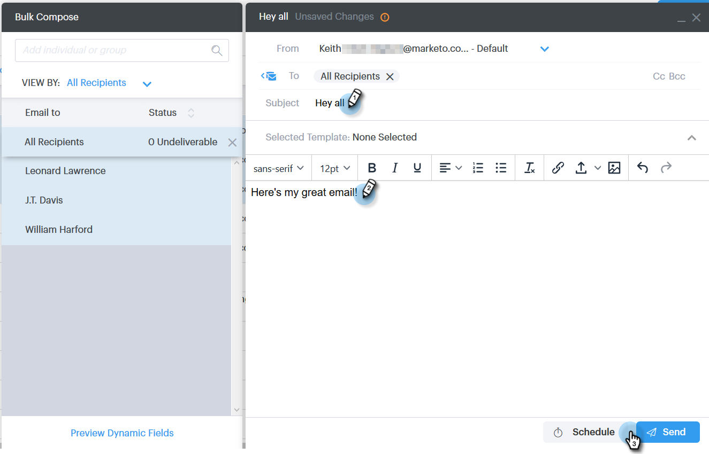

# Select 및 Send를 사용하여 일괄 이메일 작성 {#composing-bulk-emails-with-select-and-send}

선택 및 보내기 옵션을 사용하여 이메일을 보내거나 편집하는 방법은 다음과 같습니다.

## 이메일 보내기 {#sending-emails}

1. 사람 페이지로 이동합니다.

   

1. 전자 메일을 보낼 사람을 선택합니다.

   

   >[!NOTE]
   >
   >선택 및 보내기 사용 시 최대 200명을 선택할 수 있습니다.

1. **선택한 전자 메일** 단추를 클릭합니다.

   

1. 제목 줄을 입력하고 템플릿을 선택하거나 이메일을 처음부터 작성한 후 이메일을 보내십시오/[예약](/help/marketo/product-docs/marketo-sales-connect/email/using-the-compose-window/scheduling-an-email.md).

   

   >[!NOTE]
   >
   >템플릿을 선택했는데 보내기 전에 모든 동적 필드가 올바르게 채워지고 있는지 확인하려면 **동적 필드 미리 보기**&#x200B;를 클릭하세요. 벌크 사이드바의 모든 수신자가 모든 이메일을 미리 볼 수 있도록 선택되어 있는지 확인합니다. 전자 메일 하나를 선택하고 **동적 필드 미리 보기**&#x200B;를 클릭하면 해당 전자 메일만 미리 볼 수 있습니다.

## 이메일 편집 {#editing-emails}

**일괄 편집**

1. [전자 메일 보내기 섹션](#sending-emails)에서 1~3단계를 따릅니다.

   >[!NOTE]
   >
   >기본적으로 모든 수신자가 선택됩니다. 개인을 클릭하고 모든 사람을 다시 선택하려면 **모든 받는 사람**&#x200B;을 클릭하세요. 미리 알림은 일괄 편집하려면 모든 수신자를 선택해야 합니다.

1. 편집기에서 변경 작업을 수행합니다. 새 이메일을 만들거나 템플릿을 편집할 수 있습니다(이 예제에서는 새 이메일을 만드는 것입니다).

   

   >[!NOTE]
   >
   >특정 이메일 수신자를 클릭하여 해당 이메일에 전파된 변경 사항을 볼 수 있습니다.

1. 전자 메일 업데이트를 일괄 처리하여 모든 받는 사람에게 보내려면 **보내기**(또는 [일정](/help/marketo/product-docs/marketo-sales-connect/email/using-the-compose-window/scheduling-an-email.md))를 클릭하세요.

   

**각 전자 메일 편집**

벌크 업데이트를 수행하면 벌크 작성 사이드바의 모든 이메일에 대한 변경 사항이 덮어쓰기되므로 각 이메일을 사용자 정의하기 전에 벌크 업데이트 를 완료합니다.

1. [전자 메일 보내기 섹션](#sending-emails)에서 1~4단계를 따릅니다.

   >[!NOTE]
   >
   >기본적으로 모든 수신자가 선택됩니다. 개인을 클릭하고 모든 사람을 다시 선택하려면 **모든 받는 사람**&#x200B;을 클릭하세요. 미리 알림은 일괄 편집하려면 모든 수신자를 선택해야 합니다.

1. 개별 수신자를 선택합니다.

   

1. 편집기에서 변경 작업을 수행합니다.

   

   >[!NOTE]
   >
   >여기에서 나머지 이메일을 업데이트하지 않고 벌크 사이드바에서 단일 이메일을 편집할 수 있습니다.

   >[!TIP]
   >
   >다른 수신자를 클릭하여 이전에 선택한 수신자에 대한 변경 사항이 표시되지 않는지 확인할 수 있습니다.

1. 전자 메일 업데이트를 일괄 처리하여 모든 받는 사람에게 보내려면 **보내기**(또는 [일정](/help/marketo/product-docs/marketo-sales-connect/email/using-the-compose-window/scheduling-an-email.md))를 클릭하세요.

   

   >[!MORELIKETHIS]
   >
   >* [대량 전송 옵션](/help/marketo/product-docs/marketo-sales-connect/email/using-the-compose-window/bulk-sending-options.md)
   >* [작성 창에서 템플릿 사용](/help/marketo/product-docs/marketo-sales-connect/email/using-the-compose-window/using-a-template-in-the-compose-window.md)
   >* [동적 필드](/help/marketo/product-docs/marketo-sales-connect/templates/dynamic-fields/how-to-insert-dynamic-fields.md)
