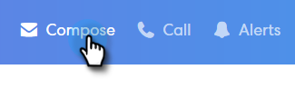

# 추적된 이메일 보내기 {#sending-a-tracked-email}

Marketing To Sales Connect로 이메일을 보낼 때 보기(이메일 열기) 및 클릭(클릭한 링크)이 추적됩니다.

>[!NOTE]
>
>**사전 요구 사항**
>
>추적된 이메일을 보내기 전에 ID를 확인하고 이메일 배달 채널을 설정해야 합니다.
>
>* [이메일 주소 확인](http://docs.marketo.com/x/ewPh)
>* Outlook 또는 Gmail용 배달 [채널](http://docs.marketo.com/x/Z4AOAQ) [설정](http://docs.marketo.com/x/kYMOAQ)

>

1. 이메일 초안을 만듭니다(이 예에서는 헤더에서 작성 **을** 선택함).

   

1. 받는 사람 필드에 받는 사람의 이름 또는 이메일 **을** 입력합니다.

   

   >[!NOTE]
   >
   >받는 사람 필드에 한 사람만 사용할 수 있습니다.

1. 각 필드에 CC 또는 BCC에 사용할 수신자를 추가합니다.

   

   >[!NOTE]
   >
   >CC나 BCC에 있는 사람이 이메일을 열면 받는 사람 필드에 있는 사람의 기록에 **대한 보기로** 열립니다.

1. 제목 줄을 추가합니다.

   

   >[!NOTE]
   >
   >이메일을 전송하려면 제목 및 받는 사람이 있어야 합니다. 제목 및 수신자가 추가되면 **자동으로 초안을** 저장합니다.

1. 편집기를 사용하여 이메일을 작성합니다. 완료되면 **보내기** (또는 [원하는 경우 예약](http://docs.marketo.com/x/GAQ6Ag))를 클릭합니다.

   

   >[!NOTE]
   >
   >**관련 문서**
   >
   >    
   >    
   >    * [이메일 예약](http://docs.marketo.com/x/GAQ6Ag)
   >    * [동적 필드](http://docs.marketo.com/x/wwDb)
   >    * [템플릿 사용](http://docs.marketo.com/display/DOCS/Templates)

