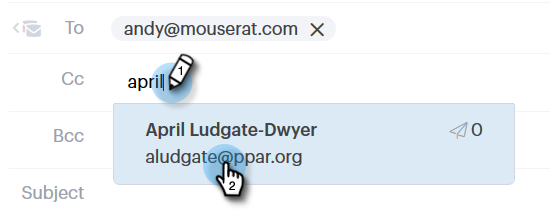

# 추적된 이메일 보내기 {#sending-a-tracked-email}

Marketo Sales Connect를 통해 이메일을 보낼 때 보기 (이메일 열림) 및 클릭 수 (클릭한 링크)가 추적됩니다.

>[!PREREQUISITES]
>
>추적된 이메일을 보내기 전에 ID를 확인하고 이메일 게재 채널을 설정해야 합니다.
>
>* [메일 주소 확인](/help/marketo/product-docs/marketo-sales-connect/getting-started/email-settings/verify-your-email.md)
>* [Outlook](/help/marketo/product-docs/marketo-sales-connect/email-plugins/msc-for-outlook/email-connection-for-outlook-users.md) 또는 [Gmail](/help/marketo/product-docs/marketo-sales-connect/email-plugins/gmail/email-connection-for-gmail-users.md)에 대한 게재 채널 설정

1. 전자 메일 초안을 만듭니다. 이 방법에는 여러 가지가 있습니다. 이 예제에서는 헤더에서 **작성**&#x200B;을 선택합니다.

   

1. **받는 사람** 필드에 받는 사람의 이름 또는 전자 메일을 입력하십시오.

   

   >[!NOTE]
   >
   >종료 필드에는 한 사람만 포함될 수 있습니다.

1. 각 필드에 참조 또는 숨은 참조를 추가할 수신자를 추가합니다.

   

   >[!NOTE]
   >
   >참조 또는 숨은 참조 역할을 받은 사람이 전자 메일을 열면 해당 전자 메일이 **받는 사람** 필드에 있는 사람의 레코드에 보기로 기록됩니다.

1. 제목 줄을 추가합니다.

   

   >[!NOTE]
   >
   >전자 메일을 보내려면 제목란과 수신자가 있어야 합니다. 제목란과 수신자가 추가되면 **초안을 자동으로 저장**&#x200B;합니다.

1. 편집기를 사용하여 이메일을 작성합니다. 완료되면 **보내기**(또는 원하는 경우 [일정](/help/marketo/product-docs/marketo-sales-connect/email/using-the-compose-window/scheduling-an-email.md))을 클릭합니다.

   

   >[!MORELIKETHIS]
   >
   >* [전자 메일 예약](/help/marketo/product-docs/marketo-sales-connect/email/using-the-compose-window/scheduling-an-email.md)
   >* [템플릿](/help/marketo/product-docs/marketo-sales-connect/templates/create-a-new-template.md)
