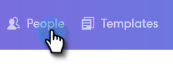
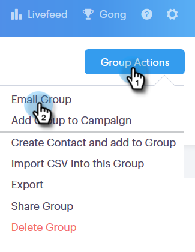
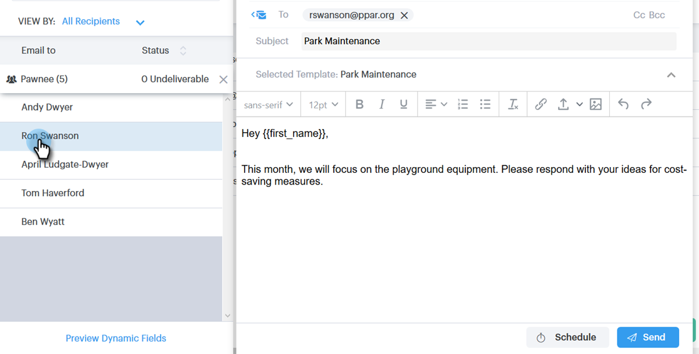
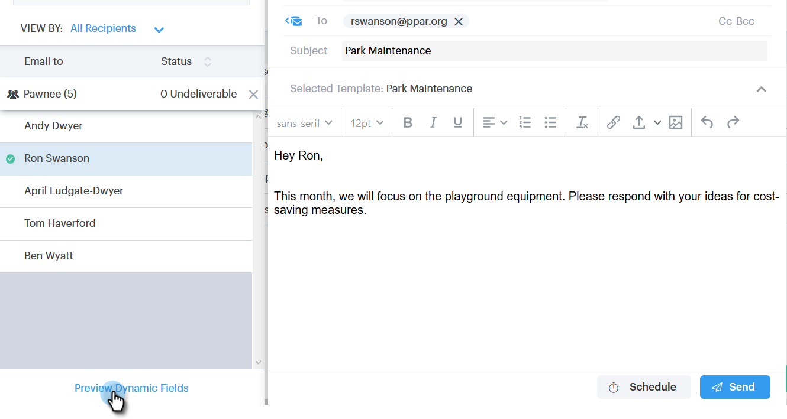

# 그룹 이메일을 통해 이메일 보내기 {#sending-emails-via-group-email}

전자 메일 그룹 옵션을 사용하여 전자 메일을 전송/편집하는 방법은 다음과 같습니다.

## 그룹 이메일 보내기 {#sending-a-group-email}

1. **[!UICONTROL People]** 탭을 클릭합니다.

   

1. 전자 메일을 보낼 그룹을 선택합니다.

   

1. [!UICONTROL Group Actions] 단추를 클릭하고 **[!UICONTROL Email Group]**&#x200B;을(를) 선택합니다.

   

1. 이메일을 작성하고(또는 템플릿 선택) 전송(또는 예약)합니다.

   

## 그룹 이메일 편집 {#editing-a-group-email}

1. [위의 1~3단계](#sending-a-group-email)를 사용하여 그룹 전자 메일을 만듭니다.

1. 템플릿을 선택하거나 이메일을 작성하십시오.

   

1. 이메일을 완료하면 이제 목록에서 각 이메일을 미리 보고 동적 필드가 올바르게 채워지고 있는지 확인할 수 있습니다.

   

1. 원하는 수신자를 선택합니다.

   

1. **[!UICONTROL Preview Dynamic Fields]**&#x200B;을(를) 클릭하고 오른쪽의 미리 보기를 봅니다.

   

   >[!NOTE]
   >
   >그룹 이메일을 보낼 때 이메일/템플릿을 일괄 편집할 수 있지만 목록의 특정 수신자에 대해 고유한 편집을 수행할 수 없습니다.

>[!MORELIKETHIS]
>
>* [대량 전송 옵션](/help/marketo/product-docs/marketo-sales-connect/email/using-the-compose-window/bulk-sending-options.md)
>* [작성 창에서 템플릿 사용](/help/marketo/product-docs/marketo-sales-connect/email/using-the-compose-window/using-a-template-in-the-compose-window.md)
