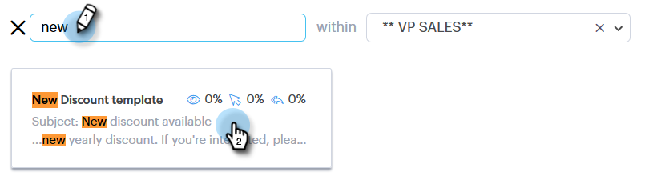

# 작성 창 {#using-a-template-in-the-compose-window}에서 템플릿 사용

## 템플릿 찾기 및 사용 {#finding-and-using-templates}

1. 이메일 초안을 만듭니다(이 예에서는 헤더에서 **작성**&#x200B;을 선택합니다).

   

1. 받는 사람 필드를 채웁니다.

   

1. 템플릿 섹션에서 검색 아이콘을 클릭하여 템플릿 검색 필드를 엽니다.

   

1. 검색할 카테고리를 선택합니다(또는 모든 카테고리에서 검색하려면 모두를 선택).

   

1. 템플릿 이름, 제목 줄 또는 이메일 본문으로 검색합니다. 원하는 템플릿을 클릭하여 선택합니다.

   

   >[!NOTE]
   >
   >다른 템플릿을 선택하면 현재 편집기에 있는 모든 정보가 대체됩니다. 변경 사항이 있는 경우 다른 템플릿을 선택하기 전에 해당 템플릿을 복사해야 합니다.

## 작성 창 {#pinning-template-categories-in-the-compose-window}에서 템플릿 카테고리 고정

가장 많이 사용하는 템플릿에 빠르게 액세스할 수 있도록 최대 5개의&#x200B;**특정 템플릿 카테고리를 즐겨찾기에 추가할 수 있습니다.**

1. 이메일 초안을 만듭니다(이 예에서는 헤더에서 **작성**&#x200B;을 선택합니다).

   

1. 즐겨찾기 옆에 있는 **+** 아이콘을 클릭합니다.

   

1. **범주 고정** 드롭다운을 클릭하고 원하는 범주를 선택합니다.

   

1. 완료되면 **변경 내용 저장**&#x200B;을 클릭합니다(선택 사항:추가하려면 3단계를 반복합니다.)

   

   >[!TIP]
   >
   >변경 내용을 저장하기 전에 드래그하여 놓는 방식으로 고정된 카테고리를 간단히 재정렬할 수 있습니다.

   

   >[!NOTE]
   >
   >**기본적으로** 여기에서 즐겨찾기입니다. 카테고리가 아니라 즐겨찾기 이메일 템플릿을 보관합니다.

   >[!NOTE]
   >
   >**관련 문서**
   >
   >    
   >    
   >    * [동적 필드](http://docs.marketo.com/x/wwDb)
   >    * [템플릿 사용](http://docs.marketo.com/display/DOCS/Templates)

이제 선택한 카테고리가 고정됩니다.