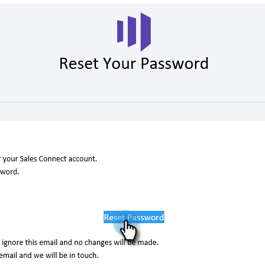

# Sales Connect 암호 변경 {#change-your-sales-connect-password}

암호를 변경하시겠습니까? 방법은 다음과 같습니다.

## 로그인하는 동안 암호 변경 {#change-your-password-while-signed-in}

1. 톱니바퀴 아이콘을 클릭하고 **[!UICONTROL Settings]**&#x200B;을(를) 선택합니다.

   

1. 기본적으로 [!UICONTROL My Profile] 페이지가 열립니다. [!UICONTROL Account Details]에서 **[!UICONTROL Change password]** 확인란을 선택합니다.

   

1. 현재 암호를 입력합니다. 그런 다음 새 이름을 입력하고 일치하는지 다시 입력합니다. 완료되면 **[!UICONTROL Save]**&#x200B;을(를) 클릭합니다.

   

>[!NOTE]
>
>암호는 다음과 같아야 합니다.
>
>* 9자 이상 포함
>* 대/소문자를 혼합하여 사용(상/하 모두)
>* 숫자 포함
>* 특수 문자 사용

## 로그아웃하는 동안 암호 변경 {#change-your-password-while-signed-out}

1. [Sales Connect 로그인](https://toutapp.com/login) 페이지로 이동하고 **[!UICONTROL Forgot password?]**&#x200B;을(를) 클릭합니다.

   

1. 계정과 연결된 전자 메일 주소를 입력하고 **[!UICONTROL Send Reset Email]**&#x200B;을(를) 클릭합니다.

   

1. 계정 소유자가 암호를 변경하고자 하는지 확인하기 위해 이메일을 보내드리겠습니다. **[!UICONTROL Reset Password]**&#x200B;을(를) 클릭합니다.

   

   >[!NOTE]
   >
   >이 이메일이 스팸 폴더로 배달되는 경우가 있으므로 스팸 폴더도 반드시 확인하십시오.

1. 새 암호를 입력하고 확인합니다. 완료되면 **[!UICONTROL Set Password]**&#x200B;을(를) 클릭합니다.

   
