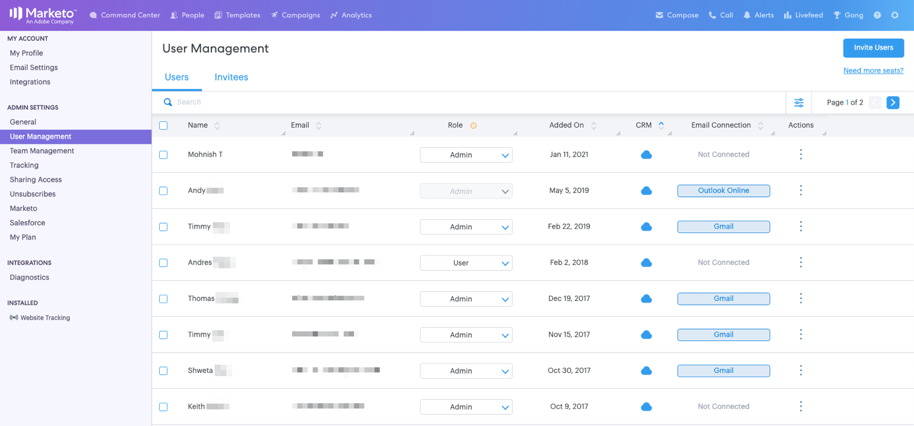

# [!DNL Sales Connect] 관리자를 위한 시작 안내서 {#getting-started-guide-for-sales-connect-admins}

이 문서는 새 [!DNL Sales Connect] 인스턴스를 설정하는 초기 단계를 안내합니다. 이 단계 중 일부는 Marketo 관리자, [!DNL Salesforce] 관리자 및 [!DNL Sales Connect] 관리자로 액세스해야 합니다. 아래 안내서에 따라 인스턴스 설정을 완료합니다.

>[!NOTE]
>
>**관리자 권한이 필요합니다.**

## 새 Marketo Sales Connect 계정 액세스 {#accessing-your-new-marketo-sales-connect-account}

Marketo Sales Connect를 구매한 경우 Marketo의 관리 섹션에서 인스턴스에 대한 액세스 권한이 프로비저닝됩니다. Marketo 관리자가 새 인스턴스에 대한 액세스 권한을 프로비저닝할 수 있는 방법에 대한 지침을 보려면 [여기를 클릭](/help/marketo/product-docs/marketo-sales-connect/getting-started/accessing-your-new-sales-connect-instance.md){target="_blank"}하십시오.

## 사용자 초대 및 관리 {#inviting-and-managing-users}

Marketo에서 Marketo Sales Connect 계정을 프로비저닝하고 첫 번째 관리 사용자를 초대하면 해당 관리 사용자는 Marketo Sales Connect 사용자 관리 페이지에서 추가 사용자를 초대할 수 있습니다. 사용자 관리 페이지에서 사용자를 초대하는 방법을 보려면 [여기를 클릭](/help/marketo/product-docs/marketo-sales-connect/admin/invite-users.md){target="_blank"}하십시오.

## [!DNL Salesforce]에 연결 중 {#connecting-to-salesforce}

전자 메일, 통화 및 작업과 같은 Salesforce에 판매 활동을 기록하려면 모든 사용자가 개별적으로 [!DNL Salesforce]에 연결해야 합니다. 그러나 관리자로 Salesforce에 연결하면 전체 팀에 대한 활동 로깅 설정을 구성할 수 있으므로 전역 로깅 설정이 모든 [!DNL Sales Connect] 사용자에게 적용됩니다.

관리자 또는 관리자가 아닌 사용자의 Sales Connect 인스턴스를 Salesforce 인스턴스에 연결하려면 [이 문서](/help/marketo/product-docs/marketo-sales-connect/crm/salesforce-integration/connect-your-sales-connect-account-to-salesforce.md){target="_blank"}의 단계를 따르십시오.

## Marketo에 연결 {#connecting-to-marketo}

Marketo에 연결하면 판매자는 향후 노력에서 마케팅 자동화 및 마케팅 통찰력을 활용할 수 있습니다. 다음 기능을 사용하려면 Marketo과의 통합을 설정해야 합니다.

* 판매자와 [마케팅 캠페인](/help/marketo/product-docs/marketo-sales-connect/marketo/make-a-campaign-visible-to-sales-connect-users.md){target="_blank"} 공유
* 라이브 피드에 [관심 있는 순간](/help/marketo/product-docs/marketo-sales-connect/marketo/interesting-moments-in-sales-connect.md){target="_blank"} 푸시
* Marketo에 판매 활동 로깅

Marketo에 연결하고 판매 사용자에게 연결에 대한 액세스 권한을 부여하는 방법에 대해 자세히 알아보려면 [여기를 클릭](/help/marketo/product-docs/marketo-sales-connect/marketo/set-up-your-marketo-connection.md){target="_blank"}하십시오.

## [!DNL Salesforce] 사용자 지정 패키지 설치 중 {#installing-salesforce-customization-package}

영업을 성공적으로 이끌 수 있도록 하는 일부분은 기본 작업 영역에서 적절한 기능을 갖추는 것을 의미합니다. Sales Connect 사용자 정의 패키지를 사용하면 Salesforce에서 참여 기능 및 주요 영업 활동 속성에 액세스할 수 있습니다.

Sales Connect 사용자 지정 설치에 대한 자세한 내용을 보려면 [여기를 클릭](/help/marketo/product-docs/marketo-sales-connect/crm/salesforce-customization/sales-connect-customizations-for-crm.md){target="_blank"}하십시오.

## 샌드박스에서 테스트 {#testing-in-sandbox}

Marketo Sales Connect를 Marketo Sandbox와 테스트하려는 팀의 경우 요청 시 추가 Sales Connect 계정을 프로비저닝할 수 있습니다. Marketo 샌드박스를 구입한 고객 또는 Marketo 번들의 일부로 구매한 고객에게만 해당됩니다. 샌드박스를 획득하려면 Marketo 계정 관리자에게 문의하십시오.

>[!NOTE]
>
>동일한 이메일 ID로 여러 인스턴스에 Sales Connect 계정을 프로비저닝할 수 없습니다. 즉, Marketo Sandbox 인스턴스로 테스트할 추가 Sales Connect 계정이 있으려면 각 계정에서 다른 이메일 ID를 사용해야 합니다.

>[!MORELIKETHIS]
>
>[관리자 권한](/help/marketo/product-docs/marketo-sales-connect/admin/user-access-details.md){target="_blank"}
