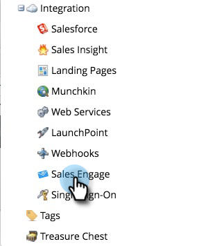

# Sales Connect 시작하기 {#getting-started-with-sales-connect}

이 단계를 읽기보다는 시청하려면 [비디오 지침 아래](#video)으로 바로 건너뛰어 보십시오.

>[!AVAILABILITY]
>
>모든 고객이 이 기능을 구입하지는 않았습니다. 자세한 내용은 고객 성공 관리자에게 문의하십시오.

## {#what-you-need-to-get-started}을(를) 시작하려면 필요한 것

* Marketing To 구독
* Sales Connect 구독
* Salesforce 구독(API 호출 및 Apex 클래스가 활성화된 경우)

## {#who-you-need-to-get-started}을(를) 시작해야 하는 사용자

* Marketing To 관리자 사용자
* Sales Connect 관리자 사용자
* Salesforce 관리자
* Sales Connect 사용자

## 영업 연결 관리자 {#sales-connect-admins}

암호를 재설정하는 링크가 포함된 이메일을 Marketing To로부터 받게 됩니다. 새 암호를 만든 후 Sales Connect에 로그인합니다.

설정을 완료하려면 다음을 수행해야 합니다.

* [Connect Sales Connect 및 Salesforce](#sfdc)
* [Sales Connect와 Marketing To를 연결하기 전에 자격 증명 획득](#acquire)
* [Adobe Sales Connect와 Marketing To 연결](#mkto)
* [사용자 초대/프로비저닝](#IPU)

원할 경우, 다음을 수행할 수도 있습니다.

* [샌드박스에서 세일즈 연결 테스트](#sandbox)

## Sales Connect 계정을 Salesforce {#connect-your-sales-connect-account-to-salesforce}에 연결

Sales Connect 계정을 Salesforce 계정에 연결하려면 관리자 또는 관리자가 아닌 사용자가 [이 문서](http://docs.marketo.com/x/JwDb)의 단계를 따르십시오.

>[!NOTE]
>
>연결할 Salesforce의 인스턴스는 Marketing To에 연결되어 있거나 연결할 인스턴스와 같아야 합니다.

## Marketing Cloud와 Sales Connect를 연결하기 전에 자격 증명 얻기 {#acquiring-credentials-prior-to-connecting-sales-connect-with-marketo}

Marketing To 내에서 자격 증명 세트를 받아야 합니다. 이러한 자격 증명은 나중에 Sales Connect 관리자가 Marketing To를 Sales Connect와 연결하는 데 사용됩니다.

1. Marketing에서 **관리**&#x200B;를 클릭합니다.

   

1. 트리에서 **판매 연결**&#x200B;을 클릭합니다.

   

1. 다음 Marketing To 자격 증명을 선택하고 Sales Connect 관리자에게 전송합니다.Munchkin ID, 클라이언트 ID, 클라이언트 암호.

   

   >[!NOTE]
   >
   >위 정보를 복사하여 붙여넣을 때 공백이 추가되지 않도록 하십시오.

## Marketing에 판매 연결 {#connect-sales-connect-to-marketo}

1. Sales Connect에서 톱니바퀴 아이콘을 클릭하고 **설정**&#x200B;을 선택합니다.

   

1. 관리 설정에서 **Marketing**&#x200B;을 선택합니다.

   

1. 마케팅 관리자가 제공하는 마케팅 자격 증명을 입력하고 **연결**&#x200B;을 클릭합니다.

   

## 사용자 초대/프로비저닝 {#invite-provision-users}

계정에 이미 사용자(이전 ToutApp)가 있는 사용자가 있으면 Sales Connect의 Marketing 섹션에 있는 **팀 액세스** 탭에 표시됩니다.

이 페이지에서 Marketing To Sales Connect 사용자로 팀을 프로비저닝할 수 있습니다. ToutApp을 사용하지 않았거나 사용자를 아직 초대하지 않은 경우 [이 문서](http://docs.marketo.com/display/TOUT/Invite+Team+Members)의 단계를 따르십시오.

>[!CAUTION]
>
>Sales Connect를 Marketing To와 연결한 후 10분 후에 이 단계를 수행하십시오.

1. 하나 이상의 사용자를 선택한 다음 **Connect**&#x200B;를 클릭합니다.

   >[!NOTE]
   >
   >사용자를 초대할 때는 작업 공간 지정을 한 번만 수행할 수 있습니다. 설정을 완료한 후 변경하려면 사용자의 연결을 해제해야 합니다.

   

1. Marketing To 구독의 작업 영역이 활성화되어 있으면 각 사용자 또는 사용자 집합에 작업 영역을 일괄 할당할 수 있습니다. 선택한 작업 영역이 없으면 기본 마케팅 작업 영역에 할당합니다.

   

1. 작업 공간 드롭다운을 클릭하고 원하는 작업 영역을 선택한 다음 **Connect**&#x200B;를 클릭합니다.

   

   >[!NOTE]
   >
   >새 사용자를 추가하려면 관리 설정의 팀 관리 섹션으로 이동하여 **사용자 초대** 단추를 클릭합니다.

[팀 관리] 페이지에서 추가 사용자를 추가하고 위의 단계를 따라 사용자를 연결할 수 있습니다.

## 샌드박스에서 세일즈 연결 테스트 {#test-sales-connect-in-your-sandbox}

Marketing To Sales Connect를 Marketing To Sandbox와 함께 테스트하려는 팀의 경우, 요청 시 추가 Sales Connect 계정을 프로비저닝할 수 있습니다. Marketing To Sandbox를 구입한 고객 또는 Marketing To 번들의 일부로 Marketing Cloud 샌드박스를 구입한 고객에게만 해당됩니다. 샌드박스 취득에 관심이 있는 경우 마케팅 계정 관리자에게 문의하십시오.

>[!NOTE]
>
>동일한 이메일 ID로 Sales Connect 계정을 여러 인스턴스에 제공할 수 없습니다. 즉, Marketing To Sandbox 인스턴스와 함께 테스트하기 위해 추가 Sales Connect 계정이 필요한 경우 각 계정에서 다른 이메일 ID를 사용해야 합니다.
