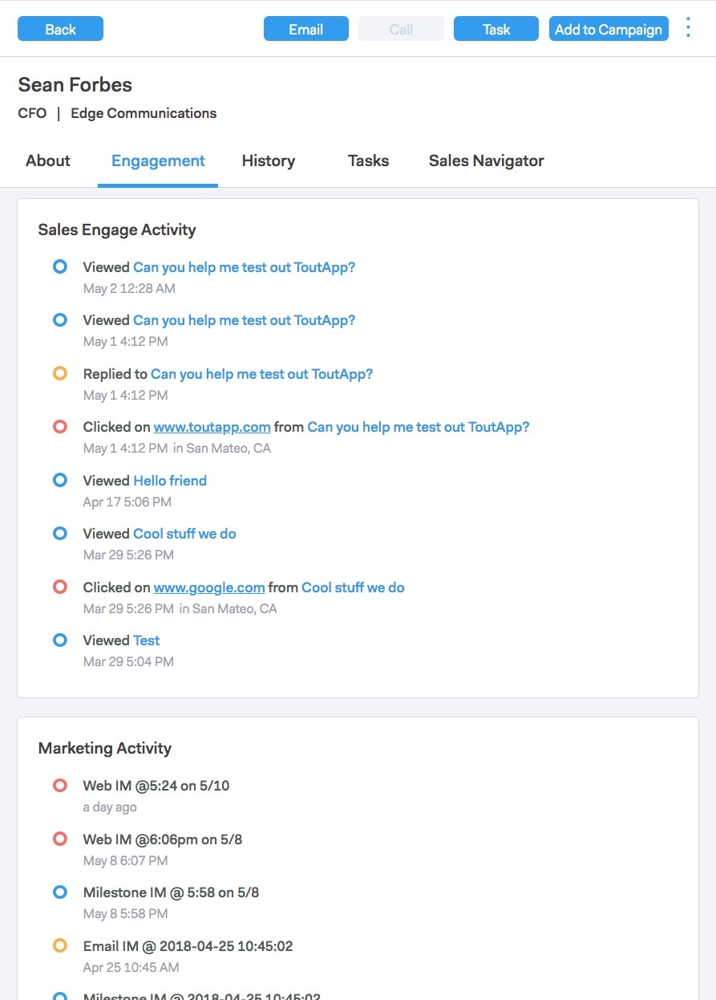

# Sales Connect 개요 {#sales-connect-overview}

Marketing Sales Connect는 다양한 기능을 제공하는 다면적인 영업 지원 솔루션으로, 영업 주기 전반에서 고객 참여를 높일 수 있습니다.

>[!NOTE]
>
>**가용성**
>
>모든 고객이 이 기능을 구입하지는 않았습니다. 자세한 내용은 고객 성공 관리자에게 문의하십시오.

## 라이브 피드 {#the-live-feed}

세일즈 담당자는 [마케팅 및 세일즈 컨텐츠의 실시간 참여를](http://docs.marketo.com/x/d4TS) 볼 수 있습니다.

## 개인 세부 사항 보기 {#person-detail-view}

자세한 사용자 통계 [에 액세스할 수 있습니다](http://docs.marketo.com/x/e4TS).

## 마케팅 활동 로그에서 결과 보기 {#see-results-in-your-marketo-activity-log}

잠재 고객이 세일즈 활동에 참여하는 방법을 살펴보십시오.

<table> 
 <tbody> 
  <tr> 
   <th>활동 유형</th> 
   <th>설명</th> 
  </tr> 
  <tr> 
   <td>
세일즈 이메일 보내기
</td> 
   <td>
사용자가 MSE에서 판매 이메일을 보냈습니다.
</td> 
  </tr> 
  <tr> 
   <td>
영업 이메일 열기
</td> 
   <td>
리드가 MSE에서 보낸 판매 이메일을 열었습니다.
</td> 
  </tr> 
  <tr> 
   <td>
영업 이메일을 클릭합니다.
</td> 
   <td>
리드가 MSE에서 보낸 판매 이메일의 링크를 클릭했습니다.
</td> 
  </tr> 
  <tr> 
   <td colspan="1">
세일즈 이메일 수신
</td> 
   <td colspan="1">
리드가 MSE로부터 이메일을 수신했습니다.
</td> 
  </tr> 
  <tr> 
   <td colspan="1">
세일즈 전화 받기
</td> 
   <td colspan="1">
리드는 영업 <a href="http://docs.marketo.com/x/NgDb" rel="nofollow">전화를 사용하여 영업사원에게 전화를 받았다</a>.
</td> 
  </tr> 
  <tr> 
   <td colspan="1">
영업 캠페인에 추가
</td> 
   <td colspan="1">
리드가 MSE에서 만든 판매 캠페인에 추가되었습니다(캠페인 페이지).
</td> 
  </tr> 
  <tr> 
   <td colspan="1">
영업 캠페인에서 제거됨
</td> 
   <td colspan="1">
영업 캠페인에서 리드가 제거되었습니다.
</td> 
  </tr> 
  <tr> 
   <td colspan="1">
흥미로운 순간
</td> 
   <td colspan="1">
리드는 마케팅에서 흥미로운 순간을 경험했습니다.
</td> 
  </tr> 
 </tbody> 
</table>

## 마케팅 캠페인 공유 {#share-marketing-campaigns}

간단한 스마트 캠페인을 만들어 판매 사용자에게 Marketing [to 캠페인 데이터에 액세스할 수 있도록 합니다](http://docs.marketo.com/x/NwDh).

시작할 준비가 되셨습니까? 설치 지침을 보려면 아래 링크를 클릭하십시오.

>[!NOTE]
>
>**관련 문서**
>
>* [Sales Connect 시작하기](http://docs.marketo.com/x/coTS)

>

