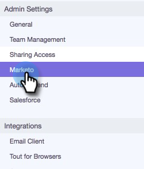

# Marketo 연결 설정 {#set-up-your-marketo-connection}

>[!NOTE]
>
>MSC를 프로비저닝하면 Marketo에서 자격 증명을 [!DNL Sales Connect]에 자동으로 보내고 인스턴스를 Marketo에 연결합니다. 이 단계는 **인스턴스가 프로비저닝된 후** 연결이 설정되지 않은 경우에만 [!DNL Sales Connect]필요합니다. 연결이 설정되면 Marketo 관리 설정 페이지에 입력한 자격 증명이 표시됩니다.

## [!DNL Sales Connect]을(를) Marketo에 연결하기 전에 자격 증명을 가져오는 중 {#acquiring-credentials-prior-to-connecting-sales-connect-with-marketo}

Marketo 내에서 자격 증명 세트를 가져와야 합니다. 이러한 자격 증명은 나중에 [!DNL Sales Connect] 관리자가 [!DNL Sales Connect]과(와) Marketo에 연결하는 데 사용됩니다.

1. Marketo에서 **[!UICONTROL Admin]**&#x200B;을(를) 클릭합니다.

   

1. 트리에서 **[!UICONTROL Sales Engage]**&#x200B;을(를) 클릭합니다.

   

1. 다음 Marketo 자격 증명을 선택하여 [!DNL Sales Connect] 관리자에게 보냅니다. [!UICONTROL Munchkin Account ID], [!UICONTROL Client ID], [!UICONTROL Client Secret].

   

   >[!NOTE]
   >
   >위의 정보를 복사하여 붙여넣을 때 공백이 추가되지 않도록 하십시오.

## Marketo에 [!DNL Sales Connect] 연결 {#connect-sales-connect-to-marketo}

1. [!DNL Sales Connect]에서 톱니바퀴 아이콘을 클릭하고 **[!UICONTROL Settings]**&#x200B;을(를) 선택합니다.

   

1. [!UICONTROL Admin Settings]에서 **[!UICONTROL Marketo]**&#x200B;을(를) 선택합니다.

   

1. Marketo 관리자가 제공한 Marketo 자격 증명을 입력하고 **[!UICONTROL Connect]**&#x200B;을(를) 클릭합니다.

   
