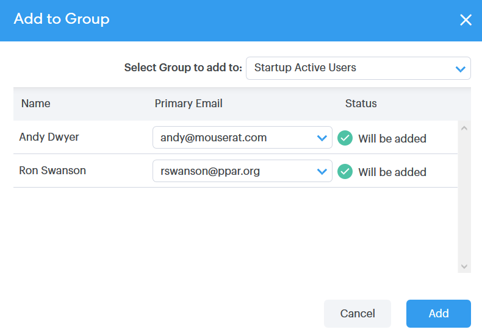

# 사용자 {#bulk-actions-on-people}에 대한 일괄 작업

연락처를 사용하여 시간을 절약하기 위해 몇 가지 할 수 있는 일이 있다.

사용 가능한 모든 벌크 작업의 첫 번째 단계는 두 개 이상의 연락처를 선택하고 도타(세 개의 세로 점)를 클릭하는 것입니다.

## 그룹에 사람 추가 {#add-people-to-group}

여러 사람을 그룹에 동시에 추가할 수 있습니다.

## 소스 {#source}

데이터베이스에 들어오는 모든 연락처에 자동으로 소스를 할당합니다. 이 단계를 사용하여 해당 소스를 업데이트합니다.

>[!NOTE]
>
>소스를 사용자 지정할 수 없습니다.

## 인증 {#authorization}

[GDPR](http://eugdpr.org/)을 준수하여 권한을 받은 방법을 지정하여 이러한 연락처와 교류할 수 있습니다.

## {#unsubscribe} 구독 취소

더 이상 귀하로부터 메시지를 받지 않으려는 연락처에 대한 대량 가입 해지를 수행합니다.

## {#delete} 삭제

연락처를 일괄 삭제합니다. 전체 단계는 [여기](http://docs.marketo.com/display/DOCS/How+to+Add+or+Delete+Contacts#HowtoAddorDeleteContacts-DeletingContacts)에서 찾을 수 있습니다.

