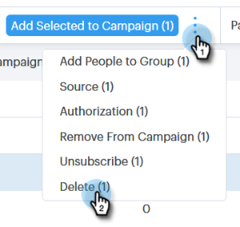

# 연락처 만들기 및 삭제 {#creating-and-deleting-contacts}

## 연락처 만들기 {#creating-contacts}

1. 사람 페이지에서 **그룹 작업** 단추를 클릭하고 연락처 **만들기를 선택합니다**.

   

1. 원하는 기타 정보와 함께 이름/성 및 이메일 주소를 입력합니다. 완료 시 **만들기** 또는 **새로 만들기** 및 추가를 클릭하여 연락처를 더 추가합니다.

   

   >[!TIP]
   >
   >한 번에 여러 연락처를 추가하시겠습니까? [CSV를 통해 연락처를 가져오는 방법을 알려면 여기를](http://docs.marketo.com/x/VADb) 클릭하십시오.

## 연락처 삭제 {#deleting-contacts}

1. 사람 페이지에서 삭제할 연락처 상자를 선택합니다.

   

   >[!NOTE]
   >
   >여러 연락처를 삭제하려면 여러 사람을 선택하면 됩니다. 나머지 단계는 동일합니다.

1. 도타(세 개의 세로 점)를 클릭하고 삭제를 선택합니다.

   

1. 연락처 삭제를 클릭하여 확인합니다.

   
