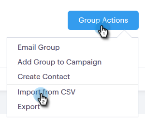

# CSV를 통해 연락처 가져오기 {#import-contacts-via-csv}

사람 페이지에 연락처를 두는 것은 템플릿의 동적 필드에 있는 개인화된 정보를 자동으로 입력하는 곳이기 때문에 중요합니다. CSV의 각 연락처에 대해 이름과 이메일 주소를 최소한 가지고 있어야 하며 해당 필드에 매핑해야 합니다.

1. [사람] 탭에서 그룹을 선택하거나 새 그룹을 만듭니다.

   

1. 그룹 **작업을** 클릭하고 **CSV 가져오기를 선택합니다**.

   

1. 찾아보기를 **클릭합니다**.

   

1. 컴퓨터에서 파일을 찾아 선택합니다.

   >[!NOTE]
   >
   >그룹은 1000개의 연락처로 제한됩니다.

1. 다음을 **클릭합니다**.

   

1. Sales Connect의 각 필드에 CSV의 열을 매핑합니다. 완료되면 **다음** 을 클릭합니다.

   

