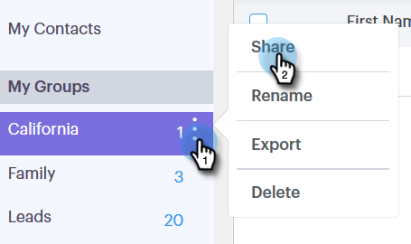

# 그룹 관리 {#manage-groups}

Sales Connect에서 그룹을 관리하는 방법을 알아봅니다.

## 그룹 {#create-a-group} 만들기

1. 사람 페이지에서 그룹 옆에 있는 **더하기 기호**&#x200B;를 클릭합니다.

   

1. 그룹 이름을 지정하고 **만들기**&#x200B;를 클릭합니다.

   

   바로 그거야!

## 그룹 {#add-contacts-to-a-group}에 연락처 추가

1. 사람 페이지에서 사람을 추가할 그룹을 찾아서 선택합니다.

   

1. **그룹 작업**&#x200B;을 클릭하고 **연락처 만들기**&#x200B;를 선택합니다.

   

   >[!NOTE]
   >
   >이렇게 하면 한 번에 한 명의 담당자가 추가됩니다. 동시에 여러 연락처를 추가하려면 [다음 단계](http://docs.marketo.com/x/VADb)를 따르십시오.

1. 연락처 정보를 채우고 **만들기**(또는 **새로 만들기 및 추가**&#x200B;를 클릭하여 다른 연락처 정보를 추가합니다.)

   

   이제 모든 작업이 끝났습니다.

   >[!NOTE]
   >
   >새로 추가된 연락처를 보려면 새로 고침을 눌러야 할 수도 있습니다.

## 그룹 {#share-a-group} 공유

1. [사람] 페이지에서 공유할 그룹을 찾아 선택합니다.

   

1. 도타(세 개의 세로 점)를 클릭하고 **공유**&#x200B;를 선택합니다.

   

1. 드롭다운을 클릭하고 그룹을 공유할 팀을 선택합니다.

   

1. **공유**&#x200B;를 클릭합니다.

   

   여전히 그룹을 소유하고 있지만 이제 팀 그룹 아래에 표시됩니다.

## 그룹 {#unshare-a-group} 공유 취소

1. 사람 페이지에서 공유를 취소할 그룹을 찾아 선택합니다.

   

1. 도타(세 개의 세로 점)를 클릭하고 **공유**&#x200B;를 선택합니다.

   

1. 그룹을 공유한 팀 옆의 **X**&#x200B;을 클릭한 다음 모달 밖으로 를 클릭합니다.

   

   이제 그룹이 공유되지 않습니다.

## 그룹 이름 바꾸기 {#rename-a-group}

1. 사람 페이지에서 이름을 변경할 그룹을 찾아 선택합니다.

   

1. 도타(세 개의 세로 점)를 클릭하고 **이름 바꾸기**&#x200B;를 선택합니다.

   

1. 새 이름을 입력하고 Enter 키를 누릅니다.

   

## {#delete-a-group} 그룹 삭제

1. 사람 페이지에서 삭제할 그룹을 찾아 선택합니다.

   

1. 도타(세 개의 세로 점)를 클릭하고 **삭제**&#x200B;를 선택합니다.

   

1. **삭제**&#x200B;를 클릭하여 확인합니다.

   

