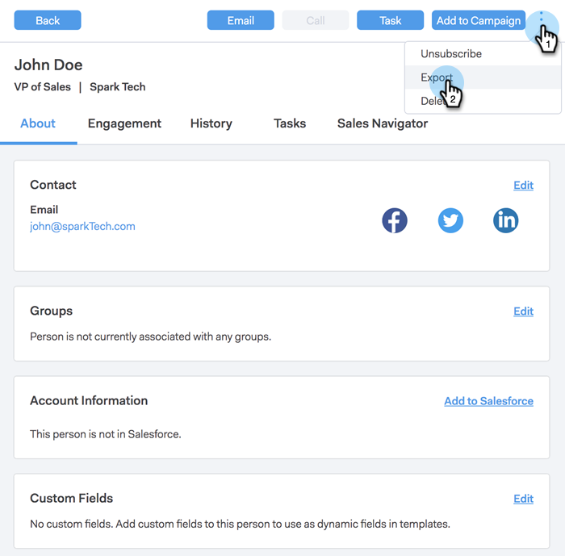

# 영업 연결 및 GDPR 준수 {#sales-connect-and-gdpr-compliance}

GDPR(General Data Protection Regulation)은 2018년 5월 25일부터 시행된 유럽 연합 법입니다.

## 개요 {#overview}

개인 데이터의 사용 및 보호 방법과 관련하여 유럽 연합(EU)과 유럽 경제 지역(EEA) 내의 데이터 주체의 권리를 강화하는 것이 목표입니다. 개인 데이터(Personal Data)는 식별되거나 식별 가능한 자연인과 관련된 모든 정보를 의미합니다.

GDPR은 6가지 주요 원칙(법률 제5조에 자세히 설명됨)으로 구성됩니다.

1. 데이터 사용 방법과 데이터 용도를 위한 투명성.
1. 수집된 데이터가 수집 시 명시적으로 지정된 용도로만 사용되도록 합니다.
1. 데이터 수집을 수집 목적에 제공하는 데 필요한 것으로 제한합니다.
1. 데이터가 정확한지 확인합니다.
1. 필요한 기간 동안에만 데이터를 저장합니다.
1. 적절한 보안 조치를 배포하여 무단 사용 또는 우발적 데이터 손실 방지

또한 규정 준수 관리 및 추적에 대한 새로운 책임 요구 사항이 있습니다. 즉, 개인 데이터가 수집되는 방법과 이유에 대한 기록과 이를 보호하기 위해 작성된 프로세스 설명서를 유지합니다.

## 누구에게 적용되나요? {#to-whom-does-it-apply}

GDPR은 EU 및 EEA 내의 데이터 주체에 대한 마케팅 상품 또는 서비스를 제공 및/또는 추적하는 EU 내부 또는 외부의 모든 조직에 적용됩니다. 개인 데이터 처리가 포함된 유럽의 데이터 주체와 거래를 하는 경우, 이 규정이 사용자에게 적용됩니다. 규정 위반 행위에 대한 벌금은 중요하며, 규정을 위반한 사람에게는 큰 벌금이 부과됩니다. 한 번에 위반될 경우 최고 배상액은 전 세계 매출 연계의 4%인 2000만유로(약200억원)보다 많다.

## 마케팅에 대한 의미 {#implications-for-marketing}

마케터는 개인적 및 인간적인 느낌을 주며, 신뢰를 기반으로 하여 고객 경험을 형성하여 고객 관리에 대한 도움을 얻고자 합니다. GDPR에서는 이러한 용어를 사용하지 않지만, 목표는 고객의 권한을 존중하고 신뢰를 얻기 위해 동일합니다. 이러한 신뢰를 구축하고 유지하기 위해 마케터는 고객이 약혼하는 방법, 시기 및 이유를 알고 있어야 합니다. 고객 선호도는 법적 요구 사항뿐만 아니라 고객 중심의 참여 관행의 기반으로서 존중되어야 합니다.

마케터가 작업 과정에서 일상적으로 사용되는 개인 데이터의 수집, 사용 및 보안에 대한 이러한 높은 기대치를 해결하는 방법은 가장 중요하며, Marketo은 이러한 기대치를 충족하는 데 도움이 될 수 있습니다.

GDPR에는 마케터가 과거, 현재 및 향후 사례를 검토해야 하는 두 가지 주요 측정이 있습니다. 첫 번째는 개인이 개인 데이터를 처리하는 데 동의하며, 두 번째는 어떻게 GDPR의 원칙을 준수하고 있는지를 입증할 수 있는 책임입니다.

Adobe는 Adobe e-Book에서 Marketo 플랫폼 내에서 동의 및 책임에 대한 광범위한 정보를 제공합니다. [GDPR 및 마케터](https://www.marketo.com/ebooks/the-gdpr-and-the-marketer/). 그러나 이 문서에서는 조직이 GDPR 규칙을 준수하는 데 도움이 되는 Marketo Sales Connect의 새로운 기능에 특히 중점을 둡니다.

## Marketo Sales Connect의 GDPR 준수 {#gdpr-compliance-in-marketo-sales-connect}

Marketo Sales Connect는 Marketo Engagement Platform의 일부인 강력한 애플리케이션으로서, 공동 작업을 통해 공동 작업을 통해 보다 신속하게 파이프라인을 생성할 수 있는 단일 워크플로우 및 판매 및 마케팅을 위한 보기를 제공합니다. Marketo Sales Connect의 새로운 기능은 특히 GDPR 준수를 염두에 두고 만들어졌습니다. Adobe는 세 가지 기능에 대해 간략하게 설명하고 이 기능을 제대로 사용할 경우 조직의 GDPR 준수 노력을 어떻게 지원할 수 있는지 설명합니다.

## 준수 카드 {#compliance-card}

Marketo Sales Connect에는 담당자 세부 정보 보기에 준수 카드가 포함되어 연락처의 인증 유형과 소스 유형에 대한 주요 정보를 제공합니다. 이를 통해 사용자는 데이터 개인 정보에 중요한 정보를 쉽게 추가 및 추적할 수 있고, 캠페인/도달 전략을 보다 현명한 결정을 내릴 수 있습니다.

연락처 인증 유형

규정 준수 카드 내에서 사용자는 인증 드롭다운을 통해 연락처의 개인 데이터를 처리하기 위한 법적 기준을 추적할 수 있습니다. 연락처의 인증 유형을 이해하면 Marketo Sales Connect 사용자가 도달 범위 내 사례에 대해 보다 현명한 결정을 내리도록 하여 각 캠페인이나 참여가 합법적이고 적절하도록 합니다.

사용자는 다음을 포함하여 다양한 선택 사항을 선택할 수 있습니다.

* 동의
* 합법적인 관심
* 계약 성과
* 법적 의무 준수
* 중요한 관심 보호
* 공익/공권력
* 기타

연락처 원본 유형

새로운 규정 준수 카드 내에서 사용자는 연락처의 출처를 추적할 수 있습니다. 소스 유형은 처음 Marketo Sales Connect에 업로드할 때 연락처의 정보를 가져온 위치를 정의합니다. 연락처의 소스 유형을 이해하면 도달 범위와 관련된 의사 결정 및 개인 데이터가 저장되는 다른 시스템 또는 위치를 파악하여 각 계약이 GDPR 법률에 따라 일치하는지 확인하는 데 도움이 됩니다.

사용자에게는 다음과 같은 다양한 드롭다운 선택 사항이 있습니다.

* CRM 동기화
* 가져오기
* 수동 업로드
* Chrome 확장 프로그램
* 기타

준수 카드 편집

개인 세부 정보 보기가 열려 있는 경우 **편집** ( Compliance Card) 를 참조하십시오.

다음 두 개의 드롭다운이 표시됩니다. 인증 유형 및 소스 유형입니다.

승인 유형으로 &quot;동의&quot;를 선택하는 경우 두 개의 필수 필드는 다음과 같습니다. &quot;동의 날짜&quot; 및 &quot;처리 목적&quot;이 표시됩니다. 이 두 필드는 다른 옵션에는 적용할 수 없습니다.

인증 유형 또는 소스 유형에 대해 &quot;기타&quot;를 선택한 경우 출처 유형을 설명하는 텍스트를 입력할 수 있습니다.

대량 작업** Marketo Sales Connect를 사용하면 연락처의 인증 및 소스 유형을 일괄적으로 업데이트하여 규정 준수 프로세스에 소요되는 시간을 절약할 수 있습니다.

사용자 페이지에서 하나 이상의 연락처를 선택하면 상단 컨테이너에 인증 및 소스 단추가 표시됩니다. 이 단추를 사용하여 여러 연락처의 인증 또는 원본을 동시에 설정할 수 있습니다.

인증 모달을 클릭하면 Compliance Card와 일치하는 드롭다운 옵션이 있는 팝업이 나타납니다.

인증 유형이 업데이트되면 확인 팝업이 표시되며 개인 세부 정보 보기에서 준수 카드에서 업데이트된 세부 정보를 볼 수 있습니다.

마찬가지로 소스 유형 은 소스 모달을 클릭하여 일괄적으로 업데이트할 수 있습니다.

선택한 연락처에 대한 올바른 소스 유형을 선택한 후 성공적인 업데이트를 확인하는 확인 창이 나타납니다.

## Marketo Sales Connect에서 연락처 데이터 내보내기 {#exporting-contact-data-from-marketo-sales-connect}

개인 세부 정보 보기에서 연락처 정보를 내보낼 수 있습니다. 을 내보내면 다음 열이 있는 .CSV 파일이 다운로드됩니다.

<table> 
 <colgroup> 
  <col> 
  <col> 
  <col> 
 </colgroup> 
 <tbody> 
  <tr> 
   <td>이름</td> 
   <td>웹 사이트</td> 
   <td>Facebook</td> 
  </tr> 
  <tr> 
   <td>성</td> 
   <td>기타</td> 
   <td>Twitter</td> 
  </tr> 
  <tr> 
   <td>회사</td> 
   <td>업데이트 날짜:</td> 
   <td>LinkedIn</td> 
  </tr> 
  <tr> 
   <td>제목</td> 
   <td>생성 위치</td> 
   <td>내보낸 위치</td> 
  </tr> 
  <tr> 
   <td>이메일 ID</td> 
   <td>Salesforce ID</td> 
   <td> </td> 
  </tr> 
  <tr> 
   <td>전화번호</td> 
   <td>개인 ID</td> 
   <td> </td> 
  </tr> 
 </tbody> 
</table>

>[!NOTE]
>
>이 작업은 한 번에 한 연락처만 수행할 수 있습니다. 현재 연락처의 대량 내보내기를 허용하는 기능이 없습니다.

연락처 정보를 내보내려면 개인 세부 사항 보기 헤더에서 세 개의 세로 점을 클릭하고 을 선택합니다 **내보내기**. .CSV 파일이 자동으로 다운로드됩니다.

>[!NOTE]
>
>GDPR에서는 UI에서 연락처를 삭제할 수도 있지만 Marketo Sales Connect는 이미 이 기능을 가지고 있습니다.

## 가입 해지됨 {#unsubscribes}

GDPR의 일반적으로 잘못 인식되는 영역에는 조직의 데이터베이스에서 가입을 해지하는 연락처가 포함됩니다. Marketo Sales Connect에서는 구독을 취소하도록 선택한 사용자의 데이터를 보호하는 새로운 규칙을 준수하기 위해 다음 기능이 포함되어 있습니다.

**링크 가입 해지:** 가입 해지 링크는 Sales Connect 웹 응용 프로그램에서 보내는 모든 전자 메일에 자동으로 추가되어 연락처에 옵트아웃할 수 있는 액세스 가능한 방법이 부여됩니다.\
**동기화 구독 취소:** 사용자는 CRM(Salesforce)에 구독 취소 및 구독 취소를 동기화하여 옵트아웃이 최신 상태인지 확인할 수 있습니다.\
**가입 해지 내역:** 사용자는 개인 세부 사항 보기에서 이전 옵트아웃 및 옵트인을 볼 수 있습니다.\
**제거 구독 취소:** 에서 가입 해지된 연락처를 다시 선택하려면 사용자에게 관리자 권한이 있고, 연락처가 해당 연락처에 대해 새로운 동의를 받았음을 보여줄 수 있어야 합니다.

## 향후 업데이트 {#future-updates}

참여 경제의 힘과 고객 중심성을 적극 옹호하는 Marketo은 데이터 주체에게 개인 정보 보호 및 데이터 보호를 제공하는 것의 중요성을 잘 알고 있습니다. 다른 데이터 보호 법에서와 마찬가지로 GDPR 준수에는 Marketo과 Adobe 고객 모두의 약속이 필요합니다. 이 문서는 조직의 GDPR 준수를 지원하기 위해 적절한 방법으로 Marketo을 사용하는 데 도움이 되기 위한 것입니다.

Adobe는 정부 규정 및 관련 법률에 의해 발행된 해당 GDPR 지침을 계속 면밀히 추적할 것입니다. 업데이트 내용은 Adobe의 Trust Center에 게시됩니다 [trust.marketo.com](https://trust.marketo.com).
