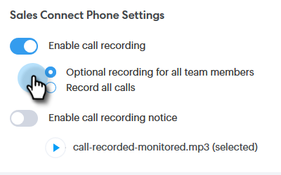

# 통화 기록 활성화 {#enable-call-recording}

관리자는 Sales Connect 호출에 대한 통화 기록을 활성화할 수 있습니다. 팀의 통화를 기록하는 것은 Best Call Practice에 따라 영업 담당자를 지도하는 좋은 방법이 될 수 있습니다.

1. 설정 아이콘을 클릭하고 **설정**&#x200B;을 선택합니다.

   

1. 관리자 설정에서 **일반**&#x200B;을 클릭합니다.

   

1. Sales Connect 전화 설정으로 스크롤한 다음 **통화 기록 사용** 토글을 선택합니다.

   

1. 판매자가 자신을 위해 통화 기록을 활성화하거나 비활성화할 수 있도록 하려면 **모든 팀원을 위한 선택적 기록**&#x200B;을 클릭하세요. 모든 통화를 자동으로 기록하려면 **모든 통화 기록**&#x200B;을 클릭하세요.

   

>[!MORELIKETHIS]
>
>[두 당사자 동의 설정](/help/marketo/product-docs/marketo-sales-connect/phone/two-party-consent-settings.md)
