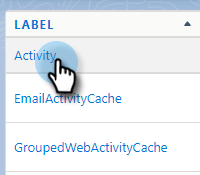

# [!DNL Salesforce]에 통화 이유 및 통화 결과 기록 {#log-call-reasons-and-call-outcomes-to-salesforce}

보고 또는 표시 목적으로 호출 결과 및 호출 이유를 [!DNL Salesforce]에 기록하려면 각각에 대해 사용자 지정 활동 필드를 만들 수 있습니다. 각 필드는 특정 API 이름([!DNL Salesforce]에서 &quot;필드 이름&quot;이라고 함)을 사용해야 합니다.

* 통화 결과 필드 이름: mktosales_call_result
* 통화 이유 필드 이름: mktosales_call_reason

이러한 필드를 활용하려면 먼저 필드를 사용자 정의 활동 필드로 만들어야 합니다. 사용자가 볼 수 있도록 하려면 작업 개체 페이지 레이아웃에 추가해야 합니다.

## [!DNL Salesforce] Classic {#salesforce-classic}

### [!DNL Salesforce] Classic에서 사용자 지정 활동 필드 만들기  {#create-custom-activity-field-in-salesforce-classic}

1. [!DNL Salesforce]에서 **[!UICONTROL Setup]**&#x200B;을(를) 클릭합니다.

   

1. 빠른 찾기 상자에 &quot;활동&quot;을 입력합니다.

   

1. **[!UICONTROL Activity Custom Fields]**&#x200B;를 클릭합니다.

   

1. **[!UICONTROL New]**&#x200B;를 클릭합니다.

   

1. 데이터 형식 &quot;[!UICONTROL Text]&quot;을(를) 선택하고 **[!UICONTROL Next]**&#x200B;을(를) 클릭합니다.

   

1. 사용자 정의 필드에 위에서 정의한 필드 이름을 지정합니다. 필드 길이는 255자로 제한됩니다. 필드 레이블은 영업팀에 표시되는 필드이며 팀의 요구 사항에 맞게 사용자 정의할 수 있습니다.

   

1. 나머지 설정은 선택 사항입니다. 구성을 완료했으면 **[!UICONTROL Next]**&#x200B;을(를) 클릭합니다.

   

1. 이 필드에 대해 원하는 필드 수준 보안 설정을 선택하고 **[!UICONTROL Next]**&#x200B;을(를) 클릭합니다(아래 이미지는 예제일 뿐).

   

   >[!NOTE]
   >
   >사용자 지정 필드가 [!DNL Sales Connect] 사용자가 사용하는 프로필에 표시되고 원하는 다른 필드가 표시되도록 하십시오.

1. 필드를 추가할 페이지 레이아웃을 선택하고 **[!UICONTROL Save]**&#x200B;을(를) 클릭합니다. **[!UICONTROL Save & New]**&#x200B;을(를) 클릭하고 호출 사유 필드에 대한 프로세스를 반복할 수도 있습니다.

   

### [!DNL Salesforce] Classic의 작업 페이지 레이아웃에 사용자 지정 활동 필드 추가 {#add-custom-activity-field-to-task-page-layout-in-salesforce-classic}

>[!NOTE]
>
>위의 9단계에서 원하는 페이지 레이아웃을 선택하지 않은 경우 다음 단계만 수행하면 됩니다.

1. [!DNL Salesforce]에서 **[!UICONTROL Setup]**&#x200B;을(를) 클릭합니다.

   

1. 빠른 찾기 상자에 &quot;Task&quot;를 입력합니다.

   

1. **[!UICONTROL Task Page Layouts]**&#x200B;를 클릭합니다.

   

1. 이 필드를 추가할 작업 페이지 레이아웃 옆에 있는 **[!UICONTROL Edit]**&#x200B;을(를) 클릭합니다.

   

1. 필드를 작업 페이지 레이아웃의 원하는 섹션으로 끌어다 놓습니다.

   

1. **[!UICONTROL Save]**&#x200B;를 클릭합니다.

   

## [!DNL Salesforce] 번개 {#salesforce-lightning}

### [!DNL Salesforce] 번개에서 사용자 지정 활동 필드 만들기 {#create-custom-activity-field-in-salesforce-lightning}

1. [!DNL Salesforce]에서 오른쪽 상단의 톱니바퀴 아이콘을 클릭하고 **[!UICONTROL Setup]**&#x200B;을(를) 선택합니다.

   

1. **[!UICONTROL Object Manager]**&#x200B;를 클릭합니다.

   

1. 빠른 찾기 상자에 &quot;[!UICONTROL Activity]&quot;을(를) 입력합니다.

   

1. **[!UICONTROL Activity]** 레이블을 클릭합니다.

   

1. **[!UICONTROL Fields & Relationships]**&#x200B;를 클릭합니다.

   

1. **[!UICONTROL New]**&#x200B;를 클릭합니다.

   

### [!DNL Salesforce] 번개에서 작업 페이지 레이아웃에 사용자 지정 활동 필드 추가 {#add-custom-activity-field-to-task-page-layout-in-salesforce-lightning}

1. [!DNL Salesforce]에서 오른쪽 상단의 톱니바퀴 아이콘을 클릭하고 **[!UICONTROL Setup]**&#x200B;을(를) 선택합니다.

   

1. **[!UICONTROL Object Manager]**&#x200B;를 클릭합니다.

   

1. 빠른 찾기 상자에 &quot;[!UICONTROL Task]&quot;을(를) 입력합니다.

   

1. **[!UICONTROL Task]** 레이블을 클릭합니다.

   

1. **[!UICONTROL Page Layouts]**&#x200B;를 클릭합니다.

   

1. 이 필드를 추가할 작업 페이지 레이아웃을 클릭합니다.

   

1. 필드를 작업 페이지 레이아웃의 원하는 섹션으로 끌어다 놓습니다.

   

1. **[!UICONTROL Save]**&#x200B;를 클릭합니다.

   

>[!MORELIKETHIS]
>
>[활동 내역에 Sales Connect 이벤트 필드 설치](/help/marketo/product-docs/marketo-sales-connect/crm/salesforce-customization/install-sales-connect-event-fields-on-activity-history.md)
