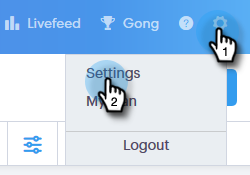
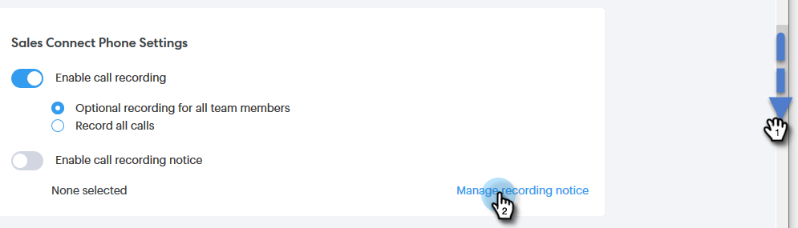

# 2자 동의 설정 {#two-party-consent-settings}

전화를 녹음할 때 미국 양자 동의 법을 준수하기 위해, 관리자라면 통화 중에 미리 녹음된 메시지를 녹음할 수 있습니다.

>[!PREREQUISITES]
>
>아래 단계를 진행하기 전에 먼저 [호출 기록 활성화를 수행해야 합니다.](http://docs.marketo.com/x/dAC1Ag)

1. 설정 아이콘을 클릭하고 **설정**&#x200B;을 선택합니다.

   

1. 관리 설정에서 **일반**&#x200B;을 클릭합니다.

   

1. Sales Connect Phone Settings로 스크롤하고 **레코딩 알림 관리**&#x200B;를 클릭합니다.

   

1. **레코딩 가져오기**&#x200B;를 클릭합니다.

   

   >[!NOTE]
   >
   >Wav 및 MP3 파일만 지원됩니다. 30초를 초과하는 파일은 업로드할 수 없습니다.

1. 하드 드라이브에서 원하는 오디오 파일을 선택합니다.

   

1. 업로드가 완료되면 파일 관리자에서 데이터(세 점)를 선택하고 **동의 알림으로 선택**&#x200B;을 클릭합니다. 완료되면 **확인**&#x200B;을 클릭합니다.

   

1. 토글을 클릭하여 선택한 메시지가 기록된 호출 시작 시 재생되도록 합니다.

   

