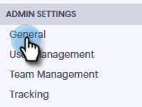
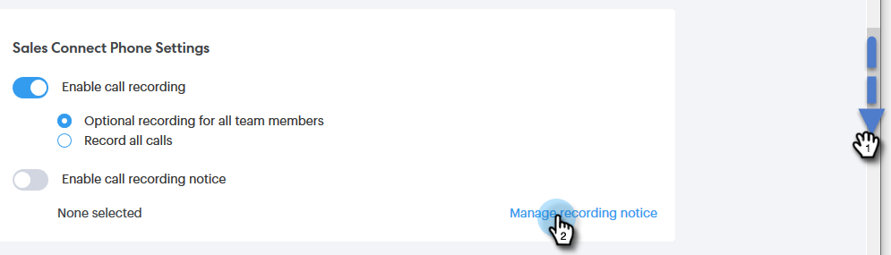
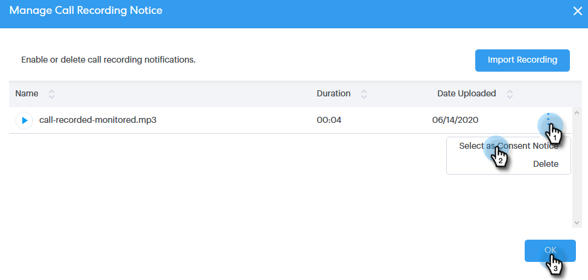
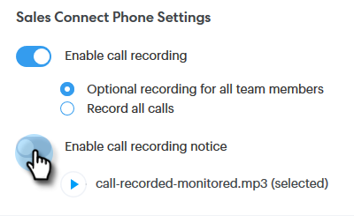

# 양 당사자 동의 설정 {#two-party-consent-settings}

통화 기록 시 미국 양당 동의법을 준수하기 위해 관리자는 사전 녹음된 메시지 중 통화 시작 시 재생할 수 있도록 선택할 수 있습니다.

>[!PREREQUISITES]
>
>아래 단계를 따르려면 먼저 [통화 기록을 활성화](/help/marketo/product-docs/marketo-sales-connect/phone/enable-call-recording.md)해야 합니다.

1. 설정 아이콘을 클릭하고 **[!UICONTROL Settings]**&#x200B;을(를) 선택합니다.

   

1. [!UICONTROL Admin Settings]에서 **[!UICONTROL General]**&#x200B;을(를) 클릭합니다.

   

1. 아래로 스크롤하여 [!UICONTROL Sales Connect Phone Settings]을(를) 클릭하고 **[!UICONTROL Manage recording notice]**&#x200B;을(를) 클릭합니다.

   

1. **[!UICONTROL Import Recording]**&#x200B;를 클릭합니다.

   

   >[!NOTE]
   >
   >Wav 및 MP3 파일만 지원됩니다. 30초 이상 파일을 업로드할 수 없습니다.

1. 하드 드라이브에서 원하는 오디오 파일을 선택합니다.

   

1. 업로드가 완료되면 파일 관리자에서 점(세 개)을 선택하고 **[!UICONTROL Select as Consent Notice]**&#x200B;을(를) 클릭합니다. 완료되면 **[!UICONTROL OK]**&#x200B;를 클릭합니다.

   

1. 토글을 클릭하여 선택한 메시지가 기록된 호출의 시작 부분에서 재생되도록 합니다.

   
