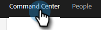
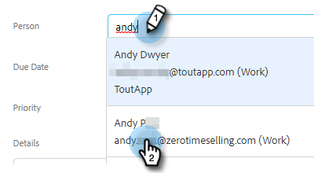

# 알림 작업 생성 및 할당 {#create-and-assign-reminder-tasks}

미리 알림 작업은 고객 및 잠재 고객 참여를 최대한 이끌어낼 수 있는 좋은 방법입니다. 작업을 만들려면 다음 단계를 수행합니다.

1. **[!UICONTROL Command Center]**&#x200B;를 클릭합니다.

   

1. 기본적으로 작업이 열립니다. **[!UICONTROL Add Task]**&#x200B;를 클릭합니다.

   

1. [!UICONTROL Email], [!UICONTROL Call], [!UICONTROL InMail] 또는 [!UICONTROL Custom] 작업에서 작업 유형을 선택합니다.

   

1. 작업에 이름을 지정합니다.

   

1. 작업을 자신에게 할당되도록 선택하거나 작업을 할당할 다른 사용자를 선택하십시오.

   

1. 이 미리 알림 작업으로 팔로우하는 사람을 추가합니다.

   

1. 작업 기한을 선택합니다.

   

1. 작업의 우선 순위를 선택합니다.

   

1. 통화 메모, InMail 메시지 템플릿 또는 사용자에 대한 메모 등 작업을 완료할 때 사용할 수 있는 작업에 대한 세부 정보를 추가합니다. 완료되면 **[!UICONTROL Create]**&#x200B;을(를) 클릭합니다.

   
