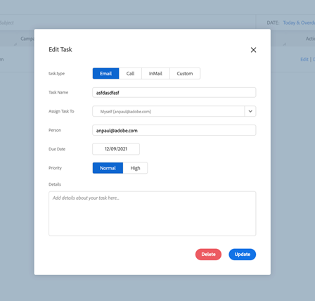

# [!DNL Salesforce]과(와) 미리 알림 작업 동기화 {#reminder-task-sync-with-salesforce}

>[!NOTE]
>
>작업 동기화를 사용하는 방법을 알아보려면 [동기화 [!DNL Sales Connect] 작업/미리 알림을  [!DNL Salesforce] 작업](/help/marketo/product-docs/marketo-sales-connect/crm/salesforce-integration/salesforce-sync-settings.md#sync-sales-connect-tasks-reminders-to-salesforce-tasks)에 체크 아웃하세요.

작업 동기화 설정을 사용하도록 설정하면 사용자가 미리 알림 작업을 [!DNL Salesforce]과(와) 양방향으로 동기화합니다. 즉, 사용자는 [!DNL Salesforce] 또는 [!DNL Sales Connect]에서 작업을 관리하고 시스템이 계속 정렬되어 있을 것으로 확신할 수 있습니다.

## 미리 알림 작업 필드 동기화 {#reminder-task-field-sync}

다음은 양방향 작업 동기화를 통해 지원되는 [!DNL Sales Connect]의 미리 알림 작업 필드와 해당 [!DNL Salesforce] 필드의 목록입니다.

<table>
 <tr>
  <th>[!DNL Sales Connect] 작업 필드</th>
  <th>[!DNL Salesforce] 작업 필드</th>
  <th>[!DNL Salesforce] 작업</th>
 </tr>
 <tr>
  <td>[!UICONTROL Task Name]</td>
  <td>[!UICONTROL Subject Field]</td>
  <td>작업 제목을 표시하는 짧은 요약 필드입니다.</td>
 </tr>
 <tr>
  <td>[!UICONTROL Status]</td>
  <td>[!UICONTROL Task Status]</td>
  <td>
작업의 상태를 표시합니다. [!DNL Sales Connect]개 작업에는 [!DNL Salesforce]개 작업 상태 선택 목록의 값 중 두 개에 매핑되는 두 가지 상태가 있습니다.

  
[!DNL Sales Connect]에서 열기 = [!DNL Salesforce]에서 시작되지 않음.

  
[!DNL Sales Connect]에서 완료 = [!DNL Salesforce]에서 완료.

  
[!DNL Salesforce]의 다른 상태 값이 [!DNL Sales Connect]과(와) 동기화되지 않습니다.
</td>
 </tr>
 <tr>
  <td>[!UICONTROL Priority]</td>
  <td>[!UICONTROL Priority]</td>
  <td>
[!DNL Sales Connect] 우선 순위는 [!DNL Salesforce]의 보통 및 높음 우선 순위 값에 매핑되는 보통 또는 높음일 수 있습니다.

  
[!DNL Salesforce]의 낮은 우선 순위 값이 [!DNL Sales Connect]에 동기화되지 않습니다.
</td>
 </tr>
 <tr>
  <td>[!UICONTROL Due Date]</td>
  <td>[!UICONTROL Due Date]</td>
  <td>작업 기한.</td>
 </tr>
 <tr>
  <td>[!UICONTROL Details]</td>
  <td>[!UICONTROL Comments]</td>
  <td>미리 알림 작업으로 완료하기로 한 내용에 대한 자세한 정보를 표시합니다.</td>
 </tr>
</table>

## [!DNL Sales Connect]개 작업을 [!DNL Salesforce]과(와) 처음 동기화 중 {#syncing-sales-connect-tasks-with-salesforce-for-the-first-time}

[!DNL Sales Connect]과(와) [!DNL Salesforce] 작업 간의 동기화를 처음 켜면 [!DNL Salesforce] 작업을 가져옵니다. **에 있는 현재 작업을**(으)로 [!DNL Sales Connect]not[!DNL Salesforce] 푸시합니다. 혼란을 줄이고 중복을 줄이기 위해 [!DNL Sales Connect]에서 [!DNL Salesforce]&#x200B;(으)로 동기화되는 작업은 *을(를) SFDC과 동기화하는*&#x200B;이후[!DNL Sales Connect]에 만들어진 작업뿐입니다.

[!DNL Sales Connect] 및 SFDC 작업을 동기화할 때 발생하는 상황은 다음과 같습니다.

* 작업 동기화 시 저장 을 클릭하면 다시 동기화됩니다. 처음에는 시간이 좀 걸릴 것입니다.

* 지난 24시간 동안 업데이트되거나 만들어진 모든 미리 알림은 SFDC에서 [!DNL Sales Connect]&#x200B;(으)로 가져옵니다. 동기화는 만기일을 기준으로 하며 이러한 모든 작업은 백 엔드에서 동기화되지만, 명령 센터에서는 오늘과 내일의 작업만 표시됩니다.

* 이전에 동기화가 켜져 있고 SFDC에서 작업을 삭제하면 지난 15일 동안 삭제된 모든 항목이 명령 센터에서 삭제됩니다.

* 동기화가 활성화되어 있는 한 [!DNL Sales Connect]과(와) SFDC 간에 작업을 지속적으로 동기화합니다.

초기 동기화 후 [!DNL Sales Connect]에서 생성, 편집, 완료 또는 삭제하는 모든 작업은 [!DNL Salesforce]의 작업 목록에 동기화됩니다. [!DNL Salesforce]에서 생성, 편집, 완료 또는 삭제된 모든 작업은 [!DNL Sales Connect]에서 작업 목록을 업데이트합니다.

이 동기화를 켜려면 웹 응용 프로그램의 [설정 페이지](https://toutapp.com/login)에서 동기화 상자를 선택하면 됩니다.

>[!NOTE]
>
>[!DNL Sales Connect]활동 세부 정보 사용자 지정[!DNL Salesforce] 설정에서 `{{activity_subject}}` 동적 필드를 사용하는 경우 [에서 작업의 제목 필드를 업데이트할 수 있으며 해당 업데이트는 동기화된 작업의 ](/help/marketo/product-docs/marketo-sales-connect/crm/salesforce-integration/configure-salesforce-activity-detail-customization.md) 제목 필드에서 동기화됩니다. 반대로 [!DNL Salesforce]의 제목 필드를 업데이트하면 _미리 알림 작업 제목 필드와_&#x200B;동기화되지[!DNL Sales Connect]않습니다.
