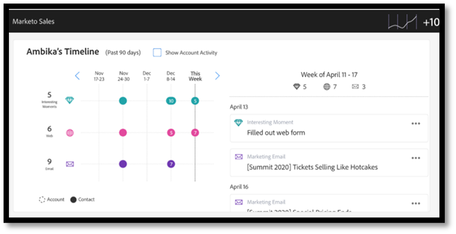
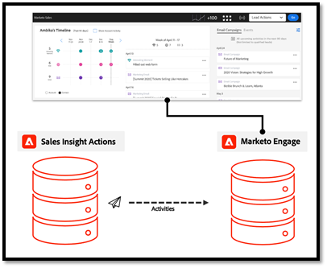

# 작업 데이터 동기화 FAQ {#actions-data-sync-faq}

Sales Insight Actions에 대한 데이터 통합 필드 동기화를 사용하면 시스템이 Marketo Engage 데이터베이스의 개인 정보를 Sales Insight Actions 데이터베이스로 가져올 수 있습니다.

이렇게 하면 Sales Insight Actions 웹 앱에 최신 직원 데이터를 제공하고 시스템에서 Marketo의 해당 직원 레코드와 Salesforce의 잠재 고객/연락처/계정/기회 레코드에 대한 고유 ID를 수집할 수 있으므로 데이터를 로깅하기 위해 레코드를 올바르게 참조할 수 있습니다.

이 동기화는 Marketo Engage의 관리 섹션에 있는 Sales Insight Actions Config 탭에서 활성화할 수 있습니다. 자세한 내용은 다음을 확인하십시오. [데이터 동기화 시작](/help/marketo/product-docs/marketo-sales-insight/actions/getting-started/sales-insight-actions-admin-setup-guide.md#initiate-data-sync).

위의 다이어그램은 사용자의 활동과 작업 데이터가 시스템 간에 동기화될 수 있는 방법을 보여 줍니다. 몇 가지 주의해야 할 사항:

* 사용자 레코드는 Marketo Engage의 Sales Insight Actions에 동기화되므로, Marketo Engage을 Sales Insight Actions 사용자 데이터의 소스로 사용할 수 있습니다
* Marketo Engage 및 판매 통찰력 작업 모두 [메커니즘 사용](/help/marketo/product-docs/marketo-sales-insight/actions/email/unsubscribes/syncing-unsubscribes-with-salesforce.md) 구독 취소 상태를 수집하여 Salesforce에 동기화하기 위한
* 구독 취소 상태는 판매 작업에서 Marketo Engage으로 동기화되지 않지만, 판매자가 다음으로 이메일을 보내도록 허용하기 전에 사용자의 Marketo 구독 취소 상태를 확인하도록 Sales Insight 작업을 구성할 수 있습니다. [Marketo 구독 취소 확인](/help/marketo/product-docs/marketo-sales-insight/actions/email/unsubscribes/marketo-unsubscribe-check.md).

다음은 데이터 통합 동기화 작동 방식과 관련된 몇 가지 FAQ입니다.

## Sales Insight Actions에 동기화되는 리드/연락처는 무엇입니까? {#what-lead-contacts-are-synced}

Sales Owner 가 할당된 Lead 및 Contact 는 Sales Actions에 동기화됩니다.

존재하는 표준 소유자 필드를 보면 잠재 고객/연락처에 Salesforce의 판매 소유자가 있는지 확인할 수 있습니다.

영업 소유자는 Marketo 동기화 사용자이거나 특정 Salesforce 또는 영업 사용자일 필요가 없습니다. Salesforce에 나열된 잠재 고객 소유자 및 연락처 소유자 필드에 사용자가 나열되어 있으면 이를 판매 잠재 고객으로 식별하고 판매 인사이트 작업에 동기화할 수 있습니다. 동기화하는 필드에 대한 모든 업데이트는 Sales Insight Actions 에서도 검색 및 업데이트됩니다.

## Sales Insight Smart Grid에 표시되는 활동 데이터는 어디에서 가져옵니까? {#where-does-the-activity-data-get-sourced-from}

이메일, 호출, 즐거운 순간 및 웹과 같은 활동 데이터는 모두 Marketo Engage의 데이터베이스에서 가져온 것입니다. Sales Insight Smart Grid는 영업 사용자가 Sales Insight 패널을 로드할 때마다 Marketo Engage 인스턴스에 이를 검색하도록 요청합니다.

Sales Insight Actions 는 Marketo Engage에서 모든 활동 데이터를 가져올 수 있도록 모든 활동 데이터를 Marketo Engage에 동기화합니다.

## 사람 레코드와 관련된 어떤 필드가 Marketo Engage에서 판매 인사이트 작업으로 동기화됩니까? {#what-fields-sync}

Marketo Engage에서 Sales Insight 작업으로 동기화되는 필드는 11개입니다.

* 이름
* 성
* Salesforce 연락처 ID
* Salesforce 리드 ID
* Salesforce 계정 ID
* Salesforce 영업 기회 ID
* Marketo ID
* 회사
* 제목
* 이메일
* 전화번호
* Linkedin URL
* 소스

## Marketo Engage 및 Sales Insight 작업 간에 동기화하는 필드를 구성할 수 있습니까? {#are-the-fields-that-sync-configurable}

Sales Insight Actions에 동기화되는 Marketo Engage 필드를 구성할 수 없으며 필드를 매핑하는 기능도 사용할 수 없습니다. Marketo에서의 동기화는 표준 Marketo 필드를 판매 작업 인스턴스의 표준 필드에 자동으로 매핑합니다.

## Sales Insight Actions에 자체 데이터베이스가 있는 이유는 무엇입니까? {#why-does-actions-have-its-own-database}

Sales Insight Actions 에는 전담 직원 및 활동 데이터베이스가 있는 자체 웹 애플리케이션이 있어 영업 팀을 위해 구축 및 설계된 최적화된 작업 영역을 제공할 수 있습니다. 이를 통해 영업 관리자와 판매자는 마케팅 운영 전문가에게 최적화된 기본 Marketo Engage 작업 영역에 액세스 권한이나 권한을 부여하지 않고도 참여 전략을 구축하고 관리할 수 있는 공간을 확보할 수 있습니다.

## 중복은 어떻게 처리됩니까? {#how-are-duplicates-handled}

Sales Actions 데이터베이스는 Marketo Engage 데이터베이스에 있는 자격이 있는 사람(Sales Owner가 있는 잠재 고객/연락처)의 사본이 됩니다. 즉, Marketo에서 만든 동일한 이메일 주소를 가진 레코드가 두 개 있는 경우 영업 작업에서 중복 레코드가 만들어집니다.

## 초기 동기화를 완료하는 데 시간이 얼마나 걸립니까? {#how-long-initial-sync}

모든 판매 리드 데이터를 새 Sales Insight Actions 인스턴스로 동기화하는 초기 프로세스는 일반적으로 1~2분마다 약 1,000명의 직원을 처리합니다. 이는 단지 추정치일 뿐이며 다를 수 있습니다.

초기 동기화가 발생하고 모든 판매 리드가 Sales Insight Actions 웹 앱 인스턴스에 채워지면 지원되는 필드 중 하나가 업데이트될 때마다 실행되는 증분 동기화가 발생합니다.

## Sales Insight Actions 사용자가 Actions 웹 앱에서 사람 데이터를 편집할 수 있습니까? {#can-actions-users-edit-people-data}

아니요. [작업] 웹 앱의 사용자와 관리자 모두 [작업]에서 사람 레코드를 만들고 편집할 수 없습니다. 직원 만들기 및 편집은 Salesforce 또는 Marketo Engage에서 수행해야 합니다. Sales Insight Actions에서는 새 데이터를 지속적으로 동기화하여 Marketo을 사람 데이터의 소스로 사용하므로, 사용자가 Marketo의 워크플로우에서 업데이트되거나 Marketo에서 만들어지거나 Salesforce에서 동기화되면 이러한 업데이트가 Sales Insight Actions 웹 앱 데이터베이스에 전달됩니다.

## 영업 활동이 Marketo에 기록됩니까? {#do-sales-activities-log-to-marketo}

예. 영업 활동 활동은 기본 활동으로 Marketo에 기록됩니다. 이러한 활동에는 판매 활동 속성에 따라 가망 고객을 타깃팅하기 위한 제약 조건과 함께 사용할 수 있는 기본 필터도 포함됩니다.

다음은 Marketo에 로그인하는 활동 목록입니다.

* 판매 이메일 보내기
* 영업 이메일 열기
* Sales Email 클릭
* 판매 이메일에 회신함
* 반송된 판매 이메일
* 판매 전화 수신
* 판매 캠페인에 추가
* 판매 캠페인에서 제거됨

## 영업 활동이 Salesforce에 기록됩니까? {#do-sales-activities-log-to-salesforce}

예. 영업 계약 활동은 기본 작업으로 Salesforce에 기록됩니다. 그런 다음 Salesforce 보고서에서 영업 활동을 추적하는 고급 팀 대시보드에 이러한 작업을 사용할 수 있습니다.

Sales Insight Actions 을 사용하면 관리자가 Salesforce에 기록할 영업 활동을 구성할 수 있습니다. 이러한 활동에는 이메일, 호출 및 진행 중 미리 알림 작업이 포함됩니다.

위의 다이어그램은 Salesforce에 기록된 정보를 보여 줍니다. 이메일 및 호출과 같은 활동은 다음에서 Salesforce에 기록됩니다. [단방향 동기화](/help/marketo/product-docs/marketo-sales-insight/actions/crm/salesforce-integration/salesforce-sync-settings.md). [구독 취소](/help/marketo/product-docs/marketo-sales-insight/actions/email/unsubscribes/syncing-unsubscribes-with-salesforce.md) 및 [미리 알림 작업](/help/marketo/product-docs/marketo-sales-insight/actions/tasks/reminder-task-sync-with-salesforce.md) 양방향 동기화를 통해 최신 상태로 유지됩니다. 이러한 각 데이터 동기화는 Sales Insight Actions 웹 앱 인터페이스에서 구성할 수 있습니다.

>[!MORELIKETHIS]
>
>* [Salesforce와 구독 취소 동기화](/help/marketo/product-docs/marketo-sales-insight/actions/email/unsubscribes/syncing-unsubscribes-with-salesforce.md)
>* [Marketo 구독 취소 확인](/help/marketo/product-docs/marketo-sales-insight/actions/email/unsubscribes/marketo-unsubscribe-check.md)
>* [Salesforce 동기화 설정](/help/marketo/product-docs/marketo-sales-insight/actions/crm/salesforce-integration/salesforce-sync-settings.md)
>* [Salesforce와의 미리 알림 작업 동기화](/help/marketo/product-docs/marketo-sales-insight/actions/tasks/reminder-task-sync-with-salesforce.md)
>* [데이터 동기화 시작](/help/marketo/product-docs/marketo-sales-insight/actions/getting-started/sales-insight-actions-admin-setup-guide.md#initiate-data-sync)

