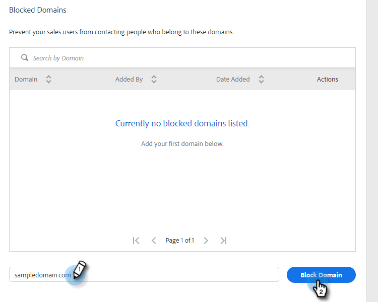

# 차단된 도메인 {#blocked-domains}

경쟁 업체, 알려진 스팸 트랩 또는 연락을 하지 않으려는 다른 도메인을 실수로 이메일로 보내는 것을 방지하여 영업 팀이 성공을 거둘 수 있도록 지원합니다.

>[!NOTE]
>
>**관리 권한 필요**

1. 웹 응용 프로그램에서 톱니바퀴 아이콘을 클릭하고 **설정**&#x200B;을 선택합니다.

   

1. 관리자 설정에서 **일반**&#x200B;을 클릭합니다.

   

1. 차단할 도메인을 입력하고 **블록 도메인**&#x200B;을 클릭합니다.

   

   >[!NOTE]
   >
   >차단된 전자 메일 도메인으로 전송되기 때문에 실패한 그룹 전자 메일 보내기 그룹의 일부인 전자 메일은 자동으로 실패하며 실패한 전자 메일 폴더에 표시되지 않습니다.
