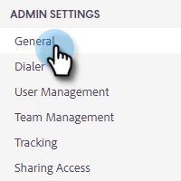

# 콘텐츠 잠금 {#content-lockdown}

콘텐츠 잠금을 활성화하여 관리자가 아닌 사용자가 템플릿 및/또는 캠페인을 편집할 수 없도록 제한합니다. 사용자는 컨텐츠를 공유, 복제, 편집 또는 삭제할 수 없습니다. 또한 템플릿을 보관할 수 있는 옵션이 없습니다.

>[!NOTE]
>
>사용자는 전송 시 또는 캠페인을 시작할 때에도 여전히 이메일 콘텐츠를 편집할 수 있습니다.

1. 톱니바퀴 아이콘을 클릭하고 **[!UICONTROL Settings]**&#x200B;을(를) 선택합니다.

   

1. [!UICONTROL Admin Settings]에서 **[!UICONTROL General]**&#x200B;을(를) 클릭합니다.

   

1. [!UICONTROL Content Lockdown]로 스크롤합니다. 슬라이더를 켜면 팀원이 템플릿 및/또는 캠페인을 만들거나 편집할 수 없습니다.

   
