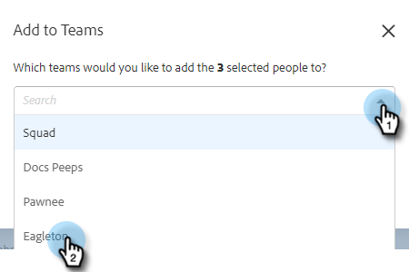
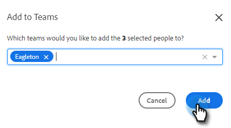

# 팀 만들기 {#creating-a-team}

팀을 만들면 콘텐츠를 공유할 수 있고 보고서를 필터링할 수 있는 사용자 그룹을 조합할 수 있습니다.

## 팀 만들기 {#create-a-team}

1. [웹 응용 프로그램](https://toutapp.com/login)에서 톱니바퀴 아이콘을 클릭하고 **[!UICONTROL Settings]**&#x200B;을(를) 선택합니다.

   

1. [!UICONTROL Admin Settings]에서 **[!UICONTROL Team Management]**&#x200B;을(를) 선택합니다.

   

1. [!UICONTROL Teams] 옆에 있는 **+** 아이콘을 클릭합니다.

   

1. 팀 이름을 입력하고 **[!UICONTROL Create]**&#x200B;을(를) 클릭합니다.

   

>[!NOTE]
>
>이제 템플릿, 캠페인 및 그룹을 해당 팀과 공유할 수 있습니다.

## 팀에 사람 추가 {#add-people-to-a-team}

1. [!UICONTROL Team Management]에서 **[!UICONTROL All Members]**&#x200B;을(를) 선택합니다.

   

1. 팀에 추가할 사용자를 찾은 다음 해당 확인란을 선택합니다.

   

1. **[!UICONTROL Add to Teams]**&#x200B;를 클릭합니다.

   

1. 드롭다운을 클릭하고 원하는 팀을 선택합니다.

   

1. 완료되면 **[!UICONTROL Add]**&#x200B;를 클릭합니다.

   
