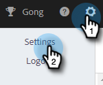

# 사용자 지정 도메인 추적을 설정하는 방법 {#how-to-set-up-custom-domain-tracking}

사용자 지정 도메인 추적을 사용하면 팀이 판매 전자 메일에 추가된 모든 추적 가능한 링크에서 고유한 회사 이름을 사용할 수 있습니다. 이 설정을 허용 목록에 추가하다 설정하면 이메일에 있는 모든 링크를 go.yourcompany.com으로 표시하여 누군가 링크를 마우스로 가리키면 go.toutapp.com 대신 go.yourcompany.com으로 표시되게 합니다.

go.toutapp.com을 가리키는 도메인에 대한 CNAME 레코드를 설정하는 IT 팀의 지원이 필요합니다. 이 CNAME은 모든 추적 링크(예: go.yourcompany.com)에 표시되는 것입니다.

IT 팀에 CNAME이 제대로 구성되었는지 확인했으면 작업에서 사용자 지정 도메인 추적 페이지에 추가할 수 있습니다.

>[!NOTE]
>
>CNAME이 제대로 설정되지 않고 작업에서 사용자 지정 도메인으로 활성화하면 추적 링크 및 픽셀을 끊을 수 있습니다.

## 사용자 지정 도메인 추적 활성화 {#enable-custom-domain-tracking}

>[!NOTE]
>
>**관리 권한이 필요합니다.**

1. 톱니바퀴 아이콘을 클릭하고 을 선택합니다 **설정**.

   

1. 관리자 설정에서 을 선택합니다. **추적**.

   

1. 사용자 지정 도메인 추적 탭에서 CNAME을 입력하고 를 클릭합니다. **Connect**.

   
