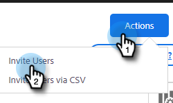

# 사용자 및 관리자 초대 {#invite-users-and-admins}

사용자 또는 관리자를 추가하는 것은 빠르고 쉽습니다!

## 사용자 초대 {#invite-users}

1. 톱니바퀴 아이콘을 클릭하고 을 선택합니다 **설정**.

   

1. 관리자 설정에서 을 선택합니다. **사용자 관리**.

   

1. 을(를) 클릭합니다. **작업** 단추를 누르고 선택합니다. **사용자 초대**.

   

   >[!NOTE]
   >
   >선택할 수도 있습니다 **CSV를 통해 사용자 초대** 모든 항목이 스프레드시트에 나열되어 있는 경우,

1. 추가할 개인의 이메일 주소를 입력합니다.

   

1. 선택 단계: 사용자가 속해 있어야 하는 모든 팀에 사용자를 추가합니다. 이 부분을 건너뛰면 새 멤버가 모두 Everyone 팀에 추가됩니다.

   

   >[!NOTE]
   >
   >[팀에 대해 자세히 알아보기](/help/marketo/product-docs/marketo-sales-insight/actions/admin/creating-a-team.md).

1. 새 사용자를 추가할 Marketo 작업 공간을 선택합니다. 작업 공간이 하나뿐인 경우 옵션으로 &quot;기본값&quot;이 표시됩니다. 클릭 **초대**.

   

1. 클릭 **확인**.

   

## 사용자를 관리자로 지정 {#make-a-user-an-admin}

>[!NOTE]
>
>**관리자 권한이 필요합니다.**

기존 사용자를 관리자로 만들려면 다음 단계를 수행합니다.

1. 톱니바퀴 아이콘을 클릭하고 을 선택합니다 **설정**.

   

1. 관리자 설정에서 을 선택합니다. **사용자 관리**.

   

1. 관리자를 만들 사용자를 찾아서 역할 드롭다운을 클릭하고 을 선택합니다 **관리**.

   

간단해!
