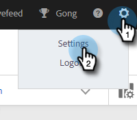
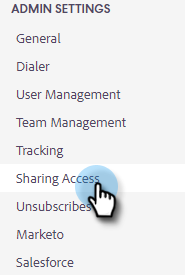

# 공유 설정 {#sharing-settings}

사용자가 공유할 수 있는 항목과 범주를 제한하여 템플릿을 보다 효율적으로 관리할 수 있습니다.

Sales Insight Actions 계정이 처음 만들어지면 공유 설정이 활성화됩니다. 이를 통해 계정 관리자는 홍수 게이트를 열기 전에 템플릿 범주를 만들고 구성할 수 있으며 사용자는 팀 범주로 콘텐츠를 공유할 수 있습니다.

공유 설정이 활성화되면 팀이나 모든 사람에게 공유 권한이 제공되지 않으면 관리자만 범주로 공유할 수 있습니다. 공유 설정이 비활성화되어 있으면 제한이 없으며 모든 사용자가 모든 템플릿 카테고리에 공유할 수 있습니다.

## 공유 설정 구성 {#configure-your-sharing-settings}

1. [웹 응용 프로그램](https://toutapp.com/login)에서 톱니바퀴 아이콘을 클릭하고 **설정**&#x200B;을 선택합니다.

   

1. 관리자 설정에서 **액세스 공유**&#x200B;를 선택합니다.

   

1. **공유 설정**&#x200B;이 활성화되어 있는지 확인하십시오. 즉, 기본적으로 관리자만 템플릿 카테고리의 템플릿을 공유할 수 있습니다.

   

1. 구성할 템플릿 범주를 선택합니다.

   

1. **액세스할 팀 추가**&#x200B;를 클릭합니다.

   

1. 추가할 팀을 선택합니다.

   

   >[!NOTE]
   >
   >팀이 표시되지 않으면 팀 관리로 이동하여 사용자 팀을 만들어야 합니다.

1. 저장하려면 **액세스할 팀 추가**&#x200B;를 클릭하세요.

   

1. 팀이 추가되었으므로 팀 관리자만 해당 팀의 사용자 또는 모두를 공유하도록 선택할 수 있습니다. 이 예에서는 액세스 권한을 공유하는 SDR 팀의 모든 사용자에게 부여합니다.

   
