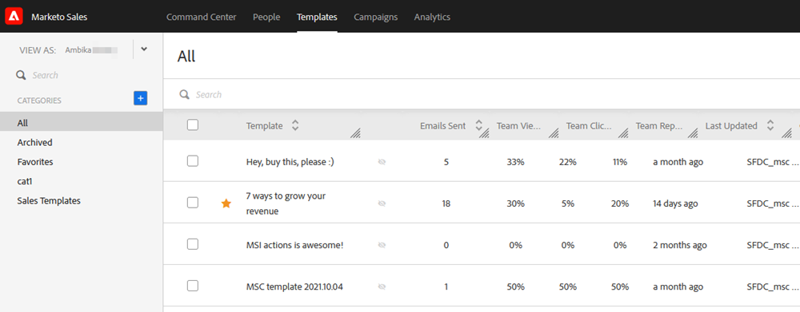

# 사용자 액세스 세부 정보 {#user-access-details}

관리자 및 관리자가 아닌 사용자는 무엇을 액세스할 수 있습니까?

## 관리자 사용자 권한 {#admin-user-permissions}

관리자는 [모든 템플릿을 볼 수 있습니다](/help/marketo/product-docs/marketo-sales-connect/templates/view-template-list-as-another-user.md).

관리자는 [모든 캠페인을 볼 수 있습니다](/help/marketo/product-docs/marketo-sales-connect/campaigns/view-campaigns-list-as-another-user.md).

관리자는 모든 이메일 활동을 볼 수 있습니다.

관리자는 실행 중인 캠페인에 있는 모든 사람을 볼 수 있습니다.

관리자는 [!UICONTROL View As] 드롭다운을 통해 사용자 캠페인과 캠페인 범주를 볼 수 있습니다.

관리자는 사용자를 대신하여 캠페인을 중지할 수 있습니다.

## 관리자가 아닌 사용자 권한 {#non-admin-user-permissions}

* 분석:

   * 사용자가 팀 분석을 볼 수 있음
   * 사용자는 자신이 속한 팀만 드릴다운할 수 있습니다
   * 사용자는 자신의 분석을 볼 수 있습니다

* [!UICONTROL People] 페이지:

   * 사용자는 모든 사람과 그룹을 공유할 수 있습니다.
   * 사용자는 자신이 속한 팀과만 그룹을 공유할 수 있습니다
   * 사용자는 작업 데이터베이스의 모든 사람을 볼 수 있습니다.
   * 사용자가 삭제되면 공유 연락처는 해당 사용자를 삭제한 기본 관리자에게 소유권을 이전합니다

* [!UICONTROL Team] 관리 페이지:

   * 볼 수 없음

* [!UICONTROL Templates] 페이지:

   * 사용자는 모든 사람과 템플릿을 공유할 수 있습니다.
   * 사용자는 관리자가 허용하는 범주의 템플릿을 공유할 수 있습니다.
   * 사용자가 팀에서 제거되면 해당 팀의 템플릿이 공유되지 않습니다
   * 사용자가 팀에서 삭제되면 해당 템플릿은 사용자를 삭제한 기본 관리자에게 소유권을 이전합니다
