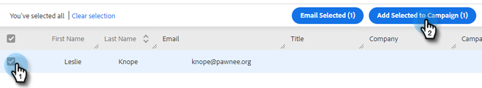

# 마케팅 캠페인에 추가 {#add-to-marketing-campaign}

>[!PREREQUISITES]
>
>[Sales 사용자에게 Campaign 표시](/help/marketo/product-docs/marketo-sales-insight/actions/marketo/make-a-campaign-visible-to-sales-connect-users.md)

## 캠페인에 개인 추가 {#add-individuals-to-a-campaign}

>[!NOTE]
>
>Sales Connect에서 Marketo Campaign에 사용자를 추가하려면 Sales Connect에 해당 사용자의 Marketo 리드 ID가 있어야 합니다.

1. **사람** 탭을 클릭합니다.

   

1. 추가할 연락처를 찾습니다.

   

1. 대화 상대를 선택하려면 확인란을 클릭하고 **선택한 항목을 Campaign에 추가**&#x200B;를 클릭합니다.

   

1. 여기 단계

   

1. 마케팅 캠페인에 추가하고 있으므로 &quot;보낸 사람&quot; 주소 선택을 건너뜁니다. 그러나 연락처를 더 추가하도록 선택할 수 있습니다. 을(를) 선택한 경우 개인 을(를) 클릭하고 입력합니다. 완료되면 **다음**&#x200B;을 클릭하세요.

   

1. **마케팅 캠페인**&#x200B;을 클릭합니다.

PICC

1. 작업 영역 드롭다운을 클릭하고 그룹을 추가하려는 캠페인이 포함된 작업 영역을 선택합니다.

PICC

>[!NOTE]
>
>원하는 작업 영역이 표시되지 않으면 관리자가 Marketo 팀 액세스 페이지를 통해 프로비저닝해야 합니다.

1. 원하는 캠페인을 선택하고 **다음**&#x200B;을 클릭합니다.

PICC

1. 자격이 있는 연락처가 표시됩니다. 추가하려면 **시작**&#x200B;을 클릭하세요.

PICC

## 캠페인에 그룹 추가 {#add-a-group-to-a-campaign}

1. **사람** 탭을 클릭합니다.

PICC

1. 내 그룹 아래에서 캠페인에 추가할 그룹을 선택합니다.

PICC

1. **Campaign에 그룹 추가**&#x200B;를 클릭합니다.

PICC

1. 마케팅 캠페인에 추가하고 있으므로 &quot;보낸 사람&quot; 주소 선택을 건너뜁니다. 그러나 연락처를 더 추가하도록 선택할 수 있습니다. 을(를) 선택한 경우 개인 을(를) 클릭하고 입력합니다. 완료되면 **다음**&#x200B;을 클릭하세요.

PICC

1. **마케팅 캠페인**&#x200B;을 선택하세요.

PICC

>[!NOTE]
>
>Sales Connect에서 Marketo Campaign에 사용자를 추가하려면 Sales Connect에 해당 사용자의 Marketo 리드 ID가 있어야 합니다.

1. 작업 영역 드롭다운을 클릭하고 그룹을 추가하려는 캠페인이 포함된 작업 영역을 선택합니다.

PICC

>[!NOTE]
>
>원하는 작업 영역이 표시되지 않으면 관리자가 Marketo 팀 액세스 페이지를 통해 프로비저닝해야 합니다.

1. 원하는 캠페인을 선택하고 **다음**&#x200B;을 클릭합니다.

PICC

1. 자격이 있는 연락처가 표시됩니다. 추가하려면 **시작**&#x200B;을 클릭하세요.

PICC
