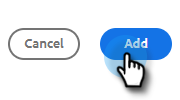
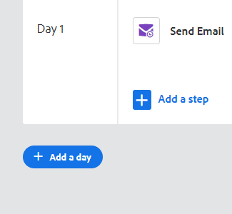

# 영업 캠페인 만들기 {#create-a-sales-campaign}

캠페인은 다음을 포함한 일련의 다중 채널 단계입니다. 이메일, 전화 통화, InMail 및 사용자 지정 작업. 이를 통해 잠재 고객 및 기존 고객과의 커뮤니케이션을 간소화할 수 있습니다.

캠페인을 사용하여 다음을 수행할 수 있습니다.

* **구성**: 효율적인 실행을 위해 한 곳에서 모든 도달 범위 활동을 간소화합니다.
* **크기 조정**: 노력을 확장하고 수작업을 최소화하며 필요한 만큼 개인화할 수 있도록 모든 도달 범위의 노력을 계획합니다.
* **측정**: Salesforce에 자동으로 로그인하면서 모든 이메일과 작업의 성공을 한 곳에서 추적합니다. 어떤 것이 공명하고 결과를 초래하는지 알면 결과를 일관되게 테스트 및 개선할 수 있습니다.

그러면 캠페인을 어떻게 설정합니까?

1. 을(를) 클릭합니다. **캠페인** 탭.

   

1. 카테고리를 선택하고 **캠페인 만들기** 새 캠페인을 만들기 위한 단추.

   

   >[!NOTE]
   >
   >을(를) 클릭하여 새 카테고리를 만듭니다 **+** 다음 **카테고리**.

1. 선택한 카테고리가 선택됩니다. 마음이 바뀌면 드롭다운을 클릭하고 다른 드롭다운을 선택합니다. 완료되면 을(를) 클릭합니다. **계속**.

   

1. 클릭 **단계 추가**.

   

1. 다음 중 하나를 선택합니다. 전자 메일, 호출, InMail 또는 사용자 지정 작업입니다. 이 예제에서는 이메일을 선택합니다.

   

1. 당신이 [이메일 사용 완료](/help/marketo/product-docs/marketo-sales-insight/actions/campaigns/sales-campaign-step-types-and-reminder-tasks.md#email){target=&quot;_blank&quot;}{target=&quot;_blank&quot;}, **추가**.

   

1. 첫 번째 요일 및 단계를 만든 후 &quot;하루 추가&quot; 단추가 활성화되고 판매 프로세스에 필요한 일 및 단계를 추가할 수 있습니다.

   

   >[!NOTE]
   >
   >일 수는 작업 사이의 일 수가 아니라 시퀀스 내의 일입니다. 예를 들어 캠페인이 7일을 계속하는 경우 &#39;3&#39;을 입력하면 7일 중 3일에 작업이 종료된다는 의미입니다. **not** 3일 후.

1. 다음을 방문하여 주말 건너뛰기와 같은 예약 및 회신 옵션을 사용자 지정했는지 확인합니다. **설정 탭** Campaign에 사용할 수 있습니다.

   

이제 캠페인에 사람들을 추가할 차례입니다!

>[!MORELIKETHIS]
>
>* 이메일 단계에 대한 영업 캠페인 전송 옵션 이해
>* [영업 캠페인 단계 유형 및 미리 알림 태스크](/help/marketo/product-docs/marketo-sales-insight/actions/campaigns/sales-campaign-step-types-and-reminder-tasks.md){target=&quot;_blank&quot;}
>* 영업 캠페인 설정

