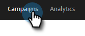

# 판매 캠페인 설정 {#sales-campaign-settings}

Sales Campaign 설정 섹션에서 특정 Sales Campaign 을 구성할 수 있으므로 해당 Sales Campaign에 대한 팀의 사용 사례에 가장 잘 부합하도록 할 수 있습니다.

## 주말 건너뛰기 {#skip-weekends}

주말을 건너뛰도록 활성화하여 주말(토요일 또는 일요일)에 떨어진 모든 단계는 월요일로 이동됩니다.

>[!NOTE]
>
>[!UICONTROL Skip Weekends]이(가) 활성화되면 전자 메일은 주 5일을 기준으로 예약됩니다. 즉, 단계가 예약되면 주말이 일로 무시됩니다.

1. **[!UICONTROL Campaigns]**&#x200B;을(를) 클릭합니다.

   

1. 원하는 판매 캠페인을 선택합니다.

   

1. **[!UICONTROL Settings]** 탭을 클릭합니다.

   

1. **[!UICONTROL Skip Weekends]** 확인란을 선택합니다.

   

## 바운스 시 제거 {#remove-on-bounce}

이메일 연결을 사용하는 경우 사용자 받은 편지함에 전송된 바운스 메시지에 따라 바운스를 감지합니다. 또한 바운스가 감지되면 영업 캠페인에서 사람을 제거할 수 있습니다.

1. **[!UICONTROL Campaigns]**&#x200B;을(를) 클릭합니다.

   

1. 원하는 판매 캠페인을 선택합니다.

   

1. **[!UICONTROL Settings]** 탭을 클릭합니다.

   

1. **[!UICONTROL Remove on Bounce]** 확인란을 선택합니다.

   

## 회신이 있는 경우 {#if-a-reply-occurs}

Gmail 또는 [!DNL Exchange]에 대해 회신 추적을 사용하도록 설정한 경우 받는 사람이 전자 메일에 회신하면 Sales Campaign을 자동으로 종료할 수 있습니다.

1. **[!UICONTROL Campaigns]**&#x200B;을(를) 클릭합니다.

   

1. 원하는 판매 캠페인을 선택합니다.

   

1. **[!UICONTROL Settings]** 탭을 클릭합니다.

   

1. **[!UICONTROL If a Reply Occurs]**&#x200B;에서 원하는 항목을 선택하십시오.

   

>[!MORELIKETHIS]
>
>* [판매 캠페인 만들기](/help/marketo/product-docs/marketo-sales-insight/actions/campaigns/create-a-sales-campaign.md){target="_blank"}
>* [전자 메일 단계에 대한 판매 캠페인 전송 옵션 이해](/help/marketo/product-docs/marketo-sales-insight/actions/campaigns/understanding-sales-campaign-send-options-for-email-steps.md){target="_blank"}
>* [판매 캠페인 단계 유형 및 미리 알림 작업](/help/marketo/product-docs/marketo-sales-insight/actions/campaigns/sales-campaign-step-types-and-reminder-tasks.md){target="_blank"}
