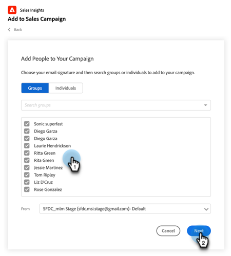

# Salesforce에서 세일즈 캠페인에 일괄 추가 사용 {#using-bulk-add-to-sales-campaign-in-salesforce}

Salesforce에서 판매 캠페인에 일괄 추가하여 판매 작업을 사용하여 아웃바운드 커뮤니케이션을 확장하는 방법을 알아봅니다.

>[!NOTE]
>
>Salesforce에서는 한 번에 선택할 수 있는 레코드 수를 200개로 제한합니다.

>[!PREREQUISITES]
>
>Salesforce 인스턴스에 [최신 Sales Insight 패키지](/help/marketo/product-docs/marketo-sales-insight/msi-for-salesforce/upgrading/upgrading-your-msi-package.md){target="_blank"}를 설치하고 Salesforce의 연락처 및 잠재 고객 목록 보기에 [작업 단추](/help/marketo/product-docs/marketo-sales-insight/actions/crm/salesforce-package-configuration/add-action-buttons-to-salesforce-list-view.md){target="_blank"}를 구성했는지 확인하십시오.

## Salesforce Lightning의 판매 캠페인에 일괄 추가 {#bulk-add-to-sales-campaign-in-salesforce-lightning}

1. Salesforce에서 **리드/연락처** 탭을 클릭하여 리드/연락처 홈 페이지로 이동합니다.

   

1. **보기** 드롭다운에서 전자 메일을 보내려는 잠재 고객/연락처에 대한 원하는 보기를 선택합니다.

   >[!TIP]
   >
   >오른쪽의 톱니바퀴 아이콘을 클릭하고 **새로 만들기**&#x200B;를 선택하여 새 보기를 만들 수 있습니다. 보기에 새 이름을 지정하고 저장하면 오른쪽에 있는 필터 아이콘을 클릭하여 이메일을 보내려는 잠재 고객/연락처 집합을 필터링할 수 있습니다.

1. 원하는 잠재 고객 또는 연락처 목록을 선택하고 **Sales Campaign에 추가** 단추를 클릭합니다.

   

1. 선택한 수신자가 추가된 영업 캠페인 모달 작업으로 이동합니다.

1. 사용자 또는 그룹을 제거하는 데 필요한 편집을 한 다음 **다음**&#x200B;을(를) 클릭합니다.

   

1. 범주 드롭다운에서 사용할 Sales Campaign 범주를 선택합니다.

1. 선택한 직원을 추가할 영업 캠페인을 선택하고 **다음**&#x200B;을(를) 클릭합니다.

   

1. 캠페인의 첫 번째 단계가 무엇인지에 따라 다른 옵션이 표시될 수 있습니다. 첫 번째 단계가 이메일인 경우 아래 표시된 것처럼 각 수신자의 이메일을 편집할 수 있는 옵션이 있습니다. 작업이 완료되면 **다음**&#x200B;을 클릭하세요.

   

1. 다시 한 번 말하지만, 첫 번째 단계가 이메일이고 캠페인 시작 시기를 선택할 수 있도록 구성한 경우 **지금 시작** 또는 **새 시작 시간을 예약**&#x200B;하는 옵션이 제공됩니다. 작업이 완료되면 **시작**&#x200B;을 클릭하세요.

   

시작을 클릭하면 몇 명이 추가되었는지 알려주는 확인 화면이 표시됩니다.

## Salesforce Classic에서 판매 캠페인에 일괄 추가 {#bulk-add-to-sales-campaign-in-salesforce-classic}

1. Salesforce에서 **리드/연락처** 탭을 클릭합니다.

1. 보기 드롭다운에서 전자 메일을 보낼 잠재 고객/연락처의 보기를 선택하고 **이동**&#x200B;을 클릭합니다.

   

   >[!TIP]
   >
   >새 보기 만들기 를 클릭하고 사용 가능한 필터를 구성하여 전자 메일을 보낼 수신자 목록의 범위를 좁힐 수 있습니다.

1. 원하는 잠재 고객 또는 연락처 목록을 선택하고 **Sales Campaign에 추가** 단추를 클릭합니다.

   

1. 선택한 사람이 추가된 상태로 작업 판매 캠페인 모달로 이동합니다.

1. 사용자 또는 그룹을 제거하는 데 필요한 편집을 한 다음 **다음**&#x200B;을(를) 클릭합니다.

   

1. **범주** 드롭다운에서 사용할 영업 캠페인 범주를 선택합니다.

1. 선택한 직원을 추가할 영업 캠페인을 선택하고 **다음**&#x200B;을(를) 클릭합니다.

   

1. 캠페인의 첫 번째 단계가 무엇인지에 따라 다른 옵션이 표시될 수 있습니다. 첫 번째 단계가 이메일인 경우 아래 표시된 것처럼 각 수신자의 이메일을 편집할 수 있는 옵션이 있습니다. 작업이 완료되면 **다음**&#x200B;을 클릭하세요.

   

1. 다시 한 번 말하지만, 첫 번째 단계가 이메일이고 캠페인 시작 시기를 선택할 수 있도록 구성한 경우 **지금 시작** 또는 **새 시작 시간을 예약**&#x200B;하는 옵션이 제공됩니다. 작업이 완료되면 **시작**&#x200B;을 클릭하세요.

   

시작을 클릭하면 몇 명이 추가되었는지 알려주는 확인 화면이 표시됩니다.

