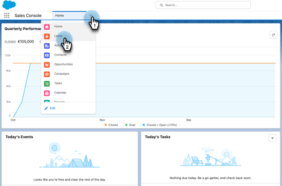

# Salesforce에서 판매 이메일 대량 보내기 사용 {#using-bulk-send-sales-email-in-salesforce}

영업 액션을 사용하여 아웃바운드 커뮤니케이션을 확장하는 데 도움이 되도록 Salesforce에서 대량 이메일을 보내는 방법에 대해 알아봅니다.

>[!NOTE]
>
>Salesforce에서는 한 번에 선택할 수 있는 레코드 수를 200개로 제한합니다.

>[!PREREQUISITES]
>
>Salesforce 인스턴스에 [최신 Sales Insight 패키지](/help/marketo/product-docs/marketo-sales-insight/msi-for-salesforce/upgrading/upgrading-your-msi-package.md){target="_blank"}를 설치하고 Salesforce의 연락처 및 잠재 고객 목록 보기에 [작업 단추](/help/marketo/product-docs/marketo-sales-insight/actions/crm/salesforce-package-configuration/add-action-buttons-to-salesforce-list-view.md){target="_blank"}를 구성했는지 확인하십시오.

## Salesforce Lightning에서 벌크 이메일 보내기 {#sending-bulk-email-in-salesforce-lightning}

1. Salesforce에서 **리드/연락처** 탭을 클릭하여 리드/연락처 홈 페이지로 이동합니다.

   

1. 보기 드롭다운에서 이메일을 보낼 리드/연락처에 대한 원하는 보기를 선택합니다.

   >[!TIP]
   >
   >오른쪽의 톱니바퀴 아이콘을 클릭하고 **새로 만들기**&#x200B;를 선택하여 새 보기를 만들 수 있습니다. 보기에 새 이름을 지정하고 저장하면 오른쪽에 있는 필터 아이콘을 클릭하여 이메일을 보내려는 잠재 고객/연락처 집합을 필터링할 수 있습니다.

1. 원하는 잠재 고객 또는 연락처 목록을 선택하고 **판매 전자 메일 보내기** 단추를 클릭합니다.

   

1. 선택한 사람이 추가된 상태로 작업 작성 창으로 이동합니다.

1. 작업 작성 창 편집기에 삽입할 템플릿을 선택하거나 사용자 지정 이메일을 작성합니다.

   >[!TIP]
   >
   >[고정된 범주](/help/marketo/product-docs/marketo-sales-insight/actions/email/using-the-compose-window/using-a-template-in-the-compose-window.md#pinning-template-categories-in-the-compose-window){target="_blank"}을 사용하여 자주 사용하는 전자 메일 템플릿에 더 쉽게 액세스할 수 있습니다.

   **선택적 단계**: **동적 필드 미리 보기** 단추를 클릭하여 동적 필드 개인 설정을 미리 봅니다.

   >[!TIP]
   >
   >모든 수신자에 대한 템플릿을 사용자 지정하려면 일괄 작성 사이드바에서 모든 수신자 옵션을 클릭하면 모든 수신자 이메일을 동시에 편집할 수 있습니다. 특정 이메일을 변경하려면 일괄 작성 사이드바에서 수신자의 이름이나 이메일을 클릭하십시오. 개별 이메일을 변경한 다음 모든 수신자를 선택하는 동안 변경 작업을 수행하면 모든 수신자에 대한 변경 사항이 개별 이메일에 대한 변경 사항을 덮어씁니다.

1. 이메일을 즉시 보내려면 **보내기**&#x200B;를 선택하고, 이메일을 보낼 날짜와 시간을 설정하려면 **일정 설정**&#x200B;을 선택합니다.

   

## Salesforce Classic에서 벌크 이메일 전송 {#sending-bulk-email-in-salesforce-classic}

1. Salesforce에서 **리드/연락처** 탭을 클릭합니다.

1. 보기 드롭다운에서 전자 메일을 보낼 잠재 고객/연락처의 보기를 선택하고 **이동**&#x200B;을 클릭합니다.

   

   >[!TIP]
   >
   >새 보기 만들기 를 클릭하고 사용 가능한 필터를 구성하여 Sales Campaign에 추가할 대상자의 목록을 좁혀 새 보기를 만들 수 있습니다.

1. 원하는 잠재 고객 또는 연락처 목록을 선택하고 **판매 전자 메일 보내기** 단추를 클릭합니다.

   

1. 작성 창에서 선택한 수신자가 포함된 작업 작성 창으로 이동합니다.

1. 작업 작성 창 편집기에 삽입할 템플릿을 선택하거나 사용자 지정 이메일을 작성합니다.

   

   >[!TIP]
   >
   >[고정된 범주](/help/marketo/product-docs/marketo-sales-insight/actions/email/using-the-compose-window/using-a-template-in-the-compose-window.md#pinning-template-categories-in-the-compose-window){target="_blank"}을 사용하여 자주 사용하는 전자 메일 템플릿에 더 쉽게 액세스할 수 있습니다.

   **선택적 단계**: **동적 필드 미리 보기** 단추를 클릭하여 동적 필드 개인 설정을 미리 봅니다.

   >[!TIP]
   >
   >모든 수신자에 대한 템플릿을 사용자 지정하려면 일괄 작성 사이드바에서 모든 수신자 옵션을 클릭하면 모든 수신자 이메일을 동시에 편집할 수 있습니다. 특정 이메일을 변경하려면 일괄 작성 사이드바에서 수신자의 이름이나 이메일을 클릭하십시오. 개별 이메일을 변경한 다음 모든 수신자를 선택하는 동안 변경 작업을 수행하면 모든 수신자에 대한 변경 사항이 개별 이메일에 대한 변경 사항을 덮어씁니다.

1. 이메일을 즉시 보내려면 **보내기**&#x200B;를 선택하고, 이메일을 보낼 날짜와 시간을 설정하려면 **일정 설정**&#x200B;을 선택합니다.
