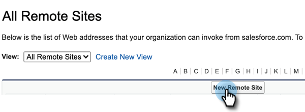

# Salesforce의 Sales Insight Actions 구성 {#sales-insight-actions-configuration-in-salesforce}

>[!PREREQUISITES]
>
>* [설치](/help/marketo/product-docs/marketo-sales-insight/msi-for-salesforce/installation/install-marketo-sales-insight-package-in-salesforce-appexchange.md) 또는 [업그레이드](/help/marketo/product-docs/marketo-sales-insight/msi-for-salesforce/upgrading/upgrading-your-msi-package.md) Salesforce 인스턴스의 Sales Insight 패키지
>* [Salesforce Enterprise/Unlimited에서 Marketo Sales Insight 구성](/help/marketo/product-docs/marketo-sales-insight/msi-for-salesforce/configuration/configure-marketo-sales-insight-in-salesforce-enterprise-unlimited.md)

## Salesforce에서 새 원격 사이트 추가 {#add-new-remote-site-in-salesforce}

1. Salesforce에서 **설정**.

   

1. &quot;원격 사이트&quot;를 검색하고 선택합니다. **원격 사이트 설정**.
   

1. 클릭 **새 원격 사이트**.

   

1. 원격 사이트 이름을 입력합니다(&quot;MarketoSalesInsight&quot; 와 유사할 수 있음). 원격 사이트 URL(https://ims-na1-stg1.adobelogin.com)을 입력하고 **저장**.

   

## CRM에서 Sales Insight Action 활성화 {#enabling-sales-insight-actions-across-the-crm}

1. Salesforce에서 **Marketo Sales Insight Config** 탭.

   

   >[!NOTE]
   >
   >상단 막대에 &quot;Marketo Sales Insight Config&quot;가 표시되지 않으면 **+** 모든 탭에서 서명하여 찾습니다.

1. 을(를) 선택합니다 **MSI 작업 사용** 확인란을 선택합니다.

   

1. API 암호 키를 입력합니다.

   

   >[!NOTE]
   >
   >API 암호 키를 바로 사용할 수 없는 경우 의 단계를 수행하여 찾을 수 있습니다 [이 문서](/help/marketo/product-docs/marketo-sales-insight/msi-for-salesforce/configuration/configure-marketo-sales-insight-in-salesforce-enterprise-unlimited.md).

1. 클릭 **저장** 완료 시.

이렇게 하면 기능 개요 문서에 설명된 모든 MSI 작업 기능이 자동으로 활성화됩니다.

>[!NOTE]
>
>&quot;MSI 작업 활성화&quot; 확인란을 선택 취소하면 모든 MSI 작업 기능을 비활성화할 수 있습니다.

## MSI-작업 거버넌스 {#msi-actions-governance}

1. 예정된 섹션에서 판매 캠페인 및/또는 작업 탭을 비활성화할 수 있습니다. 이 작업은 리드, 연락처, 계정 및 기회 패널에 적용할 수 있습니다.

   

1. 작업 설정에서 해당 기능을 선택 취소하여 MSI 작업을 비활성화할 수 있습니다.

   

>[!NOTE]
>
>거버넌스 설정은 모든 MSI 사용자에게 적용됩니다.
