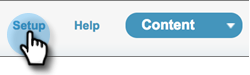

# Salesforce Classic 사용자 지정 패키지 제거 {#uninstall-salesforce-classic-customization-package}

MSI 작업 패키지 사용을 시작하면 Salesforce 계정에서 Marketo Sales Connect 패키지를 제거합니다.

## 페이지 레이아웃에서 판매 접속 필드 제거 {#remove-sales-connect-fields-from-page-layout}

1. Salesforce Classic에서 **설정**.

   

1. 왼쪽 탐색 메뉴의 빌드에서 를 확장하고(클릭하지 않음) 사용자 지정, 리드 를 차례로 확장합니다. 그런 다음 **페이지 레이아웃**.

   

1. 클릭 **편집** 리드 레이아웃 옆에 표시됩니다.

   

1. 콘솔에서 를 선택합니다. **필드**. 빠른 찾기에서 &quot;MSC&quot;를 검색합니다. 회색으로 표시된 모든 필드가 페이지 레이아웃에 추가되었습니다. 이를 삭제해야 합니다.

   

   >[!NOTE]
   >
   >회색으로 표시된 필드가 없으면 페이지 레이아웃에 해당 필드를 추가하지 않은 것을 의미합니다. 이 섹션을 건너뛸 수 있습니다.

1. Sales Connect 사용자 정의 필드가 있는 섹션으로 스크롤합니다.

   

1. 이 섹션에 추가할 수 있는 MSC 필드 유형은 10개입니다. 추가한 모든 필드를 제거하거나 전체 섹션을 삭제합니다.

1. 클릭 **빠른 저장** 완료 시.

   

## 페이지 레이아웃에서 판매 연결 단추 제거 {#remove-sales-connect-buttons-from-page-layouts}

1. 콘솔(위의 4단계)에서 을 선택합니다 **단추**. &quot;MSC&quot;를 검색합니다. 회색으로 표시된 모든 단추가 사용자 지정 단추 섹션에 추가되었습니다. 이를 삭제해야 합니다.

   

   >[!NOTE]
   >
   >회색으로 표시된 버튼이 없는 경우 해당 버튼을 추가하지 않은 것입니다. 이 섹션을 건너뛸 수 있습니다.

1. 사용자 지정 단추 섹션의 MSC 단추를 콘솔로 끌어다 놓습니다.

   

1. 클릭 **빠른 저장** 완료 시.

   

## Activity History 섹션에서 Sales Connect 필드 제거 {#remove-sales-connect-fields-from-activity-history-section}

1. 페이지 하단으로 스크롤하여 활동 내역 관련 목록 섹션으로 이동한 다음 공구모양 아이콘을 클릭합니다.

   

1. 선택한 필드 영역에서 Sales Connect 필드를 선택하고 제거 화살표를 누릅니다. 클릭 **확인** 완료 시.

   

   >[!NOTE]
   >
   >MSE _is_ 영업 연결. 그냥 이전 이름인 &quot;Marketo Sales Engage&quot;입니다.

1. 클릭 **저장** 리드 페이지를 완료한 경우

## 리드 목록 보기에서 판매 연결 일괄 작업 단추 제거 {#remove-sales-connect-bulk-action-buttons-from-lead-list-view}

1. 왼쪽 탐색 메뉴의 빌드에서 를 확장하고(클릭하지 않음) 사용자 지정, 리드 를 차례로 확장합니다. 그런 다음 **레이아웃 검색**.

   

1. 리드 목록 보기 옆의 **편집**.

   

1. 선택 **MSC Campaign에 추가(Classic)**, **MSC를 사용한 이메일(클래식)**, 및 **MSC에 푸시(클래식)**&#x200B;를 클릭하고 제거 화살표를 클릭합니다. 그런 다음 **저장**.

   

리드 목록 보기에 단추가 더 이상 표시되지 않습니다.

## 연락처에 대한 MSC 구성 제거 {#remove-msc-configuration-for-contacts}

1. Salesforce에서 **설정**.

1. 왼쪽 탐색 메뉴의 빌드에서 을(를 클릭하지 않고) 사용자 지정, 연락처 를 차례로 확장합니다. 그런 다음 **페이지 레이아웃**.

1. 연락처 레이아웃 옆의 **편집**.

1. 세 섹션 모두에서 단계를 반복합니다.

## Opportunity에 대한 MSC 구성 제거 {#remove-msc-configuration-for-opportunity}

1. Salesforce에서 **설정**.

1. 왼쪽 탐색 메뉴의 작성에서 (클릭하지 않음) 사용자 지정, 기회 순으로 확장합니다. 그런 다음 **페이지 레이아웃**.

1. 영업 기회 레이아웃 옆의 **편집**.

1. 세 섹션 모두에서 단계를 반복합니다.

Opportunity View 에는 &quot;Send MSE Email&quot; 및 다음 필드가 하나만 있습니다.

## 계정에 대한 MSC 구성 제거 {#remove-msc-configuration-for-account}

1. Salesforce에서 **설정**.

1. 왼쪽 탐색 메뉴의 빌드에서 사용자 지정, 계정 을 차례로 확장합니다. 그런 다음 **페이지 레이아웃**.

1. 계정 레이아웃 옆의 **편집**.

1. 세 섹션 모두에서 단계를 반복합니다.

계정 보기에는 &quot;Send MSE Email&quot; 및 다음 필드가 하나만 있습니다.

## Marketo Sales Outbox 제거 {#remove-marketo-sales-outbox}

1. Salesforce에서 **+** 화면 상단에 있는 탭입니다.

1. 클릭 **내 탭 사용자 지정**.

1. 오른쪽에서 Marketo 판매 창 옵션을 선택합니다. 제거 화살표를 클릭한 다음 **저장**.

## Sales Connect 패키지 삭제 {#delete-sales-connect-package}

Salesforce 계정에서 모든 개체를 제거했으면 아래 단계를 따르십시오.

1. Salesforce에서 **설정**.

1. 빠른 찾기 상자에 &quot;Apex Classes&quot;를 입력합니다.

1. 클릭 **삭제** 목록에 있는 모든 &quot;MarketoSalesConnectionCustomization&quot; 또는 &quot;MarketoSalesEngageCustomization&quot; 항목 옆에 표시됩니다.

다 끝났어!

다음은 Salesforce 인스턴스에서 제거해야 하는 모든 개체 목록입니다.

## Sales Connect 사용자 지정 세부 정보 {#sales-connect-customization-details}

<table>
 <tr>
  <th>사용자 지정 활동 필드</th>
  <th>설명</th>
  <th>유형</th>
  <th>데이터 유형</th>
 </tr>
 <tr>
  <td>MSC 호출 로컬 현재 상태 ID</td>
  <td>사용자는 MSC Phone에서 전화를 걸 때 로컬 상태 선택 사항으로 선택할 수 있습니다. 수신 전화에는 수신자의 로컬 번호가 표시됩니다</td>
  <td>활동</td>
  <td>텍스트</td>
 </tr>
 <tr>
  <td>MSC 호출 기록 URL</td>
  <td>호출을 기록할 수 있고 녹음에 대한 링크가 여기에 기록됩니다 </td>
  <td>활동</td>
  <td>텍스트</td>
 </tr>
 <tr>
  <td>MSC 캠페인</td>
  <td>연락처/리드가 켜져 있는 MSC 캠페인의 로그 이름</td>
  <td>활동</td>
  <td>텍스트</td>
 </tr>
 <tr>
  <td>MSC 캠페인 URL</td>
  <td>MSC에서 생성된 캠페인에 URL을 기록합니다. 이 아이콘을 클릭하면 MSC 웹 앱에서 캠페인이 열립니다</td>
  <td>활동</td>
  <td>텍스트</td>
 </tr>
 <tr>
  <td>MSC Campaign 현재 단계</td>
  <td>연락처/리드가 캠페인에 있는 경우 이 필드에 현재 있는 단계의 이름이 기록됩니다</td>
  <td>활동</td>
  <td>확인란</td>
 </tr>
 <tr>
  <td>MSC 전자 메일 첨부 조회</td>
  <td>수신자가 보는 첨부 파일과 함께 이메일을 보낼 때 데이터를 기록합니다</td>
  <td>활동</td>
  <td>확인란</td>
 </tr>
 <tr>
  <td>클릭한 MSC 이메일</td>
  <td>수신자가 이메일의 링크를 클릭할 때 확인 표시를 기록합니다</td>
  <td>활동</td>
  <td>확인란</td>
 </tr>
 <tr>
  <td>MSC 전자 메일 회신됨</td>
  <td>수신자가 전자 메일에 회신할 때 확인 표시를 기록합니다</td>
  <td>활동</td>
  <td>텍스트</td>
 </tr>
 <tr>
  <td>MSC 전자 메일 상태</td>
  <td>이메일 전송/진행 중/바운스되는지 표시(바운스된 이메일 추적은 사용된 게재 채널에 따라 다름)</td>
  <td>활동</td>
  <td>텍스트</td>
 </tr>
 <tr>
  <td>MSC 전자 메일 템플릿</td>
  <td>리드/연락처로 보낸 이메일에 사용된 MSC 템플릿의 로그 이름입니다</td>
  <td>활동</td>
  <td>텍스트</td>
 </tr>
 <tr>
  <td>MSC 전자 메일 템플릿 URL</td>
  <td>MSC에서 생성된 템플릿의 URL을 기록합니다. 이 아이콘을 클릭하면 MSC 웹 앱에서 템플릿이 열립니다</td>
  <td>활동</td>
  <td>텍스트</td>
 </tr>
 <tr>
  <td>MSC 이메일 URL</td>
  <td>이 URL을 클릭하면 MSC의 명령 센터가 열리고, 사용자가 보낸 전자 메일을 볼 수 있는 [사람 세부 사항 보기 내역] 탭이 열립니다</td>
  <td>활동</td>
  <td>텍스트</td>
 </tr>
 <tr>
  <td>MSC 이메일 조회</td>
  <td>수신자가 이메일을 볼 때 확인 표시를 기록합니다</td>
  <td>활동</td>
  <td>확인란</td>
 </tr>
</table>

<table>
 <tr>
  <th>MSC 롤업 로깅 필드</th>
  <th>설명</th>
  <th>유형</th>
  <th>데이터 유형</th>
 </tr>
 <tr>
  <td>MSC - 마지막 마케팅 참여</td>
  <td>마케팅에서 마지막으로 들어오는 참여</td>
  <td>
  
계정 
  
연락처 
  
리드 
  
기회</td>
  <td>데이터 및 시간</td>
 </tr>
 <tr>
  <td>MSC - 마지막 마케팅 참여 날짜</td>
  <td>마케팅의 참여 타임스탬프</td>
  <td>
  
계정 
  
연락처 
  
리드 
  
기회</td>
  <td>데이터 및 시간</td>
 </tr>
 <tr>
  <td>MSC - 마지막 마케팅 참여 설명</td>
  <td>참여 설명</td>
  <td>
  
계정 
  
연락처 
  
리드 
  
기회</td>
  <td>텍스트</td>
 </tr>
 <tr>
  <td>MSC - 마지막 마케팅 참여 소스</td>
  <td>마케팅 유도 소스</td>
  <td>
  
계정 
  
연락처 
  
리드 
  
기회</td>
  <td>텍스트</td>
 </tr>
 <tr>
  <td>MSC - 마지막 마케팅 참여 유형</td>
  <td>참여 유형(예: 웹 활동)</td>
  <td>
  
계정 
  
연락처 
  
리드 
  
기회</td>
  <td>텍스트</td>
 </tr>
 <tr>
  <td>MSC - 판매별 마지막 활동</td>
  <td>영업 팀에서 수행한 마지막 발신 활동</td>
  <td>
  
계정 
  
연락처 
  
리드 
  
기회</td>
  <td>데이터 및 시간</td>
 </tr>
 <tr>
  <td>MSC - 마지막 응답</td>
  <td>영업 전자 메일에 대한 마지막 전자 메일 회신</td>
  <td>
  
계정 
  
연락처 
  
리드 
  
기회</td>
  <td>데이터 및 시간</td>
 </tr>
 <tr>
  <td>MSC - 현재 판매 캠페인</td>
  <td>연락처/리드가 켜져 있는 MSC 캠페인의 로그 이름</td>
  <td>
  
계정 
  
연락처 
  
리드 
  
기회</td>
  <td>텍스트</td>
 </tr>
 <tr>
  <td>MSC - 마지막 판매 계약</td>
  <td>판매에서 들어오는 마지막 계약</td>
  <td>
  
계정 
  
연락처 
  
리드 
  
기회</td>
  <td>데이터 및 시간</td>
 </tr>
 <tr>
  <td>MSC - 옵트아웃</td>
  <td>옵트아웃 필드</td>
  <td>
  
계정 
  
연락처 
  
리드 
  
기회</td>
  <td>확인란</td>
 </tr>
</table>

<table>
 <tr>
  <th>MSC 단추</th>
  <th>설명</th>
  <th>유형</th>
 </tr>
 <tr>
  <td>MSC 전자 메일 보내기</td>
  <td>Salesforce에서 판매 이메일 보내기</td>
  <td>
  
계정 
  
연락처 
  
리드 
  
기회</td>
 </tr>
 <tr>
  <td>MSC Campaign에 추가</td>
  <td>Salesforce에서 MSC 캠페인에 추가</td>
  <td>
  
연락처
  
리드</td>
 </tr>
 <tr>
  <td>MSC에 푸시</td>
  <td>Salesforce에서 MSC로 연락처 푸시</td>
  <td>
  
연락처
  
리드</td>
 </tr>
 <tr>
  <td>MSC를 사용하여 호출</td>
  <td>Salesforce에서 판매 호출</td>
  <td>
  
연락처
  
리드</td>
 </tr>
</table>

<table>
 <tr>
  <th>MSC 벌크 작업 단추</th>
  <th>설명</th>
  <th>유형</th>
 </tr>
 <tr>
  <td>MSC Campaign에 추가(Classic)</td>
  <td>Salesforce에서 MSC 캠페인에 추가</td>
  <td>
  
연락처
  
리드</td>
 </tr>
 <tr>
  <td>MSC에 푸시(클래식)</td>
  <td>Salesforce에서 MSC로 연락처 푸시</td>
  <td>
  
연락처
  
리드</td>
 </tr>
 <tr>
  <td>MSC를 사용한 이메일(클래식)</td>
  <td>Salesforce에서 MSC가 포함된 이메일</td>
  <td>
  
연락처
  
리드</td>
 </tr>
</table>
