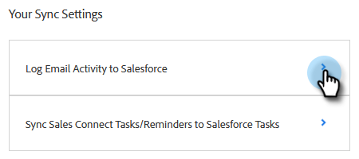

# Salesforce 동기화 설정 {#salesforce-sync-settings}

## API를 통해 Salesforce에 이메일 활동 로깅 {#logging-email-activity-to-salesforce-via-api}

이 기능을 사용하려면 Enterprise/Unlimited edition of Salesforce를 사용하고, Web Services API를 통해 통합을 구매한 경우 Professional Edition을 사용해야 합니다.

>[!PREREQUISITES]
>
>Salesforce 및 Marketo Sales가 연결되어 있어야 합니다.

1. Marketo Sales에서 톱니바퀴 아이콘을 클릭하고 을 선택합니다 **설정**.

   

1. 관리자 설정 (또는 관리자가 아닌 경우 &quot;내 계정&quot;)에서 **Salesforce**.

   

1. 을(를) 클릭합니다. **동기화 설정** 탭.

   

1. Salesforce에 이메일 활동 기록 옆에 있는 화살표를 클릭합니다.

   

1. 을(를) 클릭합니다. **Salesforce API** 탭. 이 카드에서 Salesforce에 정보를 로깅하기 위한 기본 설정을 설정할 수 있습니다. 클릭 **저장** 완료 시.

   

## Salesforce에 이메일 활동 로깅(BCC)을 통해 Salesforce에 이메일 활동 로깅 {#logging-email-activity-to-salesforce-via-email-to-salesforce-bcc}

&quot;Email to Salesforce (BCC)&quot;를 활성화하면 판매 이메일의 숨은 참조를 받게 되고 이메일이 기회, 리드 및 연락처에 대한 활동으로 기록됩니다.

>[!PREREQUISITES]
>
>Salesforce 및 Marketo Sales가 연결되어 있어야 합니다.

**이메일(BCC)을 통해 Salesforce에 이메일을 기록하려면**

1. Marketo Sales에서 톱니바퀴 아이콘을 클릭하고 을 선택합니다 **설정**.

   

1. 관리자 설정 (또는 관리자가 아닌 경우 &quot;내 계정&quot;)에서 **Salesforce**.

   

1. 을(를) 클릭합니다. **동기화 설정** 탭.

   

1. 을(를) 클릭합니다. **Salesforce로 이메일 보내기(BCC)** 탭을 클릭하고 **활성화**.

   

일부 이유로 Salesforce에 전자 메일 주소가 가져올 수 없는 경우 다음 단계에 따라 Salesforce 계정에서 BCC 기능을 활성화합니다.

1. Salesforce 인스턴스에 로그인합니다.
1. 오른쪽 상단 모서리에서 사용자 이름을 찾고 드롭다운 막대를 선택합니다.
1. 선택 **내 설정**.
1. 선택 **이메일**.
1. 선택 **Salesforce에 내 이메일 보내기**.
1. 이 페이지에는 &quot;Email to Salesforce Address&quot;라는 레이블이 지정된 필드가 표시됩니다. 그 옆에 채워지지 않은 것이 있으면 아래로 스크롤하여 &quot;My Acceptable Email Addresses&quot;로 이동합니다.
1. 숨은 참조를 원하는 이메일 주소를 입력합니다.
1. 클릭 **변경 내용 저장**.

**내 설정에서 Salesforce에 전자 메일을 찾을 수 없음**

설정 아래에 Salesforce에 내 이메일이 표시되지 않으면 관리자가 이를 활성화하지 않았을 수 있습니다. 팀이 Salesforce를 처음 사용하거나 팀이 Salesforce에서 제공하는 BCC 주소를 사용하지 않은 경우 이러한 문제가 발생할 수 있습니다.

>[!NOTE]
>
>이 설정을 사용하려면 관리자 권한이 필요합니다.

1. 클릭 **설정**.
1. 클릭 **이메일 관리**.
1. 클릭 **Salesforce에 이메일 보내기**.
1. 클릭 **편집**.
1. &quot;활성&quot; 옆의 상자를 선택합니다.
1. 클릭 **저장**.

## Salesforce 작업에 Marketo 영업 작업/미리 알림 동기화 {#sync-marketo-sales-tasks-reminders-to-salesforce-tasks}

1. Marketo Sales에서 톱니바퀴 아이콘을 클릭하고 을 선택합니다 **설정**.

   

1. 관리자 설정 (또는 관리자가 아닌 경우 &quot;내 계정&quot;)에서 **Salesforce**.

   

1. 을(를) 클릭합니다. **동기화 설정** 탭.

   

1. Salesforce 작업에 Marketo Sales Tasks/Recommendations 동기화 옆에 있는 화살표를 클릭합니다.

   

1. 원하는 옵션을 선택합니다(기본적으로 &quot;Salesforce 작업에 동기화 안 함&quot; 옵션이 선택되어 있음).

   
