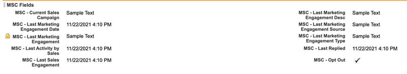

# Salesforce Classic에서 Marketo Sales Connect 제거 {#uninstall-marketo-sales-connect-from-salesforce-classic}

다음은 Sales Insight 작업 사용을 시작한 후 Salesforce 계정에서 Marketo Sales Connect 패키지를 제거하는 방법입니다.

## 페이지 레이아웃에서 Sales Connect 필드 제거 {#remove-sales-connect-fields-from-page-layout}

1. Salesforce Classic에서 **설정**&#x200B;을 클릭합니다.

   

1. 왼쪽 탐색 메뉴에서 빌드에서 맞춤화 를 확장 (하지만 클릭하지 않음)한 다음 리드 를 클릭합니다. 그런 다음 **페이지 레이아웃**&#x200B;을 선택합니다.

   

1. 잠재 고객 레이아웃 옆에 있는 **편집**&#x200B;을 클릭합니다.

   

1. 콘솔에서 **필드**&#x200B;를 선택합니다. 빠른 찾기에서 &quot;MSC&quot;를 검색합니다. 회색으로 표시된 모든 필드가 페이지 레이아웃에 추가되었습니다. 삭제해야 합니다.

   

   >[!NOTE]
   >
   >어떤 필드도 회색으로 표시되지 않으면 페이지 레이아웃에 추가하지 않은 것입니다. 이 섹션은 건너뛸 수 있습니다.

1. Sales Connect 사용자 정의 필드가 있는 섹션으로 스크롤합니다.

   

1. 이 섹션에 추가할 수 있는 10가지 유형의 MSC 필드가 있습니다. 추가한 필드를 모두 제거하거나 간단히 전체 섹션을 삭제합니다.

1. 완료되면 **빠른 저장**&#x200B;을 클릭하세요.

   

## 페이지 레이아웃에서 Sales Connect 단추 제거 {#remove-sales-connect-buttons-from-page-layouts}

1. 콘솔(위의 4단계)에서 **단추**&#x200B;를 선택합니다. &quot;MSC&quot;를 검색합니다. 회색으로 표시된 모든 단추가 사용자 지정 단추 섹션에 추가되었습니다. 삭제해야 합니다.

   

   >[!NOTE]
   >
   >회색으로 표시된 단추가 없으면 해당 단추를 추가하지 않은 것입니다. 이 섹션은 건너뛸 수 있습니다.

1. 사용자 지정 단추 섹션에서 MSC 단추를 콘솔로 끌어서 놓습니다.

   

1. 완료되면 **빠른 저장**&#x200B;을 클릭하세요.

   

## 활동 내역 섹션에서 Sales Connect 필드 제거 {#remove-sales-connect-fields-from-activity-history-section}

1. 페이지 하단으로 스크롤하여 Activity History 관련 목록 섹션으로 이동한 다음, Wrench 아이콘을 클릭합니다.

   

1. 선택한 필드 영역에서 Sales Connect 필드를 선택하고 제거 화살표를 클릭합니다. 완료되면 **확인**&#x200B;을 클릭하세요.

   

   >[!NOTE]
   >
   >약어 MSE _is_ Sales Connect. 바로 이전 이름인 &quot;Marketo Sales Engage&quot;입니다.

1. 리드 페이지가 완료되면 **저장**&#x200B;을 클릭하세요.

## 가망 고객 목록 보기에서 Sales Connect 일괄 조치 버튼 제거 {#remove-sales-connect-bulk-action-buttons-from-lead-list-view}

1. 왼쪽 탐색 메뉴에서 빌드에서 맞춤화 를 확장 (하지만 클릭하지 않음)한 다음 리드 를 클릭합니다. 그런 다음 **레이아웃 검색**&#x200B;을 선택합니다.

   

1. 잠재 고객 목록 보기 옆의 **편집**&#x200B;을 클릭합니다.

   

1. **MSC 캠페인에 추가(Classic)**, **MSC를 사용한 전자 메일** 및 **MSC에 푸시(Classic)**&#x200B;를 선택하고 제거 화살표를 클릭합니다. 그런 다음 **저장**&#x200B;을 클릭합니다.

   

더 이상 가망 고객 목록 보기에 단추가 표시되지 않습니다.

## 연락처에 대한 MSC 구성 제거 {#remove-msc-configuration-for-contacts}

1. Salesforce에서 **설정**&#x200B;을 클릭합니다.

1. 왼쪽 탐색 메뉴에서 빌드에서 맞춤화 를 확장한 다음 (클릭하지 마십시오) 연락처 을 선택합니다. 그런 다음 **페이지 레이아웃**&#x200B;을 선택합니다.

1. 연락처 레이아웃 옆에 있는 **편집**&#x200B;을 클릭합니다.

1. 세 섹션 모두에서 단계를 반복합니다.

## 영업 기회에 대한 MSC 구성 제거 {#remove-msc-configuration-for-opportunity}

1. Salesforce에서 **설정**&#x200B;을 클릭합니다.

1. 왼쪽 탐색 메뉴의 빌드에서 맞춤화, Opportunities 를 차례로 확장합니다(클릭하면 안 됨). 그런 다음 **페이지 레이아웃**&#x200B;을 선택합니다.

1. 영업 기회 레이아웃 옆에 있는 **편집**&#x200B;을 클릭합니다.

1. 세 섹션 모두에서 단계를 반복합니다.

영업 기회 보기에는 &quot;MSE 이메일 보내기&quot; 버튼과 다음 필드만 있습니다.

## 계정에 대한 MSC 구성 제거 {#remove-msc-configuration-for-account}

1. Salesforce에서 **설정**&#x200B;을 클릭합니다.

1. 왼쪽 탐색 메뉴에서 빌드에서 맞춤화 를 확장 (하지만 클릭하지 않음)한 다음 계정 을 선택합니다. 그런 다음 **페이지 레이아웃**&#x200B;을 선택합니다.

1. 계정 레이아웃 옆에 있는 **편집**&#x200B;을 클릭합니다.

1. 세 섹션 모두에서 단계를 반복합니다.

계정 보기에는 &quot;MSE 이메일 보내기&quot; 단추와 다음 필드만 있습니다.

## Marketo Sales Outbox 제거 {#remove-marketo-sales-outbox}

1. Salesforce에서 화면 상단의 **+** 탭을 클릭합니다.

1. **내 탭 맞춤화**&#x200B;를 클릭합니다.

1. 오른쪽에서 Marketo Sales Outbox 옵션을 선택합니다. 제거 화살표를 클릭한 다음 **저장**&#x200B;을 클릭합니다.

## Sales Connect 패키지 삭제 {#delete-sales-connect-package}

Salesforce 계정에서 개체를 모두 제거했으면 아래 단계를 따르십시오.

1. Salesforce에서 **설정**&#x200B;을 클릭합니다.

1. 빠른 찾기 상자에 &quot;Apex 클래스&quot;를 입력합니다.

1. 목록의 모든 &quot;MarketoSalesConnectionCustomization&quot; 또는 &quot;MarketoSalesEngageCustomization&quot; 항목 옆에 있는 **삭제**&#x200B;를 클릭합니다.

준비가 완료되었습니다!

다음은 Salesforce 인스턴스에서 제거해야 하는 모든 개체 목록입니다.

## Sales Connect 사용자 정의 세부 정보 {#sales-connect-customization-details}

<table>
 <tr>
  <th>사용자 정의 활동 필드</th>
  <th>설명</th>
  <th>유형</th>
  <th>데이터 유형</th>
 </tr>
 <tr>
  <td>MSC 호출 로컬 상태 ID</td>
  <td>사용자로서 MSC Phone에서 전화를 걸 때 Local Presence를 옵션으로 선택할 수 있습니다. 수신 전화에 수신자의 로컬 번호가 표시됩니다.</td>
  <td>활동</td>
  <td>텍스트</td>
 </tr>
 <tr>
  <td>MSC 호출 기록 URL</td>
  <td>호출을 기록할 수 있으며 녹화에 대한 링크는 여기에 기록됩니다 </td>
  <td>활동</td>
  <td>텍스트</td>
 </tr>
 <tr>
  <td>MSC 캠페인</td>
  <td>연락처/잠재 고객이 속한 MSC 캠페인의 로그 이름</td>
  <td>활동</td>
  <td>텍스트</td>
 </tr>
 <tr>
  <td>MSC 캠페인 URL</td>
  <td>MSC에서 생성된 캠페인에 대한 URL을 기록합니다. 이 아이콘을 클릭하면 MSC 웹 앱에서 캠페인이 열립니다</td>
  <td>활동</td>
  <td>텍스트</td>
 </tr>
 <tr>
  <td>MSC 캠페인 현재 단계</td>
  <td>연락처/잠재 고객이 캠페인에 있는 경우 이 필드에는 현재 진행 중인 단계의 이름이 기록됩니다</td>
  <td>활동</td>
  <td>확인란</td>
 </tr>
 <tr>
  <td>MSC 전자 메일 첨부 파일 확인됨</td>
  <td>수신자가 조회한 첨부 파일과 함께 이메일이 전송될 때 데이터를 기록합니다</td>
  <td>활동</td>
  <td>확인란</td>
 </tr>
 <tr>
  <td>MSC 이메일 클릭됨</td>
  <td>수신자가 이메일의 링크를 클릭하면 확인 표시를 기록합니다.</td>
  <td>활동</td>
  <td>확인란</td>
 </tr>
 <tr>
  <td>MSC 이메일 회신됨</td>
  <td>수신자가 전자 메일에 회신할 때 확인 표시를 기록합니다.</td>
  <td>활동</td>
  <td>텍스트</td>
 </tr>
 <tr>
  <td>MSC 이메일 상태</td>
  <td>이메일이 전송/진행 중/반송되었는지 여부를 표시합니다(반송된 이메일 추적은 사용된 게재 채널에 따라 다름).</td>
  <td>활동</td>
  <td>텍스트</td>
 </tr>
 <tr>
  <td>MSC 전자 메일 템플릿</td>
  <td>잠재 고객/담당자에게 전송된 전자 메일에 사용된 MSC 템플릿의 로그 이름</td>
  <td>활동</td>
  <td>텍스트</td>
 </tr>
 <tr>
  <td>MSC 이메일 템플릿 URL</td>
  <td>MSC에서 생성된 템플릿에 대한 URL을 기록합니다. 이 아이콘을 클릭하면 MSC 웹 앱에서 템플릿이 열립니다</td>
  <td>활동</td>
  <td>텍스트</td>
 </tr>
 <tr>
  <td>MSC 이메일 URL</td>
  <td>이 URL을 클릭하면 MSC에서 명령 센터를 열고 사용자가 전송된 전자 메일을 볼 수 있는 사람 세부 정보 보기 기록 탭을 가져옵니다.</td>
  <td>활동</td>
  <td>텍스트</td>
 </tr>
 <tr>
  <td>MSC 이메일 확인함</td>
  <td>수신자가 이메일을 볼 때 확인 표시를 기록합니다.</td>
  <td>활동</td>
  <td>확인란</td>
 </tr>
</table>

<table>
 <tr>
  <th>MSC 롤업 로깅 필드</th>
  <th>설명</th>
  <th>유형</th>
  <th>데이터 유형</th>
 </tr>
 <tr>
  <td>MSC - 마지막 마케팅 참여</td>
  <td>마케팅에서 마지막으로 들어오는 참여</td>
  <td>
  
계정 
  
연락처 
  
리드 
  
기회</td>
  <td>데이터 및 시간</td>
 </tr>
 <tr>
  <td>MSC - 마지막 마케팅 참여 날짜</td>
  <td>마케팅 참여 타임스탬프</td>
  <td>
  
계정 
  
연락처 
  
리드 
  
기회</td>
  <td>데이터 및 시간</td>
 </tr>
 <tr>
  <td>MSC - 마지막 마케팅 참여 설명</td>
  <td>약정에 대한 설명</td>
  <td>
  
계정 
  
연락처 
  
리드 
  
기회</td>
  <td>텍스트</td>
 </tr>
 <tr>
  <td>MSC - 마지막 마케팅 참여 Source</td>
  <td>Source of Marketing 참여</td>
  <td>
  
계정 
  
연락처 
  
리드 
  
기회</td>
  <td>텍스트</td>
 </tr>
 <tr>
  <td>MSC - 마지막 마케팅 참여 유형</td>
  <td>참여 유형(예: 웹 활동)</td>
  <td>
  
계정 
  
연락처 
  
리드 
  
기회</td>
  <td>텍스트</td>
 </tr>
 <tr>
  <td>MSC - 영업별 마지막 활동</td>
  <td>영업 팀에서 마지막으로 수행한 활동</td>
  <td>
  
계정 
  
연락처 
  
리드 
  
기회</td>
  <td>데이터 및 시간</td>
 </tr>
 <tr>
  <td>MSC - 마지막으로 회신함</td>
  <td>판매 이메일에 대한 마지막 이메일 회신</td>
  <td>
  
계정 
  
연락처 
  
리드 
  
기회</td>
  <td>데이터 및 시간</td>
 </tr>
 <tr>
  <td>MSC - 현재 판매 캠페인</td>
  <td>연락처/잠재 고객이 속한 MSC 캠페인의 로그 이름</td>
  <td>
  
계정 
  
연락처 
  
리드 
  
기회</td>
  <td>텍스트</td>
 </tr>
 <tr>
  <td>MSC - 마지막 판매 계약</td>
  <td>Sales에서 마지막으로 들어오는 참여</td>
  <td>
  
계정 
  
연락처 
  
리드 
  
기회</td>
  <td>데이터 및 시간</td>
 </tr>
 <tr>
  <td>MSC - 옵트아웃</td>
  <td>옵트아웃 필드</td>
  <td>
  
계정 
  
연락처 
  
리드 
  
기회</td>
  <td>확인란</td>
 </tr>
</table>

<table>
 <tr>
  <th>MSC 단추</th>
  <th>설명</th>
  <th>유형</th>
 </tr>
 <tr>
  <td>MSC 이메일 보내기</td>
  <td>Salesforce에서 판매 이메일 보내기</td>
  <td>
  
계정 
  
연락처 
  
리드 
  
기회</td>
 </tr>
 <tr>
  <td>MSC 캠페인에 추가</td>
  <td>Salesforce에서 MSC 캠페인에 추가</td>
  <td>
  
연락처
  
리드</td>
 </tr>
 <tr>
  <td>MSC로 푸시</td>
  <td>Salesforce에서 MSC로 연락처 푸시</td>
  <td>
  
연락처
  
리드</td>
 </tr>
 <tr>
  <td>MSC로 통화</td>
  <td>Salesforce에서 판매 통화</td>
  <td>
  
연락처
  
리드</td>
 </tr>
</table>

<table>
 <tr>
  <th>MSC 일괄 작업 단추</th>
  <th>설명</th>
  <th>유형</th>
 </tr>
 <tr>
  <td>MSC 캠페인에 추가(클래식)</td>
  <td>Salesforce에서 MSC 캠페인에 추가</td>
  <td>
  
연락처
  
리드</td>
 </tr>
 <tr>
  <td>MSC로 푸시(클래식)</td>
  <td>Salesforce에서 MSC로 연락처 푸시</td>
  <td>
  
연락처
  
리드</td>
 </tr>
 <tr>
  <td>MSC를 사용한 이메일(클래식)</td>
  <td>Salesforce의 MSC로 이메일 보내기</td>
  <td>
  
연락처
  
리드</td>
 </tr>
</table>
