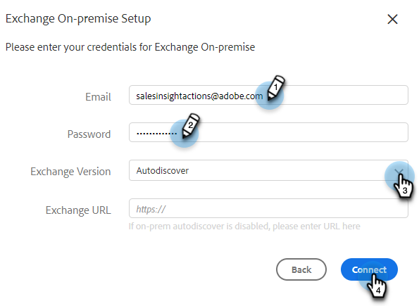

# Outlook에 연결 {#connect-to-outlook}

판매 Insight 작업 계정을 Outlook과 연결하는 방법을 알아봅니다.

>[!NOTE]
>
>각 사용자는 Marketo 판매 계정에서 Outlook에 연결해야 합니다.

## Outlook Online에 연결 {#connecting-to-outlook-online}

Outlook에 연결하면 회신 추적을 받고, Outlook 게재 채널에 액세스하고, Outlook에서 전자 메일을 예약하고, 규정 준수를 보낼 수 있습니다.

1. Marketo Sales에서 톱니바퀴 아이콘을 클릭하고 **설정**&#x200B;을 선택합니다.

   

1. 내 계정에서 **전자 메일 설정**&#x200B;을 선택합니다.

   

1. **전자 메일 연결** 탭을 클릭합니다.

   

1. **시작하기**&#x200B;를 클릭합니다.

   

1. **Outlook을 사용하여 전자 메일 보내기**&#x200B;를 선택하고 **다음**&#x200B;을 클릭합니다.

   

1. 사용 중인 Outlook 버전을 선택하고 **다음**&#x200B;을(를) 클릭합니다. 이 예제에서는 Outlook Online을 선택합니다.

   

   <table>
    <tbody>
     <tr>
      <td><strong>Outlook Online</strong></td>
      <td>Exchange Online이라고도 합니다.</td>
     </tr>
     <tr>
      <td><strong>Exchange 온-프레미스</strong></td>
      <td>Exchange 2013 및 2016 포함</td>
     </tr>
    </tbody>
   </table>

   >[!NOTE]
   >
   >현재 Marketo에서는 Exchange 하이브리드 계정을 지원하지 않습니다.

1. **확인**&#x200B;을 클릭합니다.

   

1. Outlook에 로그인하지 않은 경우 로그인 정보를 입력하고 **다음**&#x200B;을 클릭합니다. 연결하려는 계정을 선택하고 **다음**&#x200B;을 클릭합니다. 이 예에서는 이미 로그인되어 있습니다.

   

1. **승인**&#x200B;을 클릭합니다.

   

   이 연결을 사용하여 이메일을 추적하고 게재 채널로도 사용할 수 있습니다.

   >[!NOTE]
   >
   >Outlook Online(Office365)에서는 자체 전송 제한을 적용합니다. [자세히 알아보기](/help/marketo/product-docs/marketo-sales-connect/email/email-delivery/email-connection-throttling.md#email-provider-limits).

## Exchange 온-프레미스에 연결 {#connecting-to-exchange-on-premise}

Exchange On-Premise에 연결하면 회신 추적 수신, Outlook 게재 채널 액세스, Outlook에서 전자 메일 예약 및 규정 준수 전송 기능을 의미합니다.

1. Marketo Sales에서 톱니바퀴 아이콘을 클릭하고 **설정**&#x200B;을 선택합니다.

   

1. 내 계정에서 **전자 메일 설정**&#x200B;을 선택합니다.

   

1. **전자 메일 연결** 탭을 클릭합니다.

   

1. **시작하기**&#x200B;를 클릭합니다.

   

1. **Outlook을 사용하여 전자 메일 보내기**&#x200B;를 선택하고 **다음**&#x200B;을 클릭합니다.

   

1. 사용 중인 Outlook 버전을 선택하고 **다음**&#x200B;을(를) 클릭합니다. 이 예제에서는 Exchange 온프레미스를 선택합니다.

   

   <table>
    <tbody>
     <tr>
      <td><strong>Outlook Online</strong></td>
      <td>Exchange Online이라고도 합니다.</td>
     </tr>
     <tr>
      <td><strong>Exchange 온-프레미스</strong></td>
      <td>Exchange 2013 및 2016 포함</td>
     </tr>
    </tbody>
   </table>

1. 자격 증명을 입력하고 **연결**&#x200B;을 클릭합니다.

   

   >[!NOTE]
   >
   >Exchange 버전 드롭다운에서 자동 검색을 끄면 IT 부서에 Exchange URL을 문의해야 합니다.

   이 연결을 사용하여 이메일을 추적하고 게재 채널로도 사용할 수 있습니다.

   >[!NOTE]
   >
   >Exchange 온프레미스 사용 시 IT 팀에서 이메일 전송 제한을 설정합니다.

## Outlook Online에 연결하기 위한 권한을 가져오는 중 {#getting-permission-to-connect-to-outlook-online}

IT 팀과 협력하여 Marketo Sales가 Outlook Online 계정(Microsoft 365)에 연결할 수 있도록 허용해야 할 수 있습니다.

>[!NOTE]
>
>Microsoft 365 계정을 관리하는 IT 팀에 액세스가 필요한 애플리케이션이 &quot;Marketo Sales Connect&quot;라고 알립니다.

IT 팀의 환경 설정 및 현재 구성에 따라 액세스 권한 부여 방법에 대해 IT 팀에 문의하는 것이 좋습니다. 다음은 대화를 안내하는 데 도움이 될 수 있는 몇 가지 문서입니다.

* 전역 동의: [Microsoft 365 관리자를 위한 통합 앱 및 Azure AD](https://learn.microsoft.com/en-us/microsoft-365/enterprise/integrated-apps-and-azure-ads?view=o365-worldwide){target="_blank"}
* 사용자 동의: [사용자가 응용 프로그램에 동의하는 방법 구성](https://learn.microsoft.com/en-us/azure/active-directory/manage-apps/configure-user-consent?tabs=azure-portal&pivots=portal){target="_blank"}
* 관리자 동의: [관리자 동의 워크플로 구성](https://learn.microsoft.com/en-us/microsoft-365/admin/misc/user-consent?source=recommendations&view=o365-worldwide){target="_blank"}
* 사용자 동의 설정 또는 해제: [Microsoft 365에서 앱에 대한 사용자 동의 관리](https://learn.microsoft.com/en-us/microsoft-365/admin/misc/user-consent?source=recommendations&view=o365-worldwide){target="_blank"}
* Microsoft Defender로 관리: [OAuth 앱 관리](https://learn.microsoft.com/en-us/defender-cloud-apps/manage-app-permissions){target="_blank"}
