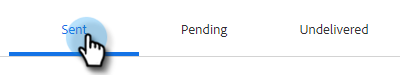

# 고급 검색 개요 {#advanced-search-overview}

이메일을 보고, 클릭하거나, 답글을 달았던 잠재 고객을 타겟팅하기 위해 고급 검색을 활용하여 가장 참여도가 높은 잠재 고객의 타겟팅 목록을 만들 수 있습니다.

## 고급 검색에 액세스하는 방법 {#how-to-access-advanced-search}

1. 웹 응용 프로그램에서 **명령 센터**&#x200B;를 클릭합니다.

   

1. **전자 메일**&#x200B;을 클릭하세요.

   

1. 해당 탭을 선택합니다.

   

1. 고급 검색을 클릭합니다.

   

## 필터 {#filters}

**날짜**

검색할 날짜 범위를 선택합니다. 사전 설정 날짜는 선택한 이메일 상태(보냄, 배달되지 않음, 보류 중)에 따라 업데이트됩니다.

**사용자**

사용자 섹션에서 이메일 수신자/발신자별로 필터링합니다.

<table>
 <tr>
  <td><strong>드롭다운</strong></td>
  <td><strong>설명</strong></td>
 </tr>
 <tr>
  <td><strong>다음으로 보기</strong></td>
  <td>Sales Connect 인스턴스에서 특정 발신자별로 필터링합니다(이 옵션은 관리자만 사용할 수 있음).</td>
 </tr>
 <tr>
  <td><strong>그룹별</strong></td>
  <td>특정 수신자 그룹별로 이메일을 필터링합니다.</td>
 </tr>
 <tr>
  <td><strong>사용자별</strong></td>
  <td>특정 수신자별로 필터링합니다.</td>
 </tr>
</table>

**When**

만든 날짜, 배달된 날짜, 실패한 날짜 또는 예약된 날짜별로 선택합니다. 사용 가능한 옵션은 선택한 이메일 상태(보냄, 배달되지 않음, 보류 중)에 따라 변경됩니다.

**캠페인**

캠페인 참여별로 이메일을 필터링합니다.

**상태**

선택할 수 있는 이메일 상태는 세 가지가 있습니다. 유형/활동 옵션은 선택한 상태에 따라 변경됩니다.

_**상태: 보냄**_

보낸 이메일 활동별 필터. 보기/보기 없음, 클릭/클릭 없음 및/또는 답글/답글 없음을 선택할 수 있습니다.

_**상태: 보류 중**_

모든 보류 중인 이메일을 기준으로 필터링합니다.

<table>
 <tr>
  <td><strong>상태</strong></td>
  <td><strong>설명</strong></td>
 </tr>
 <tr>
  <td><strong>예약됨</strong></td>
  <td>작성 창(Salesforce 또는 웹 앱), 이메일 플러그인 또는 캠페인에서 예약된 이메일.</td>
 </tr>
 <tr>
  <td><strong>초안</strong></td>
  <td>현재 초안 상태인 이메일입니다. 초안으로 저장하려면 이메일에 제목란과 수신자가 있어야 합니다.</td>
 </tr>
 <tr>
  <td><strong>진행 중</strong></td>
  <td>전송 중인 이메일입니다. 이메일은 몇 초 이상 이 상태에 남아 있지 않아야 합니다.</td>
 </tr>
</table>

_**상태: 배달되지 않음**_

배달되지 않은 이메일을 통한 필터.

<table>
 <tr>
  <td><strong>상태</strong></td>
  <td><strong>설명</strong></td>
 </tr>
 <tr>
  <td><strong>실패</strong></td>
  <td>Sales Connect에서 이메일을 보낼 수 없는 경우(일반적인 이유: 구독 취소/차단된 연락처로 이메일을 보내는 경우 또는 동적 필드를 채우는 데 문제가 있는 경우).</td>
 </tr>
 <tr>
  <td><strong>반송됨</strong></td>
  <td>수신자 서버에서 이메일을 거부하면 반송됨으로 표시됩니다. Sales Connect 서버를 통해 전송된 이메일만 여기에 표시됩니다.</td>
 </tr>
 <tr>
  <td><strong>스팸</strong></td>
  <td>수신자가 이메일을 스팸(원치 않는 이메일의 일반적인 용어)으로 표시한 경우. Sales Connect 서버를 통해 전송된 이메일만 여기에 표시됩니다.</td>
 </tr>
</table>

## 저장한 검색 결과 {#saved-searches}

다음은 저장된 검색을 만드는 방법입니다.

1. 모든 필터가 설치되면 **다른 이름으로 필터 저장**&#x200B;을 클릭합니다.

   

1. 검색 이름을 지정하고 **저장**&#x200B;을 클릭합니다.

   

저장된 검색은 왼쪽의 사이드바에 표시됩니다.

