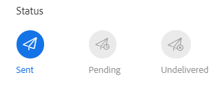
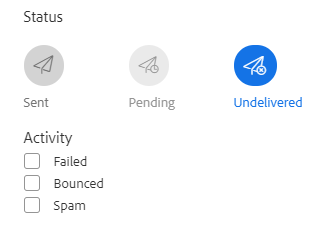

# 고급 검색 개요 {#advanced-search-overview}

고급 검색을 활용하여 이메일을 보거나 클릭하거나 회신한 잠재 고객을 타겟팅하면 가장 참여한 잠재 고객의 대상 목록을 만들 수 있습니다.

## 고급 검색에 액세스하는 방법 {#how-to-access-advanced-search}

1. 웹 응용 프로그램에서 **명령 센터**.

   

1. 클릭 **이메일**.

   

1. 적용 가능한 탭을 선택합니다.

   

1. 고급 검색을 클릭합니다.

   

## 필터 {#filters}

**날짜**

검색할 날짜 범위를 선택합니다. 사전 설정 날짜는 선택한 이메일 상태(전송됨, 배달되지 않음, 보류 중)에 따라 업데이트됩니다.

**Who**

Who 섹션에서 이메일 수신자/발신자별로 필터링합니다.

<table>
 <tr>
  <td><strong>드롭다운</strong></td>
  <td><strong>Description</strong></td>
 </tr>
 <tr>
  <td><strong>다음으로 보기</strong></td>
  <td>Filter by a specific sender in your Sales Connect instance (this option is available to Admins only).</td>
 </tr>
 <tr>
  <td><strong>그룹별</strong></td>
  <td>특정 수신자 그룹별로 이메일을 필터링합니다.</td>
 </tr>
 <tr>
  <td><strong>개인별</strong></td>
  <td>특정 수신자별로 필터링합니다.</td>
 </tr>
</table>

**When**

생성된 날짜, 배달된 날짜, 실패한 날짜 또는 예약된 날짜별로 선택합니다. 사용 가능한 옵션은 선택한 이메일 상태(전송됨, 배달되지 않음, 보류 중)에 따라 변경됩니다.

**캠페인**

캠페인 기여도별로 이메일을 필터링합니다.

**상태**

선택할 수 있는 세 가지 이메일 상태가 있습니다. 유형/활동 옵션은 선택한 상태에 따라 변경됩니다.

_**상태: 전송**_

보낸 이메일 활동별로 필터링합니다. You can choose views/no views, clicks/no clicks, and/or replies/no replies.

_**Status: Pending**_

Filters by all pending emails.

<table>
 <tr>
  <td><strong>상태</strong></td>
  <td><strong>설명</strong></td>
 </tr>
 <tr>
  <td><strong>Scheduled</strong></td>
  <td>Emails that have been scheduled from the compose window (Salesforce or the Web App), email plug-ins, or a campaign.</td>
 </tr>
 <tr>
  <td><strong>초안</strong></td>
  <td>현재 초안 상태인 이메일. 초안으로 저장하려면 이메일에 제목 줄과 수신자가 필요합니다.</td>
 </tr>
 <tr>
  <td><strong>진행 중</strong></td>
  <td>전송 중인 이메일. Emails should not remain in this state for more than a few seconds.</td>
 </tr>
</table>

_**상태: 배달되지 않음**_

Filters by emails that were never delivered.

<table>
 <tr>
  <td><strong>상태</strong></td>
  <td><strong>설명</strong></td>
 </tr>
 <tr>
  <td><strong>실패</strong></td>
  <td>Sales Connect에서 이메일을 보내지 못하는 경우(일반적인 이유는 다음과 같습니다. 가입 해지됨/차단된 연락처에 이메일을 보내거나 동적 필드를 채우는 데 문제가 있는 경우).</td>
 </tr>
 <tr>
  <td><strong>바운스됨</strong></td>
  <td>전자 메일은 수신자 서버가 거부하면 바운스된 것으로 표시됩니다. Only emails that were sent via Sales Connect servers will be shown here.</td>
 </tr>
 <tr>
  <td><strong>스팸</strong></td>
  <td>수신자가 이메일을 스팸(요청하지 않은 이메일의 공통 용어)으로 표시했을 때. Only emails that were sent via Sales Connect servers will be shown here.</td>
 </tr>
</table>

## 저장된 검색 {#saved-searches}

저장된 검색을 만드는 방법은 다음과 같습니다.

1. 모든 필터가 제자리에 있으면 를 클릭합니다. **필터를 다른 이름으로 저장**.

   

1. 검색 이름을 지정하고 을(를) 클릭합니다. **저장**.

   

저장된 검색은 왼쪽의 사이드바에 있습니다.

