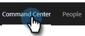

# 전자 메일 열 및 전자 메일 페이지 레이아웃 {#email-columns-and-email-page-layout}

[명령 센터](/help/marketo/product-docs/marketo-sales-insight/actions/email/command-center/command-center-overview.md)의 전자 메일 섹션에 사용 가능한 열을 표시하도록 구성할 수 있습니다. 구성 설정은 각 이메일 하위 폴더(예: 게재, 실패, 예약됨 등)에 대해 저장됩니다.

## 전자 메일 열 {#email-columns}

<table> 
 <colgroup> 
  <col> 
  <col> 
 </colgroup> 
 <tbody> 
  <tr> 
   <th>열</th> 
   <th>설명</th> 
  </tr> 
  <tr> 
   <td><strong>[!UICONTROL Person]</td> 
   <td>[!UICONTROL Sales Connect]의 사용자 이름 및 전자 메일. 이 필드를 클릭하면 개인 세부 정보 보기의 정보 탭이 열립니다.</td> 
  </tr> 
  <tr> 
   <td><strong>[!UICONTROL Name]</td> 
   <td>[!UICONTROL Sales Connect]에 있는 사용자의 이름입니다.</td> 
  </tr> 
  <tr> 
   <td><strong>[!UICONTROL Address]</td> 
   <td>[!UICONTROL Sales Connect]에 있는 사용자의 기본 전자 메일 주소입니다.</td> 
  </tr> 
  <tr> 
   <td><strong>[!UICONTROL Campaign]</td> 
   <td>이메일이 캠페인의 일부로 전송된 경우 캠페인 이름이 표시됩니다. 이 필드를 클릭하면 해당 캠페인의 설정 페이지로 이동합니다.</td> 
  </tr> 
  <tr> 
   <td><strong>[!UICONTROL Template]</td> 
   <td>템플릿의 이름을 표시합니다(이메일을 보낸 경우).</td> 
  </tr> 
  <tr> 
   <td><strong>[!UICONTROL Subject]</td> 
   <td>이메일의 제목 줄입니다.</td> 
  </tr> 
  <tr> 
   <td><strong>[!UICONTROL Groups]</td> 
   <td>이메일 수신자가 속한 그룹을 표시합니다.</td> 
  </tr> 
  <tr> 
   <td><strong>[!UICONTROL Job Title]</td> 
   <td>이메일 수신자의 제목입니다.</td> 
  </tr> 
  <tr> 
   <td><strong>[!UICONTROL Company]</td> 
   <td>이메일 수신자의 회사입니다.</td> 
  </tr> 
  <tr> 
   <td><strong>[!UICONTROL Email Status]</td> 
   <td>이메일이 포함된 상태입니다. 초안, 예약됨, 진행 중, 스팸, 반송됨, 실패, 전송됨 등의 상태가 포함됩니다. 보낸 이메일에는 해당 이메일에 발생한 보기, 클릭 수 및 답글 수를 보여주는 활동 스트림이 표시됩니다.</td> 
  </tr> 
  <tr> 
   <td><strong>[!UICONTROL Date Created]</td> 
   <td>이메일이 생성된 날짜.</td> 
  </tr> 
  <tr> 
   <td><strong>[!UICONTROL Last Updated]</td> 
   <td>이메일을 마지막으로 업데이트한 날짜.</td> 
  </tr> 
  <tr> 
   <td><strong>[!UICONTROL Delivery Channel]</td> 
   <td>이메일 전송에 사용된 게재 채널의 이름.</td> 
  </tr> 
  <tr> 
   <td><strong>[!UICONTROL Latest Activity]</td> 
   <td>이메일 수신자의 마지막 참여(예: 보기, 클릭 또는 회신).</td> 
  </tr> 
  <tr> 
   <td><strong>[!UICONTROL Date Sent]</td> 
   <td>이메일이 전송된 날짜.</td> 
  </tr> 
  <tr> 
   <td><strong>[!UICONTROL Follow Up Actions]</td> 
   <td>이메일, 전화, inMail 또는 작업으로 후속 작업에 사용할 수 있는 빠른 작업 단추입니다.</td> 
  </tr> 
  <tr> 
   <td><strong>[!UICONTROL Group Email]</td> 
   <td>이메일이 그룹 이메일의 일부로 전송된 경우 확인 표시를 표시합니다.</td> 
  </tr> 
  <tr> 
   <td><strong>[!UICONTROL Task Due Date]</td> 
   <td>이메일과 관련된 작업의 기한을 표시합니다. 작업은 전자 메일 목록의 빠른 작업 버튼에서 만들어 전자 메일과 연결할 수 있습니다.</td> 
  </tr> 
  <tr> 
   <td><strong>[!UICONTROL Email Action]</td> 
   <td>이메일에 대한 조치를 취하는 데 사용할 수 있는 빠른 조치 버튼. 이메일의 상태에 따라 보관, 성공, 삭제, 전송 다시 시도, 보관 해제 등의 작업을 사용할 수 있습니다.</td> 
  </tr> 
  <tr> 
   <td><strong>[!UICONTROL Task Type]</td> 
   <td>전자 메일과 관련된 작업의 작업 유형을 표시합니다. 작업은 전자 메일 목록의 빠른 작업 버튼에서 만들어 전자 메일과 연결할 수 있습니다.</td> 
  </tr> 
  <tr> 
   <td><strong>[!UICONTROL Date Failed]</td> 
   <td>이메일이 게재되지 않은 경우 이메일이 실패한 날짜를 표시합니다.</td> 
  </tr> 
 </tbody> 
</table>

## 이메일 페이지 레이아웃 설정 {#email-page-layout-settings}

다음 단계에 따라 레이아웃을 구성할 수 있습니다.

1. 웹 응용 프로그램에서 **[!UICONTROL Command Center]**&#x200B;을(를) 클릭합니다.

   

1. **[!UICONTROL Emails]** 섹션을 선택하십시오.

   

1. 구성 단추를 클릭합니다. 옵션에는 원하는 행 수 선택, 표시할 필드 선택, 그룹 이메일을 그리드의 단일 항목으로 롤업할지 여부(또는 이메일 그리드에 속하는 모든 이메일을 단일 항목으로 표시할지 여부) 선택 등이 있습니다.

   

1. 완료되면 구성 상자 외부를 클릭하여 변경 사항을 저장하면 됩니다.
