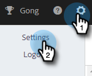

# 팀에 대한 사용자 지정 게재 채널 설정 {#set-up-a-custom-delivery-channel-for-your-team}

>[!NOTE]
>
>**관리자 권한 필요**

>[!NOTE]
>
>* SMTP 서버 설정 외에 전자 메일을 보내려면 먼저 [전자 메일 ID를 확인](/help/marketo/product-docs/marketo-sales-insight/actions/getting-started/email-settings/verify-your-email.md)해야 합니다.
>* SMTP 서버에 대한 올바른 서버 자격 증명을 얻기 위해 IT 팀 또는 SMTP 서버 공급업체와 협력하는 것이 좋습니다.
>* SMTP 서버 자격 증명을 사용하여 Gmail 및 [!DNL Exchange] 서버에 연결할 수 없습니다. 이러한 공급자와 통합하려면 이메일 연결 서비스를 사용하십시오.

1. 톱니바퀴 아이콘을 클릭하고 **[!UICONTROL Settings]**&#x200B;을(를) 선택합니다.

   

1. [!UICONTROL Admin Settings]에서 **[!UICONTROL General]**&#x200B;을(를) 클릭합니다.

   

1. **[!UICONTROL Team Delivery Channel]** 탭을 클릭합니다.

   

1. SMTP 서버 자격 증명을 입력하고 **[!UICONTROL Connect]**&#x200B;을(를) 클릭합니다.

   

   >[!NOTE]
   >
   >팀 SMTP 서버는 모든 팀 구성원에 대한 기본 전자 메일 ID의 기본 배달 채널이 됩니다. 또한 다른 모든 이메일 ID에 대한 게재 채널 옵션으로 사용할 수 있습니다.

   >[!MORELIKETHIS]
   >
   >* [Gmail 사용자를 위한 전자 메일 연결](/help/marketo/product-docs/marketo-sales-connect/email-plugins/gmail/email-connection-for-gmail-users.md)
   >* [사용자 [!DNL Outlook] 의 전자 메일 연결](/help/marketo/product-docs/marketo-sales-connect/email-plugins/msc-for-outlook/email-connection-for-outlook-users.md)
